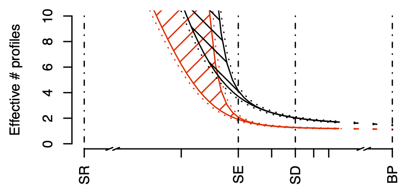

## Why should we preserve biodiversity?

Biodiversity is important to preserve because it plays a crucial role in
maintaining the health and balance of ecosystems. A diverse range of plant
and animal species helps to ensure the continuation of vital processes such as
pollination and the decomposition of organic matter. Biodiversity also
provides numerous benefits to humans, such as providing food, medicine, and
other resources, and it has intrinsic value as a unique and important part of
our world. Additionally, preserving biodiversity helps to protect against the
negative effects of climate change and other environmental challenges.

*courtesy of ChatGPT - https://chat.openai.com*

## How does biodiversity help protect against climate change?

Biodiversity plays a key role in helping to protect against climate change in
several ways. For example, a diverse range of plant species can help to
absorb carbon dioxide from the atmosphere, which can help to reduce
the amount of greenhouse gases that contribute to global warming.
Biodiversity can also help to maintain the health and resilience of
ecosystems, which can make them better able to adapt to the changes
brought about by climate change. In addition, the preservation of
biodiversity can help to safeguard against the loss of important natural
resources that are vital for human survival, such as food and water.

*courtesy of ChatGPT - https://chat.openai.com*

## How should we measure biodiversity?

There are several ways to measure biodiversity, each of which provides a
different perspective on the variety and abundance of species in a given area.
Some common ways to measure biodiversity include:

- The number of species in a given area: This is one of the most basic
measures of biodiversity, and it can provide a general sense of the
diversity of species present in an ecosystem.

- ...

Overall, the best way to measure biodiversity may depend on the specific
goals and circumstances of the study. It is often useful to combine multiple
measures in order to get a more complete picture of the biodiversity of
an ecosystem.

*courtesy of ChatGPT - https://chat.openai.com*

## Measures of Diversity

> - Species richness
>   - Number of species actually present
> - Simpson index
>   - Chance of two individuals being the same species
> - Shannon entropy
>   - Surprise in seeing next individual
> - Berger-Parker
>   - Evenness / Dominance of most abundant species

## Measures of Diversity


$$D_q = \left( \sum_{i \in \{1 \dots N_S, p_i \neq 0\}} p_i^q \right)^{\frac{1}{1-q}}$$

Covers all of these measures.

## Measures of Diversity

- Species richness
  - Number of species actually present
- Simpson index
  - Chance of two individuals being the same species
- Shannon entropy
  - Surprise in seeing next individual
- Berger-Parker
  - Evenness / Dominance of most abundant species

## Measures of Diversity

- Species richness
  - $D_0$
- Simpson index
  - $\frac{1}{D_2}$
- Shannon entropy
  - $log(D_1)$
- Berger-Parker
  - $\frac{1}{D_\infty}$

## Measures of Diversity

- Species richness
  - $D_0$
- Shannon entropy
  - $log(D_1)$
- Simpson index
  - $\frac{1}{D_2}$
- Berger-Parker
  - $\frac{1}{D_\infty}$

## Measures of Diversity

- $D_0$
  - Species richness
- $log(D_1)$
  - Shannon entropy
- $\frac{1}{D_2}$
  - Simpson index
- $\frac{1}{D_\infty}$
  - Berger-Parker

## Measures of Diversity

- $D_0$
  - Species richness
- $D_1$
  - exp(Shannon entropy)
- $D_2$
  - 1 / Simpson index
- $D_\infty$
  - 1 / Berger-Parker

## Diversity profiles

<center>{ width=80% }</center>

## Useful R

- `sort()` to sort a vector into ascending order
- `rep()`
- `barplot()`
- `rmultinom()` to generate multinomially distributed samples
- `Inf` is how we say infinity in R
- `lines()`

## Deadlines

- Edits to GitHub repos -- as soon as possible, but:
  - Practical Series 2-4: Monday 9th January, 1pm
- Project submission
  - by Monday 23rd January, 1pm
- Marks returned by Monday 13th February

## Package assessment

- Does the package work (installs, docs, functions, demos and dependencies)?
```{R, eval = FALSE}
    devtools::install_github("SBOHVM/pkgname")
    library(pkgname)
    library(help="pkgname")
    demo(package="pkgname")
    ?pkgname
```
- Can I generate reports from your demos, and how do they look?
- Is the code well structured and with clear variable names and comments?
- Is the documentation correct (for package, functions, and text in reports)?
- Does the code work correctly?
