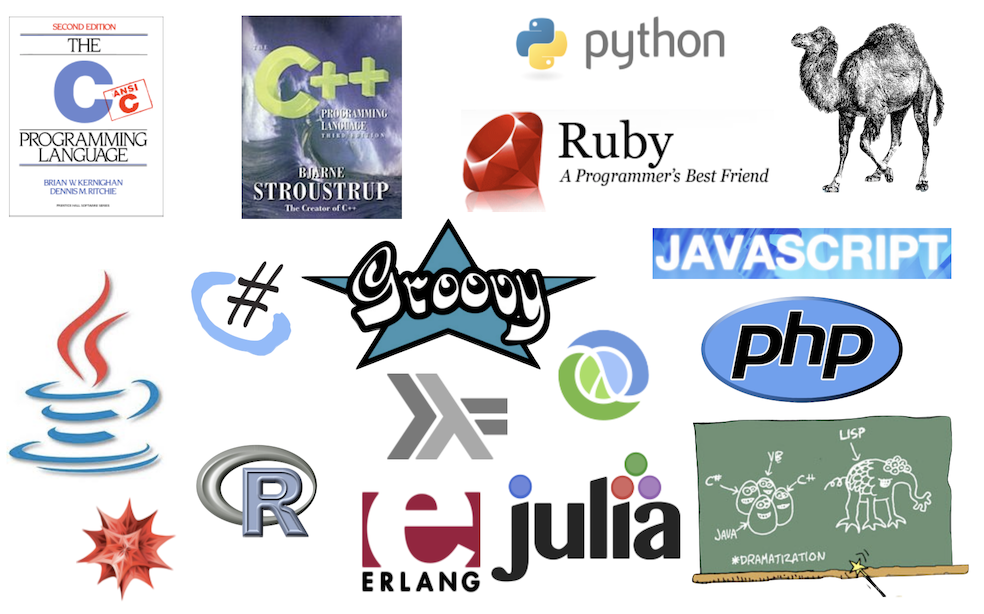

## Things to remember

> - Any programming language can solve any problem
> - But some things are much more natural in some languages than others
> - And some languages also have some amazing libraries to help!

## Programming styles

- Imperative vs. Declarative
- Structured, Functional
- Event-driven
- Object-oriented
- Concurrent
- Generic, Procedural, Reflective, Logical, ...

## Language types

- High and low level
- Compiled, JIT and interpreted/scripting
- Domain specific and general purpose
- Static and dynamic typing
- Strict and lazy evaluation

## What do you need to think about?

> - What you want to do

> - What the easiest way of doing it is

> - What languages make that easy

# So...

## What do you want to do?

- Access data
- Analyse it
- Build models
- Test hypotheses
- Report the results
- Share the methods and data

## What's good about R?

> - Approachable scripting language
> - Interactive interpreter
> - Dynamic typing, imperative, structured
> - Great statistical and graphical libraries
> - Powerful development environment in RStudio
>   - Making it easy to develop your own packages

## What's bad about R?

> - Interpreted languages are slow
>   - So new libraries are rarely written in R!
>   - Complex handwritten models are slow
> - Graphics capabilities are fixed and complicated, though extensive...
> - Lack of type checking means you’ll often struggle to know what went wrong
> - Not all libraries are well written

## What's different about R?

> - Formulae and factors
> - Data frames, and ease of manipulating data
> - Plotting data
> - Massive database of user-supplied packages
>   - Easy(-ish!) to create your own packages

## What does this tell us?

R is designed for:

- reading data
- processing data
- building models
- analysing results
- displaying results
- sharing new functionality

## So what have you learned?

- Write code
- Write documentation
- Identify and isolate reusable code
- Generate documented results
- Keep track of code changes
- Share code with others reliably
- Read, understand and test other people's code
- Collaborate with one another to improve your code

## Conclusions

- R has arguably the best libraries to make it easy to process, analyse and report data
- And it’s also reasonably general purpose
- So it’s a good place to start
- But don’t get too hung up on one language
- There are lots of problems with R!

## Languages

{ width=100% }

# Writing Fragile Code

## Writing fragile code...

- When we’re using Word we want it to never crash!
  - Partly this is because we can’t fix it even if we know there’s a problem
  - Partly because we might lose something important
- When we write our own code, we do want it to crash... why?
  - We don’t want it to carry blithely on when something doesn’t make sense
  - Otherwise we might get the wrong answer at the end without ever knowing there was a problem!
- Writing fragile code that crashes or stops easily is a good thing in scientific programming, at least when you’re writing your own code 
