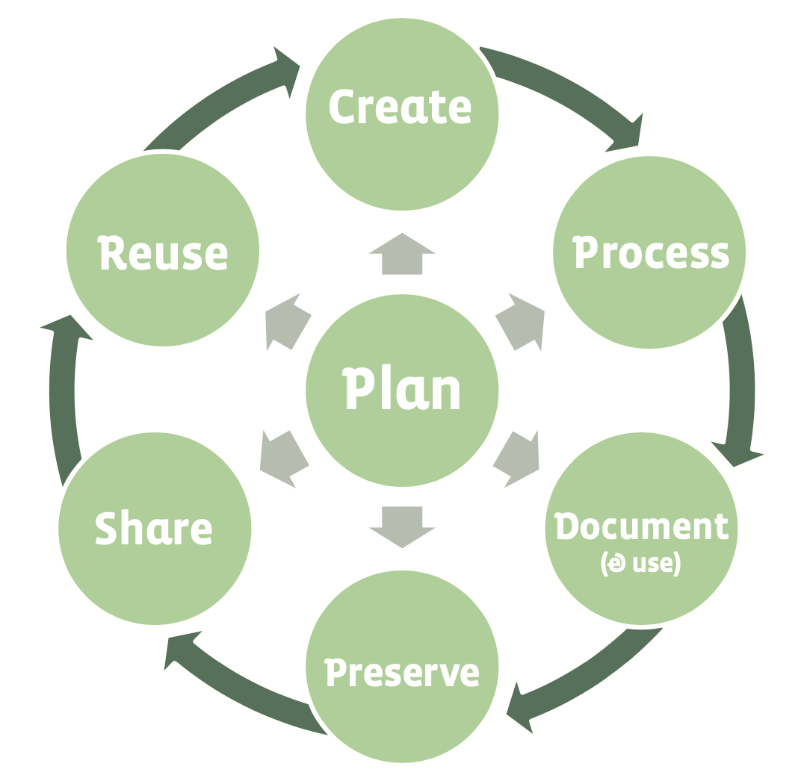

## Reproducible Research starts with Reproducible Data

We strongly encourage you to read this guide, whether you are working in the
field or the lab to generate your own data, or managing someone else's data to
do analyses:

https://www.britishecologicalsociety.org/wp-content/uploads/2019/06/BES-Guide-Data-Management-2019.pdf

## Data

> - Metadata is also data
> - Derived data is also data
> - Simulation runs are also data

## The data lifecycle

{ width=60% }

Copyright © British Ecological Society, 2018

## Why all this effort?

Potential benefits of good data management include:

- ensuring data are accurate, complete, authentic and reliable
- increasing research efficiency
- saving time and money in the long run
  - ‘undoing’ mistakes is frustrating
- meeting funder requirements
- minimizing the risk of data loss
- preventing duplication by others
- facilitating data sharing
- ensuring data discovery and reuse

## Metadata

Metadata help others discover data through searching and browsing online and
helps with interoperability, which is necessary for data reuse. Metadata comes
in three forms:

> - descriptive
>   - fields such as title, author, abstract and keywords
> - administrative
>   - rights and permissions and data on formatting
> - structural
>   - explanations of e.g. tables within the data

## Backup

- Personal devices such as laptops and tablets are convenient for short-term, temporary storage but should not be used for storing master files. They are at high risk of being lost, stolen or damaged.
- External devices such as hard drives and USB sticks are often convenient because of their cost and portability. However, they do not guarantee long-term preservation and can also be lost, stolen or damaged.
- Some remote or online services provide backup and use cloud technology to allow users to synchronize files across different computers. However, the University's OneDrive does not provide
any form of backup, just a cloud synchronisation across computers.
- Paper!

## Archiving and storage {.smaller}

Critical for sharing, publication and long-term reproducibility of your work.

- Local Research Data Management
  - e.g. UoG:
    - https://www.gla.ac.uk/myglasgow/datamanagement
  - Allows permanent archiving for publication:
    - http://researchdata.gla.ac.uk
- Global archiving services
  - e.g. Zenodo:
    - https://zenodo.org
    - Allows automatic archiving of code as well as data
- Data Journals
  - e.g. Scientific Data:
    - https://www.nature.com/sdata

## Reusing data

- Much more efficient than generating your own!
- But you **must** cite the data sources...
