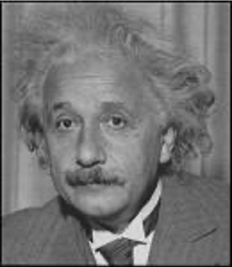
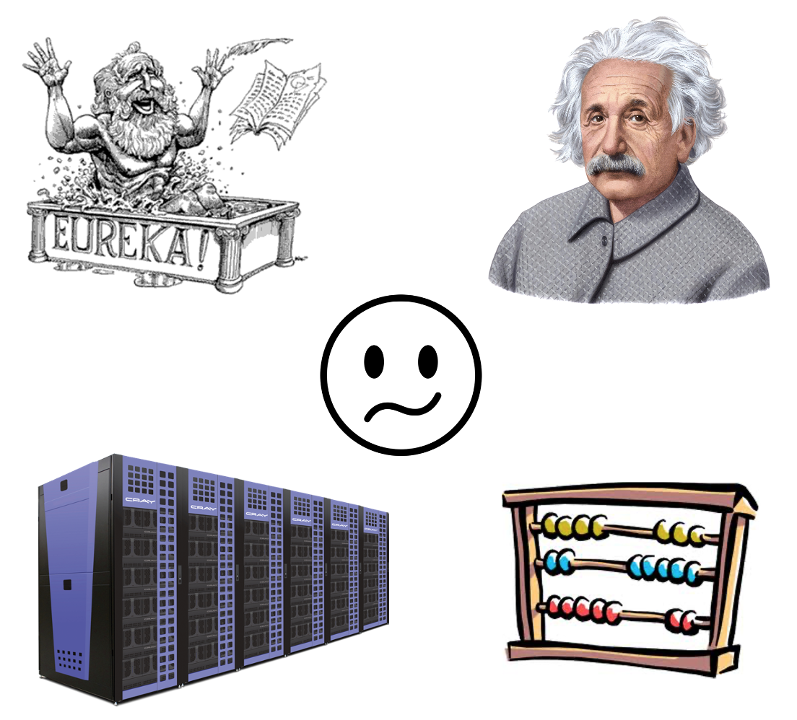
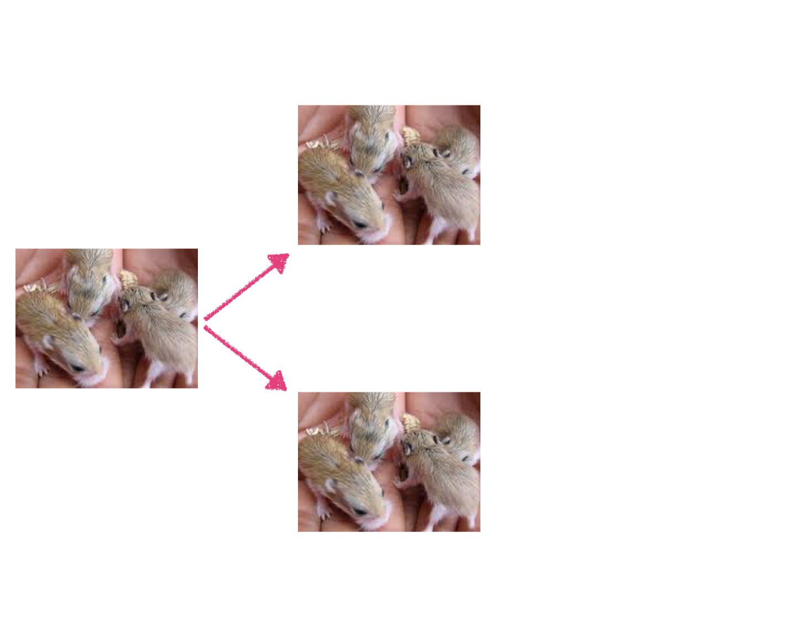

## Models come in many types... {.flexbox .vcenter}

{ width=100% }

## The purpose of a model... {.flexbox .vcenter}

  - A model captures the essence of an object or process
  - A model should be appropriate for the specific task or questions 

  
{ width=60% }

## The purpose of a model... {.flexbox .vcenter}

{ width=70% }

> "A model should be as simple as possible but no simpler..." 

> Albert Einstein

## Why build mathematical models?

- To simplify
- To understand
- To predict

## Uses of epidemiological models {.flexbox .vcenter}

  - Understand disease dynamics
  - Estimate important parameters
  - Identify where we need more data
  - Explore control options
  - Make predictions
  
  { width=80% }

## Implementing a model... {.flexbox .vcenter}

{ width=60% }

## Implementing a model... {.flexbox .vcenter}

{ width=60% }

# Simple population dynamics

## Exponential growth or decline 

- Rate of increase (or decrease) is proportional to current population size

{ width=60% }

## Exponential growth or decline 

- Rate of increase (or decrease) is proportional to current population size

{ width=60% }

## Exponential growth or decline 

- Rate of increase (or decrease) is proportional to current population size

{ width=60% }

## Exponential growth or decline 

- Rate of increase (or decrease) is proportional to current population size

{ width=60% }

## Hamster population explosion {.flexbox .vcenter}

{ width=80% }

## Human population growth

- Define a variable to represent the number of individuals in the population at time $t$
- $N(t)$, where $N$ is a dependent variable and $t$ is an independent variable
- is the same as $N_t$ 
- or just $N$ (shorthand)

## Initial conditions 

- Define the value of the population at time $t=0$

  $$\begin{eqnarray} N(t = 0) &=& N_0 \\ &=& 7\ 000\ 000\ 000  \end{eqnarray}$$

## Parameters 

- Specify the rate of increase
  - Human population increasing at approximately 1.5% each year
  - Rate of increase $\lambda = 0.015$ per year

## The difference equation model

- Incrementing the human population in 1 year time steps

  $$N(t + 1) = \lambda \times N(t) + N(t)$$
- where $\lambda = 0.015$

## Changing the time step 

- Incrementing the human population in 1 month time steps

  $$N(t + 1) = (\lambda / 12) \times N(t) + N(t)$$

- where $\lambda = 0.015$

## Return to time steps of a year

- Incrementing the human population in 1 year time steps

  $$N(t + 1) = \lambda \times N(t) + N(t)$$

- where $\lambda = 0.015$

## How long until population doubles?

$$N(t + 1) = \lambda \times N(t) + N(t)$$

$$ \mathit{i.e.\quad} N(t + 1) = (\lambda + 1) \times N(t)$$

## How long until population doubles?

$$\begin{eqnarray} N(t + 2) &=& (\lambda + 1) \times N(t + 1) \\
&=& (\lambda + 1)\times(\lambda + 1) \times N(t) \\
&=& (\lambda + 1)^2 \times N(t) \end{eqnarray}$$

## How long until population doubles?

$$N(t + n) = (\lambda + 1)^n \times N(t)$$

So, the number of years ($n$) taken to double is the $n$ that satisfies

$$(\lambda + 1)^n = 2$$

## Solving the equation

$$\begin{eqnarray} (\lambda + 1)^n &=& 2 \\ 
\log((\lambda + 1)^n) &=& \log(2) \\
n \times \log(\lambda + 1) &=& \log(2) \\
n &=& \log(2) / \log(\lambda + 1) \\
n &=& 46.6
\end{eqnarray}$$

## Doubling time

- The doubling time ($n$) does not depend on the starting population size
- This is always true of an exponentially growing population

## Fixed doubling time

{ width=80% }

## Model types

- Difference equation models
  - Describe updating of population in chunks of time
  - *e.g.* $N(t + 1) = \lambda \times N(t) + N(t)$

## Model types

- Difference equation models
  - Describe updating of population in chunks of time
  - *e.g.* $N(t + 1) = \lambda \times N(t) + N(t)$
- Differential equation models
  - Describe continuous updating of population
  - *e.g.* $\frac{dN}{dt} = \lambda \times N$
  - where $\frac{dN}{dt}$ is the rate of change of $N$

## Model types

- Difference equation models
  - Describe updating of population in chunks of time
  - *e.g.* $N(t + 1) = \lambda \times N(t) + N(t)$
- Differential equation models
  - Describe continuous updating of population
  - *e.g.* $\frac{dN}{dt} = \lambda \times N$
  - where $\frac{dN}{dt}$ is the rate of change of $N$
- Difference equations 
  - Good approximations to continuous models when time chunks are small
  - No need to worry about differential equations today :)
  
## Practicals
- Programming in R Practical:
  - Learn some programming skills
  - Build simple population dynamics models in R

