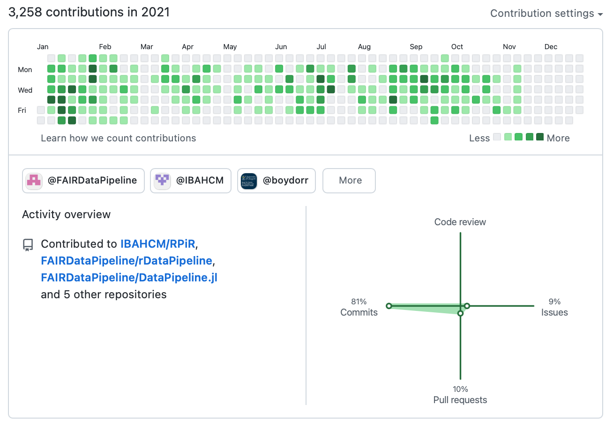

  
# GitHub 

# My journey...

## 2014

{ width=80% }

## 2015

{ width=80% }

## 2016

{ width=80% }

## 2017

{ width=80% }

## 2018 November Viva

{ width=80% }

## 2019 

{ width=80% }

## 2020 Covid-19

{ width=80% }

## 2021

{ width=80% }

# Why did it take so long?

## Umm... 

- **Git is scary?**
  - It's a foreign language! branch, head, origin, blame, diff, fork?
  - Git is for command line experts?
  - What if I break the repo? and merge conflicts...
- **Why is git useful?**
  - Time travel?
- **I'm too busy?**
  - I've got stuff to do!

{ width=80% }

# Why should you use git / GitHub?

## 1. Centralized cloud storage of your code 

{ width=90% }

## 2. Version control system 

{ width=50% }

## 2. Version control system 

- Keep track of important versions
- Always have a working version

## 3. A single point of truth

- Latest version of code
- Previous versions of code (with changes)
- Data
- Project description
- Installation instructions
- Science / notes
- Discussion / ideas
- To do list / tasks

## 4. Reproducible research

- Makes your code / data available as a single project
- Makes your code / data citable
- Track changes 
- Track what went wrong

## 4. Collaboration {.flexbox .vcenter}

{ width=90% }

## 5. Collaboration

Makes it easier to:

- collaborate 
- share your code
- improve your code

Makes your project / data / code:

- easier to find
- easier to install

## 6. You might need to learn it eventually anyway

- Software developer
- Research software engineer
- Data science 

## And more?

- Automatically test your code
- Build websites
- Improve your code / learn new skills
- ...

## Let's go back to 2014...

{ width=80% }

# GitHub demo

# RStudio projects 

## Why use RStudio projects?

- Helps keep you organised!!!
- When you open a project
  - a new R session is loaded
  - the working directory is set to the project directory
  - ~~.RData is loaded~~
  - .Rhistory is loaded
  - previous tabs are left open
  - other RStudio settings are loaded

# Questions?
