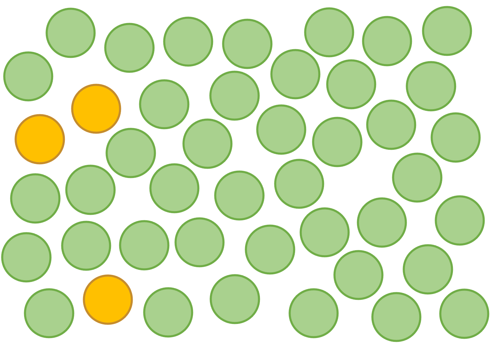
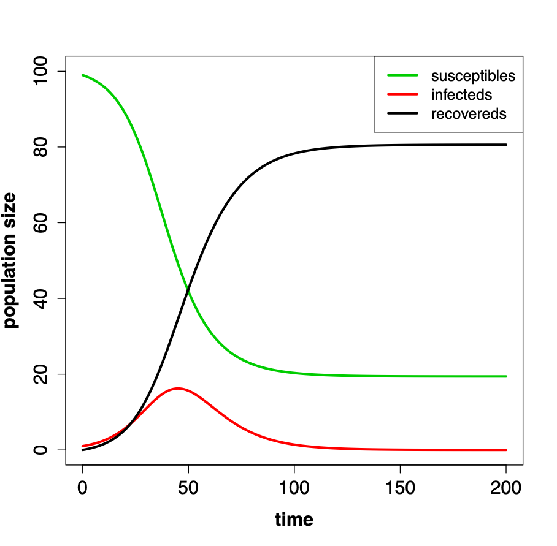
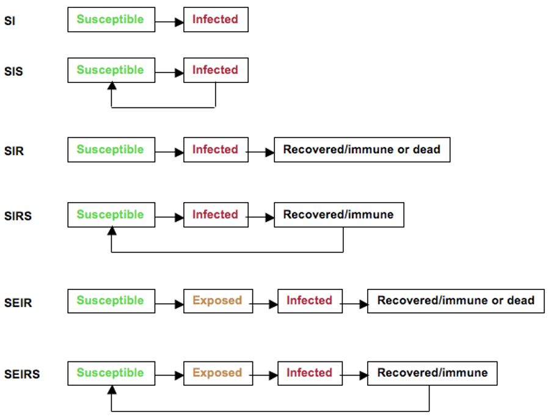
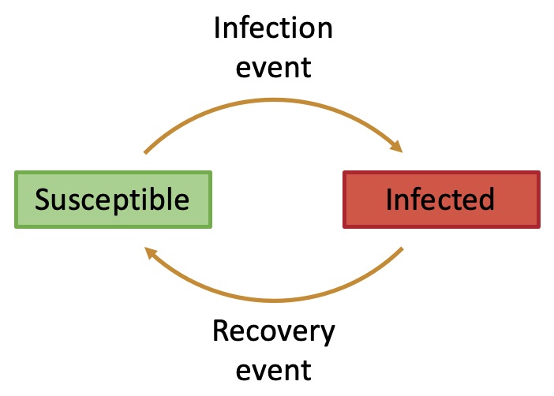
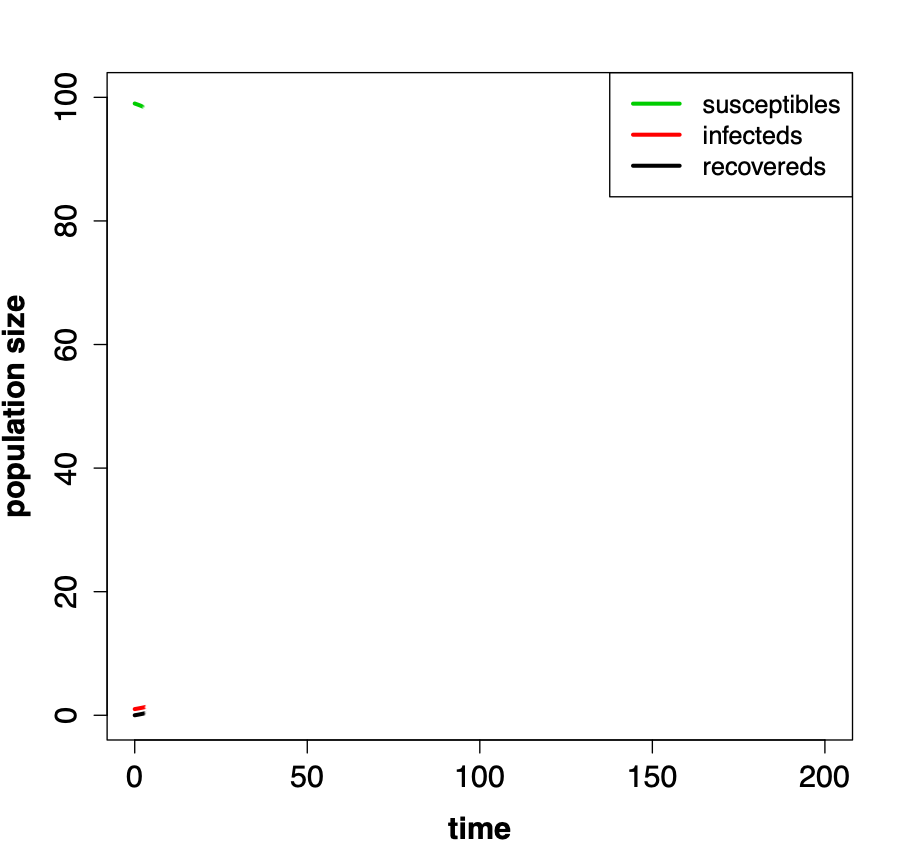
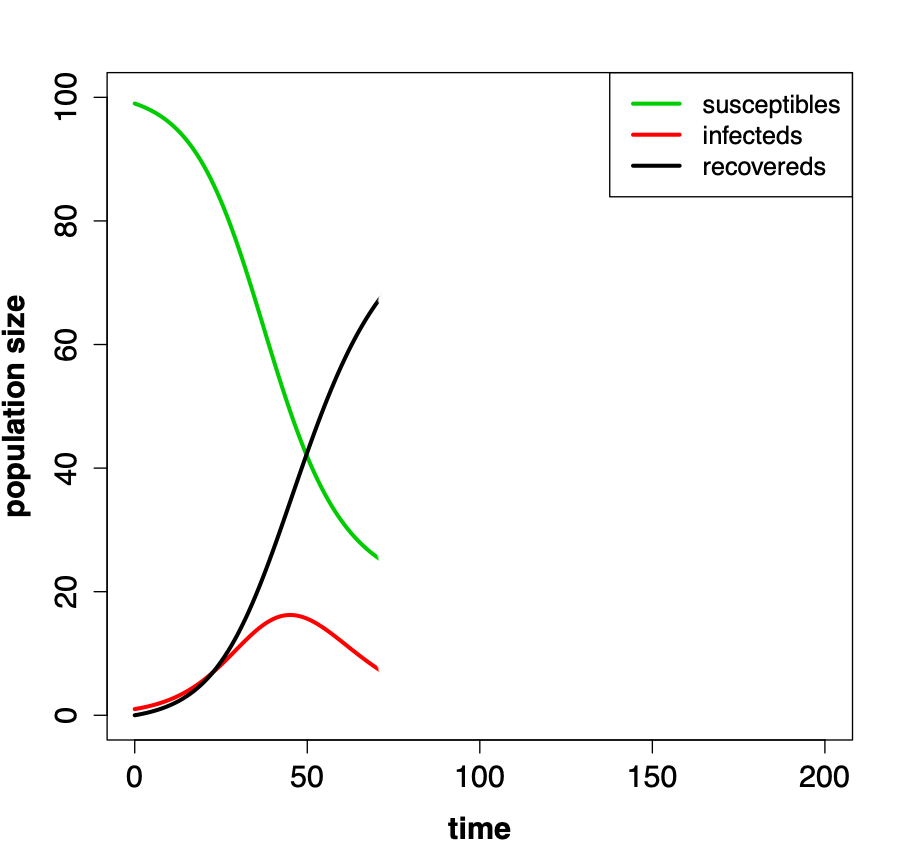
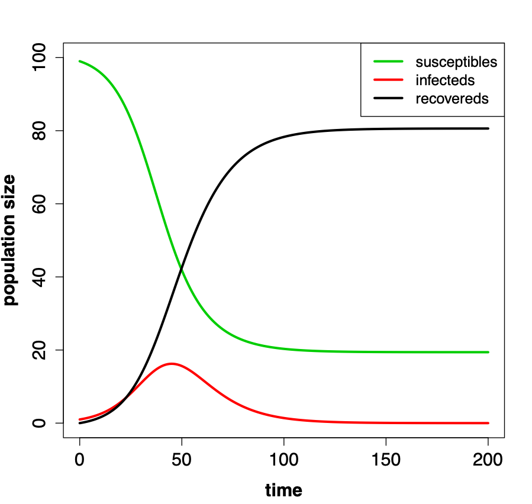
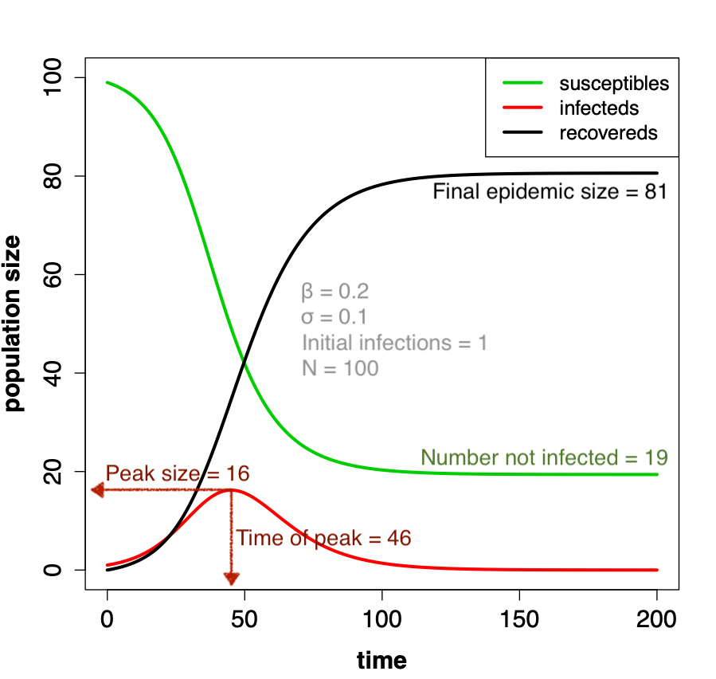

## Basic reproduction number, $R_0$

- This is a key concept in epidemiology and is defined as:

  > "the average number of secondary cases arising from an infected individual 
introduced into a fully susceptible population"

# Basic reproduction number $R_0 > 1$

## $R_0 > 1$

{ width=80% }

## $R_0 > 1$

{ width=80% }

  
## $R_0 > 1$

{ width=80% }

## $R_0 > 1$

{ width=80% }

## $R_0 > 1$

{ width=80% }

## $R_0 > 1$

{ width=80% }

# Basic reproduction number $R_0 < 1$

## $R_0 < 1$

{ width=80% }

## $R_0 < 1$

{ width=80% }

## $R_0 < 1$

{ width=80% }

## $R_0 < 1$

{ width=80% }

## Outbreak behaviour depends on $R_0$

- If $R_0 > 1$ we expect an outbreak to take off
- If $R_0 < 1$ if we expect a just a few cases with no sustained outbreak

## Epidemic dynamics

{ width=60% }

## Model structure {.flexbox .vcenter .smaller}

- Determined by the biology of the infection
  - do infected individuals die?
  - do infected individuals recover?
  - are recovered individuals immune?
  - are there latently infected individuals?

{ width=100% }

## SIR process {.flexbox .vcenter}

{ width=80% }

## Terminology

- $S(t)$, $S_t$ or $S$ is the number of susceptibles

- $I(t)$, $I_t$ or $I$ is the number of infecteds

- $R(t)$, $R_t$ or $R$ is the number of recovereds

- $N$ is the total population size
  - *i.e.* $N = S + I + R$

## Modelling transmission

- Total rate at which new infections currently arise in the population

$$\beta I \frac{S}{N}$$

- $\beta$ is the transmission rate
- $I$ is the current number of infected individuals
- $\frac{S}{N}$ is the proportion of population that is still susceptible

## Modelling recovery

- Total rate at which individuals are recovering

$$\sigma I$$

- $\sigma$ is the recovery rate  
- $I$ is the current number of infected individuals 

## SIR model in difference equation form

$$S_{t+1} = S_t - \beta I_t (\frac{S_t}{N})$$

## SIR model in difference equation form

$$S_{t+1} = S_t - \beta I_t (\frac{S_t}{N})$$

$$I_{t+1} = I_t + \beta I_t (\frac{S_t}{N}) - \sigma I_t$$

## SIR model in difference equation form

$$S_{t+1} = S_t - \beta I_t (\frac{S_t}{N})$$

$$I_{t+1} = I_t + \beta I_t (\frac{S_t}{N}) - \sigma I_t$$

$$R_{t+1} = R_t + \sigma I_t$$

## SIS process

{ width=80% }

## SIS model in difference equation form

$$S_{t+1} = S_t – \beta I_t \frac{S_t}{N} + \sigma I_t$$

$$I_{t+1} = I_t + \beta I_t \frac{S_t}{N} – \sigma I_t$$

## Confusing notation...

$$\beta \times I \times (\frac{S}{N})$$

is the same as…

$$\beta I(\frac{S}{N})$$

is the same as

$$\frac{\beta I S}{N}$$

## Basic reproduction number, $R_0$

- This is a key concept in epidemiology and is defined as:

  > "the average number of secondary cases arising from an infected individual 
introduced into a fully susceptible population"

## Calculating $R_0$

$$\begin{align} R_0 = {} & \textrm{number of new infections per day} \\
& \textrm{(arising from 1 infected in a fully} \\
& \textrm{susceptible population)} \times \\
& \textrm{number of days infectious} \end{align}$$

## Calculating $R_0$

$$\begin{align} R_0 = {} & \textrm{number of new infections per day} \\
& \textrm{(arising from 1 infected in a fully} \\
& \textrm{susceptible population)} \times \\
& \textrm{number of days infectious} \\
= {} & \beta \times \textrm{number days infectious} \end{align}$$

## Note on rates and duration

- We convert between a rate and a duration using the reciprocal
  - $\textrm{duration} = \frac{1}{\textrm{rate}}$
  - $\textrm{rate} = \frac{1}{\textrm{duration}}$
- Examples:
  - Recovery rate = 0.1 per day
  - Infectious period = $\frac{1}{0.1}$ = 10 days

  - Infectious period = 3 weeks
  - Recovery rate = $\frac{1}{3}$ per week

## Calculating $R_0$

$$\begin{align} R_0 = {} & \textrm{number of new infections per day} \\
& \textrm{(arising from 1 infected in a fully} \\
& \textrm{susceptible population)} \times \\
& \textrm{number of days infectious} \\
= {} & \beta \times \textrm{number days infectious} \end{align}$$

## Calculating $R_0$

$$\begin{align} R_0 = {} & \textrm{number of new infections per day} \\
& \textrm{(arising from 1 infected in a fully} \\
& \textrm{susceptible population)} \times \\
& \textrm{number of days infectious} \\
= {} & \beta \times \textrm{number days infectious} \\
= {} & \beta \times \frac{1}{\textrm{recovery rate}} \end{align}$$

## Calculating $R_0$

$$\begin{align} R_0 = {} & \textrm{number of new infections per day} \\
& \textrm{(arising from 1 infected in a fully} \\
& \textrm{susceptible population)} \times \\
& \textrm{number of days infectious} \\
= {} & \beta \times \textrm{number days infectious} \\
= {} & \beta \times \frac{1}{\textrm{recovery rate}} \\
= {} & \beta \times \frac{1}{\sigma} \\
= {} & \frac{\beta}{\sigma}
 \end{align}$$

## Epidemic dynamics for $R_0 = 2$

{ width=60% }

## Epidemic dynamics for $R_0 = 2$

{ width=60% }

## Epidemic dynamics for $R_0 = 2$

{ width=60% }

## Epidemic dynamics for $R_0 = 2$

{ width=60% }

## Epidemic dynamics for $R_0 = 2$

{ width=60% }

## Epidemic dynamics for $R_0 = 2$

{ width=60% }

## Epidemic dynamics for $R_0 = 2$

{ width=60% }

  
## Key features of dynamics

- Infection burns itself out
- Not all individuals become infected

## Key features of dynamics

- Infection burns itself out
- Not all individuals become infected

- Chain of transmission eventually halts due to insufficient susceptibles, 
not a complete lack of susceptibles

# Basic reproduction number $R_0 < 1$

# Basic reproduction number $R_0 < 1$

## $R_0 < 1$

{ width=80% }

## $R_0 < 1$

{ width=80% }

## $R_0 < 1$

{ width=80% }

## $R_0 < 1$

{ width=80% }

## Dynamics for $R_0 = 0.5$

{ width=60% }

## SIS process

{ width=80% }

## SIS model in difference equation form

$$S_{t+1} = S_t – \beta I_t \frac{S_t}{N} + \sigma I_t$$

$$I_{t+1} = I_t + \beta I_t \frac{S_t}{N} – \sigma I_t$$

## SIS simulation for $R_0 = 3$

{ width=60% }

## SIS simulation for $R_0 = 3$

{ width=60% }

## Practicals

- Programming in R Practical:
  - Extending your programming skills
  - Building simple disease dynamics models in R
