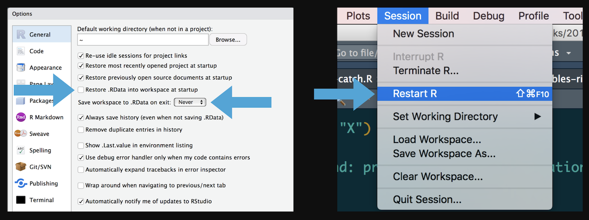
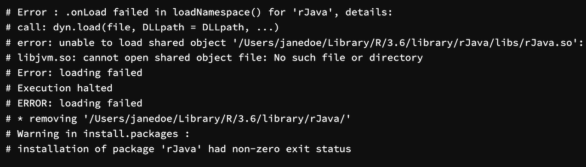

# More useful things...

## Important functionality {.smaller}

-   Restarting R
-   Debugging
-   while loops:

```{R, eval=FALSE}
    while (...) { ... }
```

## Restarting R

Restart early, restart often... and don't restore data.

<center>{ width=100% }</center>

## Errors

<center>{ width=100% }</center>

## Errors

<center>{ width=100% }</center>

## Debugging

There are lots of debugging options in R

<center>{ width=100% }</center>

## `for (...)` loops - recap

Doing something a fixed number of times:
```{R, comment=""}
sequence <- seq(from = 0, to = 2, by = 0.5)

for (number in sequence) {
  print(number)
}
```

## `while (...)` loops

Doing something until it is finished:
```{R, comment=""}
number <- 0
max.number <- 2
increment <- 0.5
while (number <= max.number) {
  print(number)
  number <- number + increment
}
```
