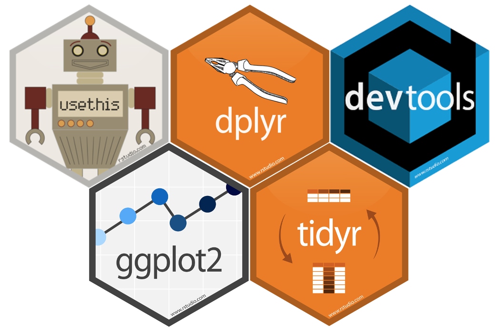
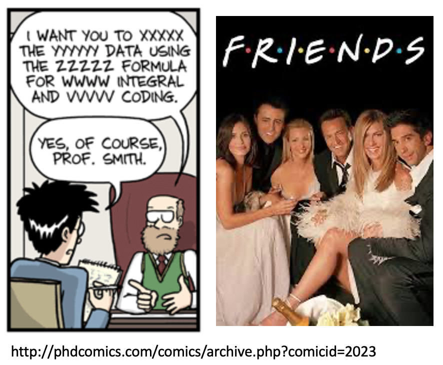
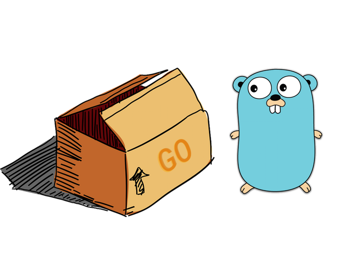
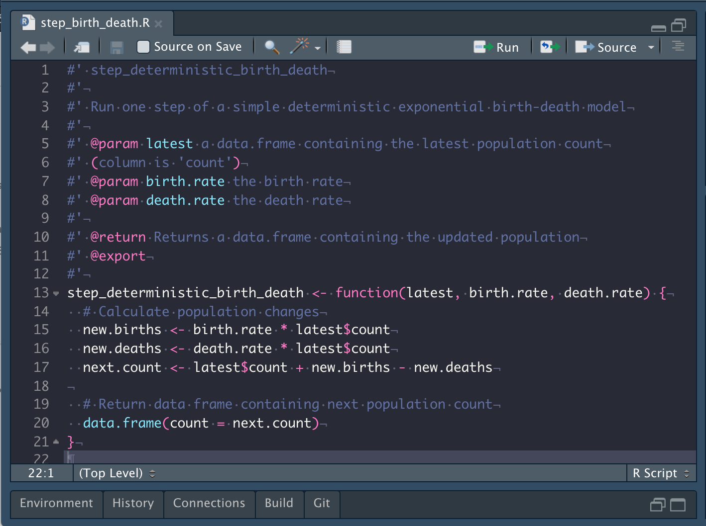
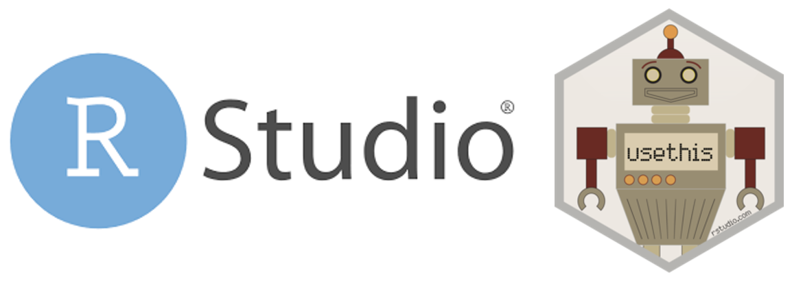

# Why???

## To help people write better code

{ width=80% }

## To share your methods

{ width=80% }

## To share your code

{ width=60% }

## To keep your code organised

{ width=60% }

## To keep your code consistent {.flexbox .vcenter}

{ width=80% }

# How???

## {.flexbox .vcenter}

{ width=80% }

