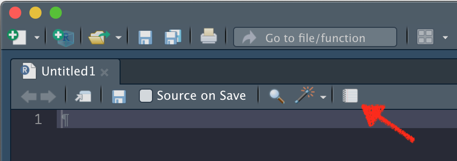

```{r setup, include=FALSE}
library(learnr)
tutorial_options(exercise.reveal_solution = FALSE)
gradethis::gradethis_setup()

knitr::opts_chunk$set(error = TRUE)
set.seed(123)
```


## Overview

In this session you will run a simple program in R within a {learnr} tutorial.
It will run the difference equation model of exponential growth discussed in
the lecture. Then you'll create an R project and create a report from the code.

## Introduction 

Suppose we want model the growth of a population in R. We will use the 
exponential growth model that we talked about in the lecture, and describe it 
as a **difference equation**, so that we are updating the population in discrete 
steps. In words, the behaviour of the model could be described as something 
like: 

> The change in population size is the growth rate times the current population 
size 

Or, if we wanted to write this out more fully (though possibly 
less elegantly!), we might say: 

> The population size at the next time point is the current population size plus 
the growth rate times the current population size.

We can also use mathematics to describe the behaviour more precisely. In this 
case: 

$$N(t+1) = N(t) + \lambda \times N(t)$$

where $N(t)$ is the population size at time $t$, and $\lambda$ is the growth 
rate. We want to convert this equation into R code, and run the model of 
exponential growth in a population, initially with a starting population size 
of 5, a growth rate of 0.1 per day, and to run it for 20 days.

We can start by first initialising the population, $N$, and setting the growth 
rate parameter (remembering that $\lambda$ is the greek letter written as 
`lambda` in English – since R doesn’t understand greek!). Then create a `for()` 
loop to repeatedly update the population (20 times in this case), and print out 
the final answer. If you run this code, it should give you a final population 
size of 33.6375.

```{r forloop, exercise.cap = "Exercise 1", exercise=TRUE}
N <- 5
lambda <- 0.1
days <- seq(from = 1, to = 20)

for (i in days) {
  N <- N + lambda * N
}
print(N)
```

Try to edit the code above and answer the following questions (hit Start Over to 
reset the code block before attempting each question). 

```{r N, echo=FALSE}
quiz(caption = "Quiz",
     question("1a. What initial population size results in a final population size of 53.82?",
              answer("3"),
              answer("5"),
              answer("8", correct = TRUE),
              answer("10"),
              allow_retry = TRUE
     ),
     question("1b. How many days does it take for the population size to grow to 8.05255 *(remember to click the 'start over' button on the Exercise 1 code block first)*?",
              answer("2"),
              answer("5", correct = TRUE),
              answer("12"),
              answer("16"),
              allow_retry = TRUE
     ),
     question("1c. What growth rate results in a final population size of 5555.676 *(remember to click the 'start over' button on the Exercise 1 code block first)*?",
              answer("0.16"),
              answer("0.3"),
              answer("0.399"),
              answer("0.42", correct = TRUE),
              allow_retry = TRUE
     )
)
```

If we wanted to print out the population at every step rather than just at the 
end, we would have to put the print statement in the loop as well as updating 
`N`. How could we do this? Remember that `for()` **will repeat all of the**
**lines inside the curly brackets** `{ ... }` **that follow it in every loop**.
Try it and see:

```{r printloop, exercise = TRUE}
N <- 5
lambda <- 0.1
days <- seq(from = 1, to = 20)

for (i in days) {
  N <- N + lambda * N
}
print(N)
```

```{r printloop-solution}
N <- 5
lambda <- 0.1
days <- seq(from = 1, to = 20)

for (i in days) {
  N <- N + lambda * N
  print(N)
}
```

<div id="printloop-hint">
**Hint:** Move `print(N)` into the for loop. 
</div>

```{r printloop-check}
grade_this_code()
```

We've been working through these exercises with variable names that are hard to
remember, and this makes the code harder to follow. Here, just go through the
code below and change them for more sensible names. There are lots of options,
but for this example you must change them as follows:

- `N` -> `population.count`
- `lambda` -> `growth.rate`
- `a` -> `first.day`
- `e` -> `last.day`
- `i` -> `day`

Hopefully once you've changed them you can see that the code is at least a bit
easier to read!

```{r changenames, exercise.cap = "Exercise 2", exercise = TRUE}
N <- 5
lambda <- 0.1
a <- 1
e <- 20
days <- seq(from = a, to = e)

for (i in days) {
  N <- N + lambda * N
}
```

```{r changenames-solution}
population.count <- 5
growth.rate <- 0.1
first.day <- 1
last.day <- 20
days <- seq(from = first.day, to = last.day)

for (day in days) {
  population.count <- population.count + growth.rate * population.count
}
```

```{r changenames-check}
grade_this_code()
```

We will further develop your skills in writing and using scripts (and in the 
next exercise we will learn how to write functions).

## Tasks

We’re now going to start again, but write out our code more clearly. In 
particular we’re going to name our variables well, so we know what they are, 
and comment the code (we call it adding documentation) so that we know what the 
code is doing. Our aim is to write an **R program** to run a difference 
equation model of an exponentially growing population. We'll go through how to 
do this step by step. 

First, some initial documentation. You can put in as little or as much as you 
like, but we recommend something to describe the aim of the script, and then 
some details on exactly what is going on. 

```{r init, exercise = TRUE, exercise.cap = "R Markdown header"}
#' ---
#' title: "Simple growth difference equation model"
#' author: "My Full Name"
#' date: '`r format(Sys.Date(), "%B %d %Y")`'
#' output: html_document
#' ---

#' File: 0101-growth-loop.r
#' ========================
#' 
#' Set up the simulation parameters
#' --------------------------------
#' First we set up the parameters for the simulation

# Set the growth rate
```

The text at the top, bordered by `#' ---` is a yaml header, which 
generates an **R markdown report** header in a special format. If you were 
writing this script in RStudio, you could generate a report from the
<span style="color: #de77ae;">File</span> menu by selecting
<span style="color: #de77ae;">Compile Report...</span> (we'll do this later).
An html document would pop up in a viewer after a couple of seconds, and a new
file should appear in the directory you were working in. The lines below the
yaml header, beginning with `#'` generate text chunks in such a report. 

The text after a `#` symbol are normal R comments. These are ignored by R, but
are there  to help you and others to understand your programs. Good commenting
is a difficult but important programming skill. 

Now we can continue entering the code. We used `lambda` when describing the model 
mathematically but as we said in the previous section, it is good practice to
**give things meaningful names** in a computer program, so we are going to use
the name `growth.rate` instead. We have also switched to use the correct values
for human demographic growth, rather than the simple numbers we used earlier. 

```{r}
growth.rate <- 0.015

# Starting population size
initial.count <- 7000000000
```

> Note that a dot is a valid part of an object name in R -- though not in all 
programming languages -- spaces and arithmetic symbols (*e.g.* the 
minus sign) are not. 

Now we should set the start and end times for the simulation:

```{r}
# And setting times
start.time <- 0
end.time <- 100
```

and having specified these parameters we can start entering the comments and 
code that describe the simulation:

```{r}
#' Run the simplest possible simulation
#' ------------------------------------
#' Then run it so that we can get the output we need
```

Note again the use of `#'`. Since we’ve chosen to write this in R markdown,
**this will define a section in our report**. Our simple model earlier only gave 
us the final population size, but we want to be able to plot the population size 
against time so we want to store each new population size as it is generated. 
To do this we initialise an object called `population.vector` whose 
entries will be the population size at successive times.

```{r}
# Set up the population starting size (at the first timestep)
population.vector <- initial.count
```

At this point, you could `print()` the initial population size to
check the code is working correctly. You should see that `population.vector`
has a value of 7e+09.

```{r printvector-setup}
growth.rate <- 0.015
initial.count <- 7000000000
start.time <- 0
end.time <- 100
population.vector <- initial.count
```

```{r printvector, exercise.cap = "Exercise 3", exercise = TRUE}

```

```{r printvector-solution}
print(population.vector)
```

<div id="printvector-hint">
**Hint:** Use`print()` to print the contents of an object to the console. 
</div>

```{r printvector-check}
grade_this_code()
```

Now we should specify the sequence of timesteps. Note that there are 10
days if you go from day 0 to day 10, so the first timestep is time 1, not 0:

```{r}
# The timesteps that the simulation will run through
timesteps <- seq(from = start.time + 1, to = end.time)
```

and then we can start the main loop:

```{r, eval = FALSE}
# Now we loop through the time itself (starting at the second timestep)
for (new.time in timesteps) {
  # First extract the current population size
  current.population <- tail(population.vector, 1)
  # Calculate changes to population (births)
  new.additions <- growth.rate * current.population
  # Calculate population at next timestep
  next.population <- current.population + new.additions
  # Add new element onto end of population vector
  population.vector <- c(population.vector, next.population)
}
```

The variable `new.time` will count the 
timesteps from `start.time + 1` to the `end.time`. Inside the loop (the bit 
inside the curly brackets – remembering that curly brackets allow you to repeat
multiple lines of commands in a `for()` loop instead of the just one). The first 
step on each run through the loop is to extract the `current.population` size 
from our `population.vector` using the `tail()` command. By default
`tail(population)` would give the last 6 values in the vector, but by specifying 
a value of 1, we are asking it to return only the last value in the vector. The
command `head()` does the same thing with the first values of a vector. Then we
calculate the births, in `new.additions`. Then we add the births to the existing
population to create the population at the next timestep, in `next.population`.
Finally, we update the vector of population values by adding the latest value 
onto the end of the vector, using the `c()` command. We then return to the start 
of the loop until we have completed the timesteps.

To check what is happening in the loop you could print the timestep, 
the current population, and the number of new births. If you want to get 
really fancy try combining these outputs with `paste()` or `paste0()`. 

```{r population-setup}
growth.rate <- 0.015
initial.count <- 7000000000
start.time <- 0
end.time <- 100
population.vector <- initial.count
timesteps <- seq(from = start.time + 1, to = end.time)
```

```{r population, exercise.cap = "Exercise 4", exercise = TRUE}
# Now we loop through the time itself (starting at the second timestep)
for (new.time in timesteps) {
  # First extract the current population size
  current.population <- tail(population.vector, 1)
  # Calculate changes to population (births)
  new.additions <- growth.rate * current.population
  # Calculate population at next timestep
  next.population <- current.population + new.additions
  # Add new element onto end of population vector
  population.vector <- c(population.vector, next.population)
}
```

<div id="population-hint">
**Hint:** Use `print(new.time)` inside the for loop to print the timestep, 
`print(current.population)` to print the current population, and 
`print(new.additions)` to print the number of new births. 
</div>

Try and answer the following questions:

```{r newbirths, echo=FALSE}
quiz(caption = "Quiz",
     question("4a. How many new births are there in time step 3?",
              answer("108173625", correct = TRUE),
              answer("106575000"),
              answer("109796229.375"),
              answer("1.05e+08"),
              allow_retry = TRUE
     ),
     question("4b. In which time step do new births first exceed 120,000,000?",
              answer("11"),
              answer("8"),
              answer("10", correct = TRUE),
              answer("9"),
              allow_retry = TRUE
     )
)
```

When we have completed the timesteps we exit the loop and plot our results. Here 
we will plot the values of `population.vector` against the values of 
another vector of times. Note that these vectors need to be the same length, so 
the command `c(start.time, timesteps)` is used to append the vector of 
timesteps which started at 1 onto the initial timepoint, 0. 

```{r, eval=FALSE}
# Now we can plot the timesteps against the population vector
plot(c(start.time, timesteps), population.vector, type = "l")
```

Now we have a complete program, which should show the growth of the human 
population from 7 billion and generate a plot showing how population varies with
time. So that we can reference it later, we've named it 
<span style="color: #de77ae;">0101-growth-loop.R</span> (check the header 
of the code block below). Try running the code now. Try to make sure you 
understand how everything works by adding print statements or commenting out
different sections if necessary. 

> When running code in R we have the option of
selecting the whole program or running selected parts. Doing the latter will 
help you understand what the program is doing and find errors. When debugging 
code, adding print statements or comment out lines might also help identify 
problems. Remember this the next time you get an error.

```{r plot, exercise = TRUE, exercise.cap = "0101-growth-loop.R", exercise.lines = 42}
#' Set up the simulation parameters
#' --------------------------------
#' First we set up the parameters for the simulation.

# Set the growth rate
growth.rate <- 0.015

# Starting population size
initial.count <- 7000000000

# And setting times
start.time <- 0
end.time <- 100

#' Run the simplest possible simulation
#' ------------------------------------
#' Then run it so that we can get the output we need

# Set up the population starting size (at the first timestep)
population.vector <- initial.count

# The timesteps that the simulation will run through
timesteps <- seq(from = start.time + 1, to = end.time)

# Now we loop through the time itself (starting at the second timestep)
for (new.time in timesteps) {
  # First extract the current population size
  current.population <- tail(population.vector, 1)
  # Calculate changes to population (births)
  new.additions <- growth.rate * current.population
  # Calculate population at next timestep
  next.population <- current.population + new.additions
  # Add new element onto end of population vector
  population.vector <- c(population.vector, next.population)
}

#' Plot the results
#' ----------------
#' And finally we output the results.

# Now we can plot the timesteps against the population vector
plot(c(start.time, timesteps), population.vector, type = "l")
```

The program generates a vector, `population.vector`, which you can treat as you 
would any other piece of data in R. Try the following:

```{r summary, exercise.cap = "Exercise 5", exercise = TRUE, exercise.setup = "plot"}
# Output a summary of population.vector

```

```{r summary-solution}
# Print a summary of population.vector
summary(population.vector)
```

<div id="summary-hint">
**Hint:** Read `?summary`
</div>

```{r summary-check}
grade_this_code()
```

```{r head, exercise.cap = "Exercise 6", exercise = TRUE, exercise.setup = "plot"}
# Output the first 6 elements of population.vector

```

<div id="head-hint">
**Hint:** Read `?head`. 
</div>

```{r head-check}
grade_result(pass_if(~identical(.result, head(population.vector))))
```

```{r head2, exercise.cap = "Exercise 7", exercise = TRUE, exercise.setup = "plot"}
# Output the first 10 elements of population.vector

```

```{r head2-check}
grade_result(pass_if(~identical(.result, head(population.vector, 10))))
```

```{r tail, exercise.cap = "Exercise 8", exercise = TRUE, exercise.setup = "plot"}
# Print the last element of population.vector

```

<div id="tail-hint">
**Hint:** Read `?tail`. 
</div>

```{r tail-check}
grade_result(pass_if(~identical(.result, tail(population.vector, 1))))
```

Run the code for different initial conditions and different growth rates. Test 
the code using the value of the human population growth rate we used in the 
lecture (1.5% or 0.015 per year). By looking at the values on a plot, check that 
you agree with the doubling time we calculated theoretically of ~46 years.

Finally, create a new project in RStudio - you can do this by selecting
<span style="color: #de77ae;">File</span> > <span style="color: #de77ae;">New
Project...</span>, and then choose <span style="color: #de77ae;">New
Directory</span> > <span style="color: #de77ae;">New Project</span> and then a
name and a location on your computer to save it in, and tick
<span style="color: #de77ae;">Open in new session</span> because your current
session is used up by this practical. From now on all of the coding you do will
happen in this (or another) new RStudio session. Keep the current one just for
running the practicals.

In the new session, create a new R file, and copy the code in
the <span style="color: #de77ae;">R Markdown header</span>
and <span style="color: #de77ae;">0101-growth-loop.R</span> code sections
into it (ignoring duplicates), save it, and generate a report from it.
You can do this by clicking on <span style="color: #de77ae;">File</span> >
<span style="color: #de77ae;">Compile Report...</span>) or you
can click on the little notebook icon:

```{r echo = FALSE, fig.align = "center", out.width = "60%"}

```

You'll start generating your own reports in practical 1-6, but you won't need to
submit any till the second practical series. There is more detail on projects in
practical 2-1.
