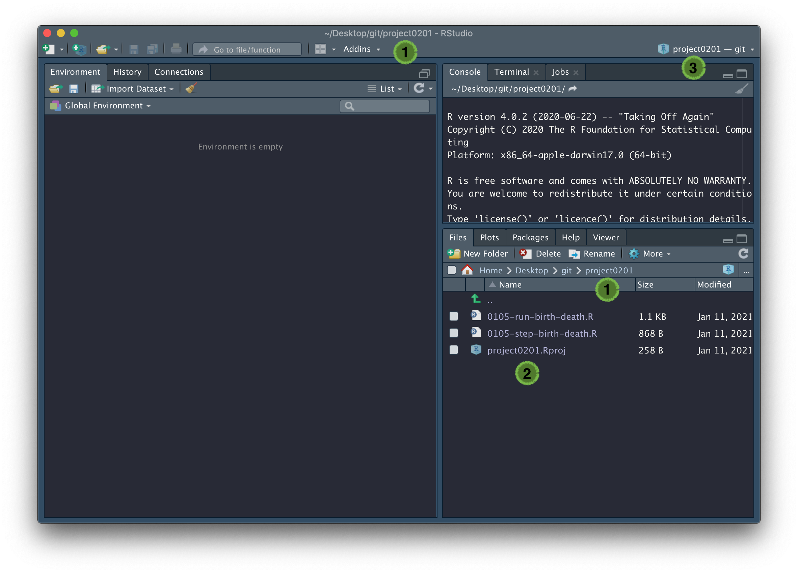

```{r setup, include=FALSE}
library(learnr)

knitr::opts_chunk$set(error = TRUE)
options(knitr.kable.NA = '')

set.seed(123)
```

## Overview

*In this practical we will look at RStudio projects as a means to organise* 
*your workflow.*

## Background

For more information, follow this [link](https://support.rstudio.com/hc/en-us/articles/200526207-Using-Projects).

## Tasks

We have written a function that will generate an RStudio project for you to 
look at. In the following example, we have set 
<span style="color: #de77ae;">~/Desktop/git</span> as our working directory
(this is where we keep all of our projects) and run `dummy_project()`, without 
any arguments. 

A new instance of RStudio should open:

```{r echo = FALSE, fig.align = "center", out.width = "100%"}

```

You should find that (1) your working directory is now 
<span style="color: #de77ae;">project0201</span>, (2) inside this directory
are three files, and (3) an RStudio project has been set up, called 
<span style="color: #de77ae;">project0201</span>. Of the three files, two 
should be familiar to you - the script and step function from 
Practical 1-5. The third file, 
<span style="color: #de77ae;">project0201.Rproj</span>, is an RStudio project
file, which is used to make this directory an RStudio project, and can be used 
as a shortcut for opening this project from your filesystem.

Now.. let's make a new RStudio project. In RStudio, click
<span style="color: #de77ae;">File > New project > New Directory > Empty
Project</span>, and then choose a location and a name for the project. You 
should notice that (1) your working directory has changed, (2) inside of this 
directory there is only one file, an Rproj file, and (3) an RStudio project has 
been set up. If you click on the name of your new project in the top right
corner of RStudio, you should see (4) a list of recently opened projects.

```{r echo = FALSE, fig.align = "center", out.width = "100%"}
knitr::include_graphics('images/new_project.png')
```

Click on <span style="color: #de77ae;">project0201</span> to reopen the original
project and you should find that your working directory has changed back to 
<span style="color: #de77ae;">project0201</span>, and all your files are there
where you left them. This is an easy way to organise your workflow and quickly
switch between projects.
