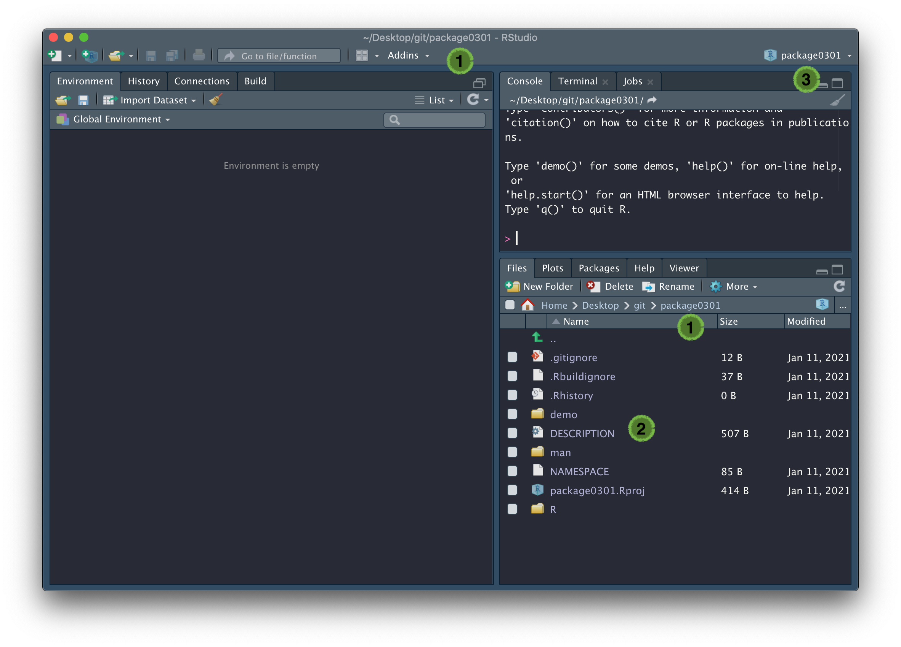

```{r setup, include=FALSE}
library(learnr)

knitr::opts_chunk$set(error = TRUE)
options(knitr.kable.NA = '')

set.seed(123)
```

## Overview

*In this practical we will learn how to create an R package.*

## Background

For more information, follow this [link](https://r-pkgs.org).

## Tasks

We have written a function that will generate an R package for you to 
look at. In the following example, we have set 
<span style="color: #de77ae;">~/Desktop/git</span> as our working directory
(this is where we keep all of our projects) and run 
`dummy_package("githubusername")`, replacing `githubusername` with your actual 
GitHub username. 

A new instance of RStudio should open:

```{r echo = FALSE, fig.align = "center", out.width = "100%"}

```

You should find that (1) your working directory is now 
<span style="color: #de77ae;">githubusername</span>, (2) inside this directory
are a number of files and directories:

* <span style="color: #de77ae;">.gitignore</span>: contains regular
expressions that should be ignored by Git, more info
[here](https://www.pluralsight.com/guides/how-to-use-gitignore-file)
* <span style="color: #de77ae;">.Rbuildignore</span>: contains regular
expressions that should be ignored by R CMD check / when building the package 
from source, more info
[here](https://r-pkgs.org/package-structure-state.html#rbuildignore)
* <span style="color: #de77ae;">.Rhistory</span>: contains R command history, 
accessed by pressing the up key in the Console
* <span style="color: #de77ae;">demo/</span>: contains R demo files, more info
[here](https://r-pkgs.org/misc.html#demo) (which we've populated with 
<span style="color: #de77ae;">d0301_run_birth_death.R</span>, the
script from Practical 1-5)
* <span style="color: #de77ae;">DESCRIPTION</span>: contains metadata about 
your package, more info [here](https://r-pkgs.org/description.html)
* <span style="color: #de77ae;">man/</span>: contains code used to generate 
documentation when the package is built (don't edit these files), more info 
[here](https://r-pkgs.org/man.html#man-workflow)
* <span style="color: #de77ae;">NAMESPACE</span>: contains the names of 
imported and exported functions (don't edit this file), more info
[here](https://r-pkgs.org/namespace.html#namespace)
* <span style="color: #de77ae;">githubusername.Rproj</span>: an RStudio project 
file, which is used to make this directory an RStudio project, and can be used 
as a shortcut for opening this project from your filesystem, more info 
[here](https://support.rstudio.com/hc/en-us/articles/200526207-Using-Projects)
* <span style="color: #de77ae;">R/</span>: contains code used to generate 
functions when the package is built, more info (which we've populated with 
<span style="color: #de77ae;">step_deterministic_birth_death.R</span>, the
step function from Practical 1-5)
[here](https://r-pkgs.org/r.html#code-organising)

and (3) an RStudio project has been set up, called 
<span style="color: #de77ae;">githubusername</span>. Feel free to explore these 
files and make sure you have a good grasp of what they do.

To install this package on your machine, make sure you're in the root directory 
(in this case, <span style="color: #de77ae;">~Desktop/git/githubusername/</span>) 
and run:

```{r, eval = FALSE}
devtools::install()
```

Note that `devtools::` is equivant to calling `library()` on `devtools`, so if 
you've already done that, you can just call `install()` directly.

### Demo

Try running the demo:

```{r eval = FALSE}
demo(topic = "d0301_run_birth_death", package = "githubusername")
```

As you can see in <span style="color: #de77ae;">demo/d0301_run_birth_death.R</span>, 
this is just a standard script. Any script in the
<span style="color: #de77ae;">demo</span> directory that has been installed as part of a 
package can be run using `demo()`. Calling `demo(package = "githubusername")` lists
all of the demos installed as part of the {githubusername} package. 

Note the <span style="color: #de77ae;">demo/00Index</span> file, which is lists 
each demo alongside a description, on a single line. When adding a new entry, 
remember to put three spaces between the demo name and its description or you 
won't see it in the demo list.

When you add your own demos, you need to run `devtools::install()` to 
permanently install them as part of your package.

### Package documentation

Look at the package documentation by using the `help()` function, or running:

```{r eval = FALSE}
library(githubusername) 
?githubusername
```

This documentation was generated from 
<span style="color: #de77ae;">R/githubusername-package</span>. Open this file
and compare its contents with the documentation generated in RStudio. 
Go ahead and edit the `@author` field. This is your package now.

Remember that any changes you make to the package documentation won't yet be 
visible. You need to run `devtools::install()` to permanently install them as 
part of your package.

Note that if you scroll to the bottom of the help function and click on 
<span style="color: #de77ae;">Index</span> you'll get a list of functions 
exported by this package. 

### Function documentation

Look at the help file for `step_deterministic_birth_death.R()` and compare this
to <span style="color: #de77ae;">R/step_deterministic_birth_death.R</span>, 
which gives you a simple example of how functions are documented. 

When you add your own function to a package, after having written the 
{Roxygen2} comments, you should run `devtools::document()` to generate the 
<span style="color: #de77ae;">man/</span> files and edit the 
<span style="color: #de77ae;">NAMESPACE</span>. You should then run 
`devtools::install()` to permanently install them as part 
of your package.

### Package metadata

Open the <span style="color: #de77ae;">DESCRIPTION</span> file. This file is 
used to record package dependencies. We've added a dependency on {RPiR} so you
can see how to add one. Three things are required:

* Add an entry in the <span style="color: #de77ae;">Imports</span> field of the
DESCRIPTION file
* Add an `@import` in the 
<span style="color: #de77ae;">githubusername-package</span> file
* Run `devtools::document()` to populate the 
<span style="color: #de77ae;">NAMESPACE</span> file (which you should never 
edit by hand)

In this particular case, {RPiR} is not available on CRAN, so we've had to 
note its location in the 


As well as recording dependencies, the 
<span style="color: #de77ae;">DESCRIPTION</span> file contains various metadata
such as the package <span style="color: #de77ae;">Title</span>, 
<span style="color: #de77ae;">Authors@R</span>, and
<span style="color: #de77ae;">Description</span>. Fill those in now.

Whenever you make a change to your package, you should try to get into the 
habit of changing the version number. This is important because it allows
you to keep track of which version of the code is being used for a 
particular analysis. The format is usually `major.minor.patch`, see
[here](https://semver.org) for more details. 

After making edits to the <span style="color: #de77ae;">DESCRIPTION</span> 
file, change the <span style="color: #de77ae;">Version</span> number to `0.1.0`.

Then run `devtools::install()` to permanently install these changes as part of 
your package.
