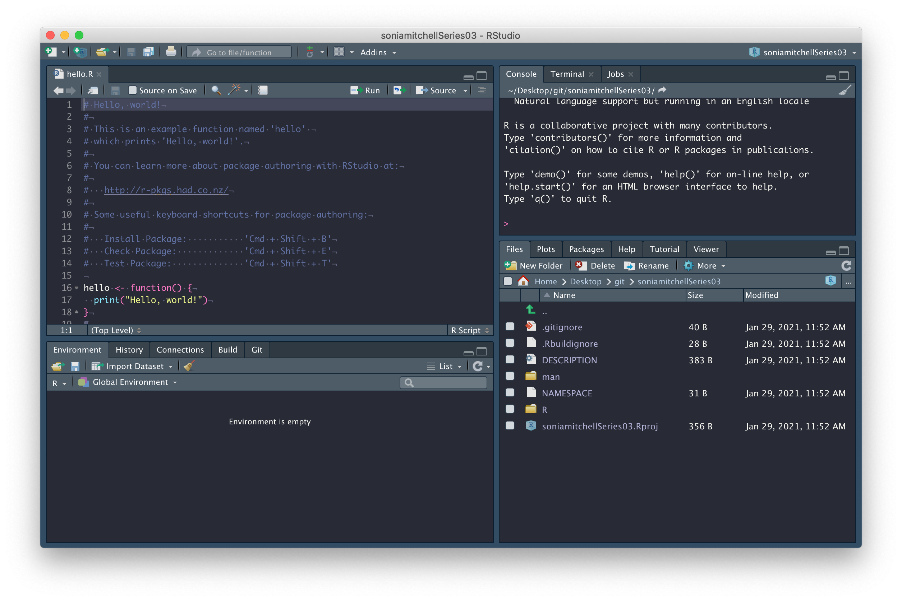
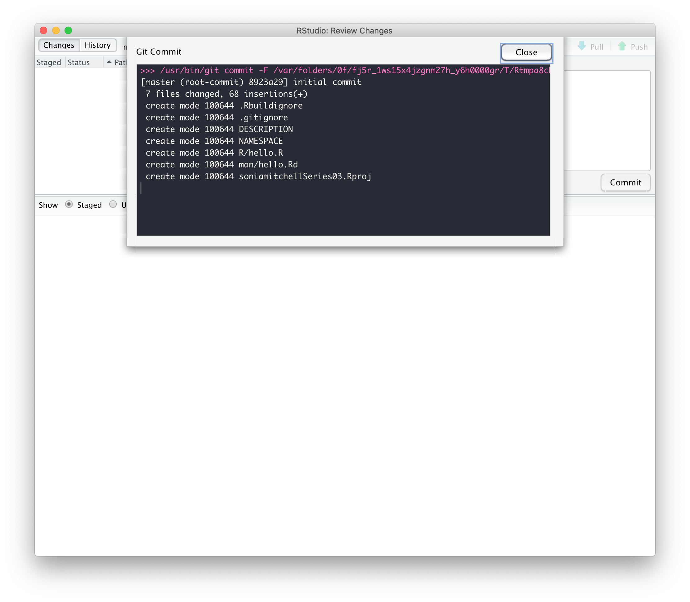
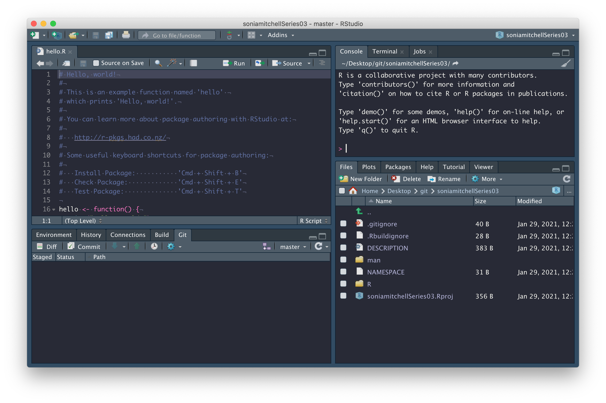
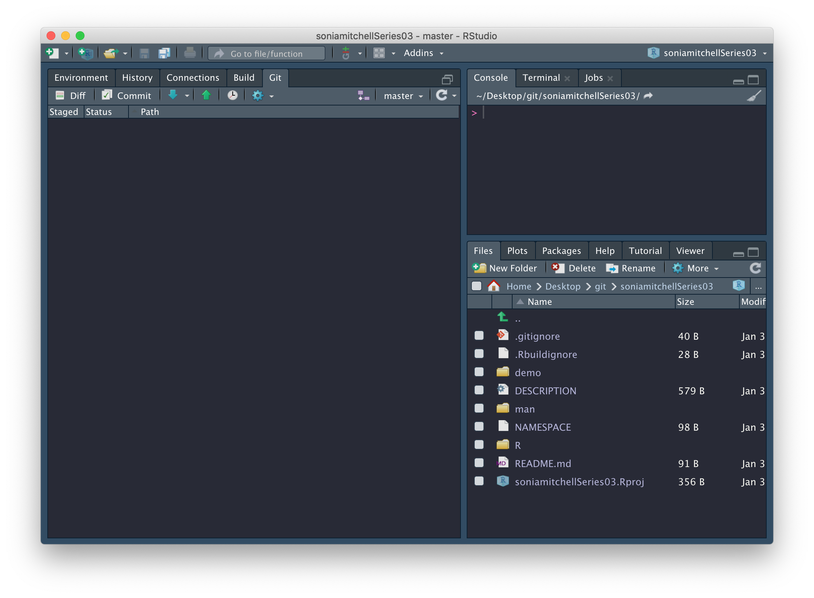

```{r setup, include=FALSE}
library(learnr)

knitr::opts_chunk$set(error = TRUE)
options(knitr.kable.NA = '')

set.seed(123)
```

## Overview

*In this practical we will learn how to create an R package. There is much more
information on R packages in [this book](https://r-pkgs.org).*

## Create a package

We're now going to create an R package, in RStudio. To do this, click
<span style="color: #de77ae;">File > New project... > New Directory > R Package</span>. 
Name the package `githubusernameSeries03` (replacing `githubusername` with your
actual GitHub username), check the box next to 
<span style="color: #de77ae;">Create a git repository</span> (and next to
<span style="color: #de77ae;">Open in new session</span> if you are running this
practical in RStudio and don't want it to close), then click on
<span style="color: #de77ae;">Create Project</span>.

```{r, echo = FALSE, fig.align = "center", out.width = "100%"}
knitr::include_graphics('images/1.png')
```

You should find that (1) a new RStudio project has been created called 
<span style="color: #de77ae;">githubusernameSeries03</span>, (2) your working
directory is now <span style="color: #de77ae;">githubusernameSeries03</span>, 
and (3) inside this directory are a number of files and directories:

```{r, echo = FALSE, fig.align = "center", out.width = "100%"}

```

We'll explore some of these files in due course. In the mean time, 
<span style="color: #de77ae;">commit</span> all of the files with a nice
descriptive comment.

```{r, echo = FALSE, fig.align = "center", out.width = "100%"}
knitr::include_graphics('images/3.png')
```

We've changed 7 files and made 68 insertions.

```{r, echo = FALSE, fig.align = "center", out.width = "100%"}

```

But we can't push! Oh no! The little green 
<span style="color: #de77ae;">Push</span> button is dull and lifeless.

```{r, echo = FALSE, fig.align = "center", out.width = "100%"}

```

First close that <span style="color: #de77ae;">hello.R</span> tab. We don't need
it, but it was automatically generated by `usethis::create_package()` (which was
called by RStudio when you selected
<span style="color: #de77ae;">File > New project... > New Directory > R Package</span>).

Now, we need to set up a GitHub repository and while there are a number of 
ways to do this, the easiest way to connect an existing project to GitHub is by 
running this:

```{r, eval = FALSE}
usethis::use_github(organisation = "IBAHCM", private = TRUE)
```

This process will automatically edit your 
<span style="color: #de77ae;">DESCRIPTION</span> file and ask whether
it's OK to commit these changes, so just say yes, and your GitHub
repository should open automatically in a window in your browser. 

We don't have a README yet, so click 
<span style="color: #de77ae;">Add a README</span> and type something nice in 
your README file (in your browser), then scroll down and 
<span style="color: #de77ae;">Commit new file</span>. Your GitHub repository 
should now look something like this:

```{r, echo = FALSE, fig.align = "center", out.width = "100%"}
knitr::include_graphics('images/6.png')
```

and RStudio should look like this:

```{r, echo = FALSE, fig.align = "center", out.width = "100%"}
knitr::include_graphics('images/7.png')
```

Note the little green <span style="color: #de77ae;">Push</span> arrow is now
vibrant and clickable because we're connected to GitHub. Which reminds me, 
there's still one more thing to do. We need to figure out how to pull that 
<span style="color: #de77ae;">README.md</span> file from GitHub to our computer. 
We can do this by clicking on the blue <span style="color: #de77ae;">Pull</span> 
arrow. When you do this, you should see that the 
<span style="color: #de77ae;">README.md</span> file has appeared in your working
directory, with contents matching what you wrote on GitHub.

```{r, echo = FALSE, fig.align = "center", out.width = "100%"}
knitr::include_graphics('images/8.png')
```

Now we're going to do a few things to customise your package. To fast forward
through these steps run `RPiR::populate_package()`. There are some deletions
(of example code, for instance) as well as additions (of code from the first
practical series). Now push all of the changes to GitHub.

## Package structure

We're ready now to see what this package does. So first, we need to install it
on your machine by running:

```{r, eval = FALSE}
devtools::install()
```

Note that the brackets are empty. To understand what's happening here, run
`?install` (you may need to `library(devtools)` first) and look at the 
arguments list. Under <span style="color: #de77ae;">Usage</span>, you can see
that every argument has a listed default value:
```
install(
  pkg = ".",
  reload = TRUE,
  quick = FALSE,
  build = !quick,
  args = getOption("devtools.install.args"),
  quiet = FALSE,
  dependencies = NA,
  upgrade = "ask",
  build_vignettes = FALSE,
  keep_source = getOption("keep.source.pkgs"),
  force = FALSE,
  ...
)
```

The default option for the `pkg` argument is `"."`, which corresponds 
to the current working directory. So, you don't need to specify a file path if 
you're in the working directory of your package (which you are).

>Also note that `devtools::` tells R to look for the `install()` function 
inside the `devtools` package. It is equivalent to calling `library(devtools)` 
and then just calling `install()` directly.

At this point your RStudio session should look something like this:

```{r, echo = FALSE, fig.align = "center", out.width = "100%"}

```

and you should have the following files in your working directory:

* <span style="color: #de77ae;">.gitignore</span>: contains regular
expressions that should be ignored by Git, more info
[here](https://www.pluralsight.com/guides/how-to-use-gitignore-file)
* <span style="color: #de77ae;">.Rbuildignore</span>: contains regular
expressions that should be ignored by R CMD check / when building the package 
from source, more info
[here](https://r-pkgs.org/package-structure-state.html#rbuildignore)
* <span style="color: #de77ae;">demo/</span>: contains R demo files, more info
[here](https://r-pkgs.org/misc.html#demo) (which we've populated with 
<span style="color: #de77ae;">d0105_run_birth_death.R</span>, the
script from Practical 1-5)
* <span style="color: #de77ae;">DESCRIPTION</span>: contains metadata about 
your package, more info [here](https://r-pkgs.org/description.html)
* <span style="color: #de77ae;">man/</span>: contains code used to generate 
documentation when the package is built (don't edit these files, this process 
will be automated), more info [here](https://r-pkgs.org/man.html#man-workflow)
* <span style="color: #de77ae;">NAMESPACE</span>: contains the names of 
imported and exported functions (don't edit this file either), more info
[here](https://r-pkgs.org/namespace.html#namespace)
* <span style="color: #de77ae;">R/</span>: contains code used to generate 
functions when the package is built (which we've populated with 
<span style="color: #de77ae;">step_deterministic_birth_death.R</span>, the step function from
Practical 1-5), more info [here](https://r-pkgs.org/r.html#code-organising)
* <span style="color: #de77ae;">README.md</span>: contains markdown used to 
generate your GitHub repository readme page, more info 
[here](https://docs.github.com/en/github/creating-cloning-and-archiving-repositories/about-readmes)
* <span style="color: #de77ae;">githubusername.Rproj</span>: an RStudio project 
file, which is used to make this directory an RStudio project, and can be used 
as a shortcut for opening this project from your filesystem, more info 
[here](https://support.rstudio.com/hc/en-us/articles/200526207-Using-Projects)

Feel free to explore these files and make sure you have a good grasp of what 
they do.

### Package metadata and dependencies

Open the <span style="color: #de77ae;">DESCRIPTION</span> file. It should look
something like this:

```
Package: soniamitchellSeries03
Type: Package
Title: What the Package Does (Title Case)
Version: 0.1.0
Author: Who wrote it
Maintainer: The package maintainer <yourself@somewhere.net>
Description: More about what it does (maybe more than one line)
Use four spaces when indenting paragraphs within the Description.
License: What license is it under?
Encoding: UTF-8
LazyData: true
URL: https://github.com/IBAHCM/soniamitchellSeries03
BugReports: https://github.com/IBAHCM/soniamitchellSeries03/issues
Imports: 
RPiR (>= 0.56.0),
Remotes: 
IBAHCM/RPiR
RoxygenNote: 7.1.1
```

This file is used to record package dependencies (that is, other packages that 
your package needs to work). Most typically, package *y* will be a dependency 
of package *x* if the functions in package *y* are being used by the functions 
in package *x*. In which case you would need to make it explicit within the 
functions of package *x* where the dependencies are (we're not doing this just
yet so don't worry). See
[here](https://ibahcm.github.io/RPiR/articles/pages/packages_guide.html#add-dependencies) 
for details.

However, we do use the `RPiR` package in our demo, so we've added a dependency 
on `RPiR` for you. This was done by:

1. Adding an entry in the `Imports` field of the 
   <span style="color: #de77ae;">DESCRIPTION</span> file, *i.e.*
   ```{r, eval = FALSE}
   Imports: 
   RPiR
   ```
   
   In this particular case, the `RPiR` package is not available on CRAN, so 
   we've had to note its location in the `Remotes` field as well as the 
   `Imports` field:
   ```{r, eval = FALSE}
   Remotes: 
    IBAHCM/RPiR
   ```
   
2. We then added an `@import` tag in the 
   <span style="color: #de77ae;">githubusername-package.R</span> file (located 
   in the <span style="color: #de77ae;">R</span> directory):
   ```{r, eval = FALSE}
   #' @import RPiR
   ```
   
3. Finally, we used `devtools::document()` to populate the 
   <span style="color: #de77ae;">NAMESPACE</span> file (which you should never 
   edit by hand).

As well as recording dependencies, the 
<span style="color: #de77ae;">DESCRIPTION</span> file contains various metadata
such as the package `Title`, `Author`, and `Description`. Fill those in now.

Note that, whenever you make a change to your package, you should try to get 
into the habit of changing the version number. This is important because it
allows you to keep track of which version of the code is being used for a 
particular analysis. The format is usually **major.minor.patch**, more info
[here](https://semver.org). After making edits to the 
<span style="color: #de77ae;">DESCRIPTION</span> 
file, change the <span style="color: #de77ae;">Version</span> number to `0.1.0`.

Then run `devtools::install()` to permanently install these changes as part of 
your package.

### Package documentation

Look at the package documentation by using the `help()` function:

```{r, eval = FALSE}
help(package = githubusernameSeries03)
```

or `?`:

```{r, eval = FALSE}
library(githubusernameSeries03)
?githubusernameSeries03
```

This documentation was generated from 
<span style="color: #de77ae;">R/githubusernameSeries03-package.R</span>, which 
we've written for you using roxygen comments (more information can be found 
[here](https://r-pkgs.org/man.html#man-packages)). Open this file and compare 
its contents with the documentation generated in
RStudio. Also note that if you scroll to the bottom of the help function and
click on <span style="color: #de77ae;">Index</span> you'll get a list of
functions exported by this package, which is useful if you're searching for 
specific functionality. 

Go ahead and edit the `@author` field in 
<span style="color: #de77ae;">R/githubusernameSeries03-package.R</span>. Note 
that these changes are not yet visible in the package documentation (in the 
the `Author(s)` section of the package help file). You need to run 
`devtools::document()` to recompile the documentation and `devtools::install()` 
to permanently install it as part of your package.

### Demo

Use the <span style="color: #de77ae;">Files</span> tab to navigate to the 
<span style="color: #de77ae;">demo</span> directory. This is where the demos 
live. Open the <span style="color: #de77ae;">00Index</span> and
<span style="color: #de77ae;">d0105_run_birth_death.R</span> files as new 
tabs. You can see that 
<span style="color: #de77ae;">d0105_run_birth_death.R</span> is a standard R
script, similar to those you produced in practical series 2. 

> The important thing to note here is that you no longer need to `source()`
files, since any functions you need to use can be installed as part of the 
package.

Try running the demo:

```{r, eval = FALSE}
demo(topic = "d0105_run_birth_death", package = "githubusernameSeries03")
```

To list all of the demos installed as part of the `githubusername` package, 
run:

```{r, eval = FALSE}
demo(package = "githubusernameSeries03")
```

The descriptions in this listing are generated from the 
<span style="color: #de77ae;">demo/00Index</span> file, which lists 
each demo alongside a description, on a single line. When adding a new entry, 
remember to put three spaces between the demo name and its description or you 
won't see it in the demo list. Note that any script in the
<span style="color: #de77ae;">demo</span> directory can be run using `demo()`, after the package is installed. So don't forget when you add your own demos, 
you need to run `devtools::install()` to permanently install them as part of 
your package.

### Function documentation

The functions themselves are stored in the 
<span style="color: #de77ae;">R</span> directory. Navigate back to the root of 
your package, then into the 
<span style="color: #de77ae;">R</span> directory, and open the 
<span style="color: #de77ae;">step_deterministic_birth_death.R</span> file in a 
new tab. The function itself should be recognizable, but the documentation 
is written using roxygen comments and tags. More info
[here](https://r-pkgs.org/man.html#roxygen-comments).

Recall that your package documentation was written in a similar format in
<span style="color: #de77ae;">R/githubusernameSeries03-package.R</span>. 

>The <span style="color: #de77ae;">R</span> directory should only contain 
function and your <span style="color: #de77ae;">packagename-package.R</span> 
file. If you put any scripts or other random files in here, your package will 
break.

```{r, eval = FALSE}
#' step_deterministic_birth_death
#'
#' Run one step of a simple deterministic exponential birth-death model
#'
#' @param latest a data.frame containing the latest population count
#' (column is 'count')
#' @param birth.rate the birth rate
#' @param death.rate the death rate
#'
#' @return Returns a data.frame containing the updated population
#' @export
#'
step_deterministic_birth_death <- function(latest, birth.rate, death.rate) {
  # Calculate population changes
  new.births <- birth.rate * latest$count
  new.deaths <- death.rate * latest$count
  next.count <- latest$count + new.births - new.deaths

  # Return data frame containing next population count
  data.frame(count = next.count)
}
```

Run `?step_deterministic_birth_death` and compare it to the 
roxygen comments you see in 
<span style="color: #de77ae;">step_deterministic_birth_death.R</span>. 
The first line of comments is the name of your function and will generate the 
<span style="color: #de77ae;">Title</span> when 
you run `?step_deterministic_birth_death`. Note that there's a `@title` tag 
here that you don't need to include since `roxygen2` expects the first line of 
roxygen comments to be a title. The next bit (separated by a blank line) 
is the <span style="color: #de77ae;">Description</span>. Again, there's a 
`@description` tag here, which you don't need to include since `roxygen2` 
expects the description to come after the title. To add descriptors for your
arguments, you need to use the `@param` tag, which uses the format
`@param argument description`. The `@return` tag is used to populate the 
<span style="color: #de77ae;">Value</span> section of the documentation, and 
describes the output of your function. The `@export` tag tells R that 
you want this function to be exported by your package. That means, you want 
people to be able to call it, as opposed to it being an internal function that 
they never see. Finally, I like to add an empty roxygen comment between some of 
the tags and between the documentation and the function itself because I think 
it makes it easier to read, but it's not necessary.

When you add your own function to a package after having written the 
roxygen comments, or when you edit any roxygen comments you should run 
`devtools::document()` to (re)generate the documentation files. These files 
will automatically appear in your <span style="color: #de77ae;">man/</span> 
directory (which will also be generated if it doesn't already exist). In 
addition to this, the <span style="color: #de77ae;">NAMESPACE</span> file will 
automatically be edited when you add a new exportable function. 

>Remember that functions that are not listed in the 
<span style="color: #de77ae;">NAMESPACE</span> won't be exported by your 
package. So as well as adding an `@export` tag to your function documentation, 
you should always run `devtools::document()` to populate the 
<span style="color: #de77ae;">NAMESPACE</span>

You should then run `devtools::install()` to permanently install these changes 
as part of your package.

## Prepare for Practical 3-2

Now that you have some familiarity with the package structure, it's time to 
start adding your own files. During the course of this practical series, you'll
be adding new functions and new demos to this package. What we're going to do
now is add the files you need to start Practical 3-2.

### 1. Add a function

For Practical 3-2 you'll need to add a function called 
<span style="color: #de77ae;">timestep_stochastic_birth_death</span> 
with appropriate documentation. Copy the 
<span style="color: #de77ae;">step_deterministic_birth_death</span> function for 
the time being, renamed of course. You'll be using this as a starting point in 
Practical 3-2.

### 2. Add a demo
Now create a new R script called 
<span style="color: #de77ae;">d0302_stochastic_birth_death.R</span> and save it
in the <span style="color: #de77ae;">demo</span> directory. Copy the contents 
of <span style="color: #de77ae;">d0105_run_birth_death.R</span> into your new
demo. You'll be using this as a starting point in Practical 3-2. 

On line 30, edit the function call so that you're calling 
`timestep_stochastic_birth_death` rather than 
`step_deterministic_birth_death()`, and don't forget to edit the title in the 
documentation.

To add a description of your demo, you need to add a new entry, on 
a new line in the <span style="color: #de77ae;">00Index</span> file.

### 3. Rebuild your package

Now that you've created a new demo and function, you need to run
`devtools::document()` to recompile the documentation. 

Then you need to run `devtools::install()` to permanently install these changes 
as part of your package.

## Check it works

### 1. Check it works for yourself

To check it works: 

1. Run `demo(package = "githubusernameSeries03")` to check your new demo is
   listed;
2. Try running your demo with 
   `demo("d0302_stochastic_birth_death.R", package = "githubusernameSeries03")`;
3. Run `?timestep_stochastic_birth_death` to check your new function has 
   documentation; and
4. Compile an html report from the demo to make sure that the report works too.

Hopefully you've been making regular pushes to GitHub.

Now just like you did in Practical series 2, add an issue to your repository 
and ask the people in your breakout room to check your work.

### 2. Check it works for other people

There are two ways you can check a package:

1. First, just install it! They should just call `install_github()` as you
   would for `RPiR`, and find out what demos are available and run them:
   ```{r, eval = FALSE}
   # Install your colleague's package
   devtools::install_github("IBAHCM/githubusernameSeries03")

   # Find out what demos are available:
   demo(package = "githubusernameSeries03")

   # Run the demos, e.g.:
   demo("d0302_stochastic_birth_death", package = "githubusernameSeries03")
   ```

2. If you have time, then create a new project from their GitHub repository
   (we talked about this in the *Sharing is caring* section of Practical 2-1),
   and make sure that the html reports can be generated when you open the demo
   files and compile them directly.
