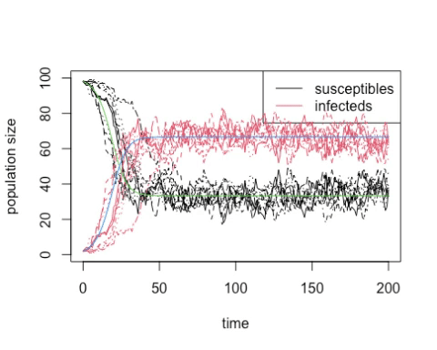

```{r setup, include=FALSE}
library(learnr)

knitr::opts_chunk$set(error = TRUE)
set.seed(123)
```

## Overview

*In this practical we develop and run our first stochastic version of the SIS model.*

## Background

We saw in the previous practicals the impact of including randomness into the
exponential model with births and deaths. Having developed the programming 
framework, it is now time to investigate the impact of randomness in the 
simplest epidemiological model -- the SIS model.

## Tasks

In this practical we will write a stochastic version of the SIS model. You have 
been provided with `run_simulation()` in the `RPiR` package, which allows some 
extra functionality over `run_simple()` to run simulations using the older
deterministic models. Pay attention in particular to writing 
the function, where the most important changes need to be made.

### R/timestep_stochastic_birth_death.R

The function should be defined like this:

```{r, eval = FALSE}
timestep_stochastic_SIS <- function(latest, transmission.rate, recovery.rate, timestep) {
  # -- some code --
}
```

It proceeds much as before with the deterministic SIS model, calculating the 
effective beta and sigma at this timestep, and then as with the stochastic birth 
death model, you need to work out whether the individual rate of infection or 
recovery per timestep is greater than 1, in which case it cannot be used as a
probability. In this case, the actual individual infection rate is 
`effective.transmission.rate` $\times \frac{I}{N}$ and the individual recovery 
rate is `effective.recovery.rate`.

Now for the key step... you need to sample from the binomial distribution (as 
described in the lecture) to determine the number of new infecteds and 
susceptibles using `rbinom()` with the probability of "success" set to the
individual rates detailed above. Then update the populations, and if there are
no infecteds left, then the epidemic is over, so set `is.finished` to `TRUE.` 

```{r, eval = FALSE}
is.finished <- next.infecteds == 0
```

Then append the new data to the data frame as usual, and return a list with the
updated population data frame and a variable that tells us whether we are 
finished or not.

```{r, eval = FALSE}
list(updated.pop = next.population, end.experiment = is.finished)
```

### demo/d0304_run_SIS.R

You need to write a new demo, <span style="color: #de77ae;">d0304_run_SIS</span>, and 
a new function, `timestep_stochastic_SIS()`, adapted from the
<span style="color: #de77ae;">d0303_run_birth_death</span> demo and
`timestep_stochastic_birth_death()` to handle the SIS model rather than 
exponential growth. 

## Running the code / Report

When you are happy with the structure of the code, run it a few times with the 
same parameter values and observe the variability. Try changing beta (which will
change $R_0$) and the initial number of infecteds and see how the likelihood of
early extinction changes. Notice that we can automate overlaying multiple 
simulations on the same graph:

```{r tenloop-setup}
library(RPiR)

timestep_stochastic_SIS <- function(latest, transmission.rate, recovery.rate, 
                                    timestep = 1) {
  ## Calculate total size of population, effective beta and sigma
  pop.size <- latest$susceptibles + latest$infecteds
  effective.transmission.rate <- transmission.rate * timestep
  effective.recovery.rate <- recovery.rate * timestep
  if ((effective.transmission.rate * latest$infecteds / pop.size >= 1) ||
        (effective.recovery.rate >= 1))
    stop("Effective rate too high, timestep must be too big")
  
  ## Calculate changes to populations
  new.infecteds <- rbinom(1, latest$susceptibles,
                          effective.transmission.rate * latest$infecteds / pop.size)
  new.susceptibles <- rbinom(1, latest$infecteds, effective.recovery.rate) 
  next.susceptibles <- latest$susceptibles + new.susceptibles - new.infecteds
  next.infecteds <- latest$infecteds - new.susceptibles + new.infecteds
  
  ## Is the experiment over?
  is.finished <- (next.infecteds == 0)
  
  ## Create new row of populations data frame and return list
  next.population <- data.frame(time = latest$time + timestep,
                                susceptibles = next.susceptibles,
                                infecteds = next.infecteds)
  list(updated.pop = next.population, end.experiment = is.finished)
}

# Set up initial populations
pop.size <- 100
initial.infecteds <- 2
initial.susceptibles <- pop.size - initial.infecteds

# Transmission and recovery rates
ecoli.trans <- 0.3
ecoli.recov <- 0.1

# Simulation times
start.time <- 0
end.time <- 200
this.timestep <- 1

# And initial population sizes
initial.populations <- data.frame(time = start.time,
                                  susceptibles = initial.susceptibles,
                                  infecteds = initial.infecteds)
```

```{r tenloop, exercise = TRUE, exercise.lines = 21}
# We want a total of 10 plots
first.graph <- TRUE 
for (loop in 1:10) {
  final.populations <- run_simulation(timestep_stochastic_SIS,
                                      initial.populations,
                                      end.time,
                                      transmission.rate = ecoli.trans, 
                                      recovery.rate = ecoli.recov, 
                                      timestep = this.timestep)
  # First time, make a new plot, afterwards just draw lines
  if (first.graph) {
    plot_populations(final.populations,
                     new.graph = TRUE, 
                     col = c(susceptibles = "green", infecteds = "red"))
    first.graph <- FALSE 
  } else {
    plot_populations(final.populations,
                     new.graph = FALSE,
                     col = c(susceptibles = "green", infecteds = "red"))
  }
}
```

You could do all ten plots in a single loop by setting `new.graph` appropriately
- by starting with `TRUE` and them changing it to `FALSE` as I did in the slides,
or changing it depending on what value `loop` has, for instance.  

You should also overlay the deterministic results from Practical 2-4. 
`run_simulation()` will now work with this as well since it automatically 
detects that it just returns a dataframe, and behaves appropriately:

```{r, eval = FALSE}
final.populations <- run_simulation(timestep_deterministic_SIS, 
                                    initial.populations,
                                    end.time,
                                    transmission.rate = ecoli.trans,
                                    recovery.rate = ecoli.recov, 
                                    timestep = working.timestep)
```

Here's an example of the kinds of outputs you might see:

<center></center>

This example was generated using:

```{r, eval = FALSE}
pop.size <- 100
initial.infecteds <- 2
ecoli.trans <- 0.3
ecoli.recov <- 0.1
```

Try changing 
the total population size and determine the impact on the observed variability.
Demonstrates the variability in the results of the stochastic model in your demo.

## Check it works

As with previous exercises, you need to check that everything works correctly --
that the package installs, and the demos and help files work and you can
generate reports from the demos -- and then we want you to get a couple of other
people in your breakout room to check your code and make sure it works for them,
and we want you to check other people's code too. We describe how to do this for
packages in GitHub in Practical 3-1 (also under *Check it works*) if you're
uncertain.

*Remember, interacting like this through GitHub to help each other will count as
most of your engagement marks for the course.*
