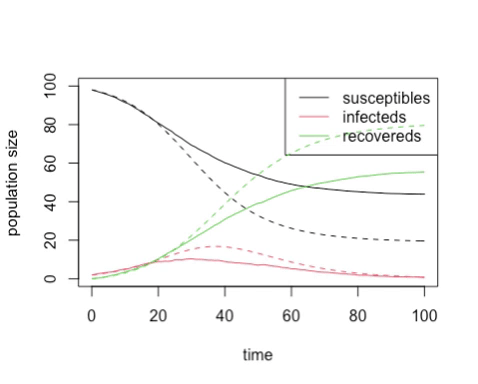

```{r setup, include=FALSE}
library(learnr)

knitr::opts_chunk$set(error = TRUE)
set.seed(123)
```

## Overview

*In this practical, we want to compare the mean stochastic result with the
 deterministic result for the SIR model.*


## Background

We know that the outbreak can die out by chance before it gets going in the 
stochastic model, and it's not clear that the deterministic model takes this 
into account, so we want to directly compare the two and check. Also, since the
stochastic model can finish before the end time of the simulation, we need a 
small amendment to allow us to average across "incomplete" simulations.

## Tasks

Adapt the code from <span style="color: #de77ae;">d0305_run_SIR</span> to make a 
new demo, <span style="color: #de77ae;">0306_mean_SIR</span>. Try just 
adding the stochastic simulations from 3-5 together by adding the 
`final.populations` data frames together, and then dividing by the number of 
runs. Unless you are lucky (in which case run it again!), you will probably find 
the adding up fails because the data frames are different lengths. This is 
because some (all) simulations finished early because the outbreak died out.

Go to the <span style="color: #1697C0;">IBAHCM/RPiR</span> package on 
github and look at the `cleanup_timesteps()` function (which actually calls 
`cleanup_times()` -- both functions are in
<span style="color: #1697C0;">R/cleanup.R</span>). This function takes a
population data frame and tidies it up in various ways. For our purposes, we can
use it to extend a data frame to the correct end time, by repeating the 
population sizes when the outbreak finished over and over again until we have
reached the correct end time. We just call it as follows:

```{r, eval = FALSE}
final.populations <- cleanup_timesteps(final.populations,
                                       timestep = this.timestep,
                                       end.time = end.time)
```

Once we have done this, we can calculate the averages by just adding the 
populations from each stochastic run to each other and dividing by the number of
runs. Plot this averaged stochastic result against the deterministic result as
in Practical 2-5. **To do this, you will also have to copy the function for the
deterministic SIR model into this package and turn it into a function in the
package.** *The function will need documentation, but otherwise it work with
`run_simulation()` without changes, as (unlike `run_simple()`) it can cope with
model functions that return just data frames, or functions that return a list
like your new stochastic functions.*

You should get something like this:

<center></center>

particularly if you used these parameters:

```{r, eval = FALSE}
initial.infecteds <- 2
initial.recovereds <- 0
sir.transmission.rate <- 0.2
sir.recovery.rate <- 0.1
```

## Running the code

Try running the code with an $R_0$ of 2, and a variety of different numbers of 
initially infected animals. You should find that as we start with more initially
infected animals, the chance of the outbreak not taking off drops, and the 
stochastic model looks more and more like the deterministic model.

## The Science

This is a real research result! Deterministic models are not capable of 
detecting this possibility of **stochastic extinction**, and this is one of the 
major advantages of stochastic models.

## Report

Write a demo, showing stochastic extinction. Show different results 
for stochastic models and deterministic models for small initial outbreaks and 
low values of $R_0$, but similar results for high $R_0$ / high initial numbers 
of infecteds.

## Check it works

As with previous exercises, you need to check that everything works correctly --
that the package installs, and the demos and help files work and you can
generate reports from the demos -- and then we want you to get a couple of other
people in your breakout room to check your code and make sure it works for them,
and we want you to check other people's code too. We describe how to do this for
packages in GitHub in Practical 3-1 (also under *Check it works*) if you're
uncertain.

*Remember, interacting like this through GitHub to help each other will count as
most of your engagement marks for the course.*
