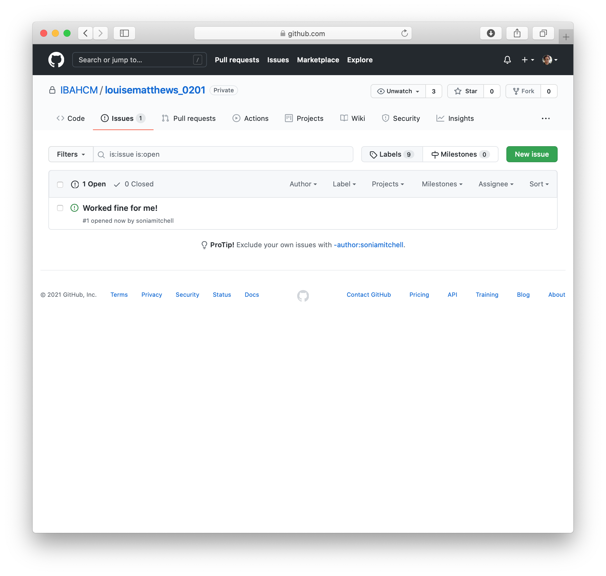

```{r setup, include=FALSE}
library(learnr)
tutorial_options(exercise.reveal_solution = FALSE)
gradethis::gradethis_setup()
 
knitr::opts_chunk$set(error = TRUE)
set.seed(123)
```

## Overview

*In this practical we will look at GitHub and RStudio projects as a means to 
organise your workflow. Furthermore, we will take the code for the models with 
just growth (Practical 1-4) and with births and deaths (Practical 1-5) and make 
a clearer report comparing the two.*

---

Note that from here on out you will be working in RStudio. If you don't still 
have it open, you should be able to open the new project that you created in 
Practical 1-1 using <span style="color: #dd1c77;">File > Open Project in New 
Session...</span> in RStudio or follow the instructions in 1-1 to create 
another new project if you want to do that.

To access course materials, you have two options:

1. If you choose to run the course using `run_practical()`, you should notice a 
   big red stop button in the corner of the 
   <span style="color: #dd1c77;">Console</span> tab. This will prevent you from 
   being able to run anything else in this instance of RStudio. You should 
   therefore open a second instance of RStudio to run your code.
  
2. You can instead access the course materials from a new tab, which will run
   in the background. In RStudio, click 
   <span style="color: #dd1c77;">View > Panes > Pane Layout...</span> then in 
   the <span style="color: #dd1c77;">Files, Plots, Packages, Help, Viewer</span> 
   section, scroll down and check the box next to 
   <span style="color: #dd1c77;">Tutorial</span>. This will give you a tutorial 
   tab from which to access materials. You can then click 
   <span style="color: #dd1c77;">Show in new window</span> (next to the tiny
   icon of a house) to make the window larger. You should be able to run your
   code in the same instance of RStudio without any problems.

## GitHub

First you'll need to create a repository in the IBAHCM organisation on GitHub.
You'll find instructions on how to do this
[here](https://ibahcm.github.io/RPiR/articles/pages/github.html). Note that
you'll need to do this throughout this course, which is why we've kept these 
instructions separate.

After you've done that, back in RStudio, load the `RPiR` package and run the
`practical_series_one()` function. This will populate your working directory --
and therefore your RStudio project -- with the scripts and functions from
Practical Series 1. Remember that the yellow question mark in the 
<span style="color: #dd1c77;">Status</span> column of the 
<span style="color: #dd1c77;">Git</span> tab means that these are not currently 
in your GitHub repository.

```{r echo = FALSE, fig.align = "center", out.width = "100%"}
knitr::include_graphics('images/a.png')
```

So let's push them up to GitHub! Check the boxes next to all of the files, the
scripts, the functions, and invisible `.gitignore` file and even the RStudio
project file. Then click <span style="color: #dd1c77;">Commit</span>.

```{r echo = FALSE, fig.align = "center", out.width = "100%"}
knitr::include_graphics('images/b.png')
```

Write a suitably descriptive message and 
<span style="color: #dd1c77;">Commit</span> the files.

```{r echo = FALSE, fig.align = "center", out.width = "100%"}
knitr::include_graphics('images/c.png')
```

A new window should open with a summary of your actions, stating your commit 
message and telling you that 11 files changed and 513 insertions were made.

```{r echo = FALSE, fig.align = "center", out.width = "100%"}
knitr::include_graphics('images/d.png')
```

Now go to your GitHub repository. Are the files there? What did we forget to 
do? Don't forget that pressing <span style="color: #dd1c77;">Commit</span> 
isn't enough. When you commit your files, you're packaging them up ready to go. 
You still have to <span style="color: #dd1c77;">Push</span> them to GitHub. Do
that now and make sure they appear in your repository.

```{r echo = FALSE, fig.align = "center", out.width = "100%"}
knitr::include_graphics('images/e.png')
```

## A clean start

Sometimes you can find that something you have done before in R can interfere 
with what you are now doing -- though if you've written all of your code 
correctly, then obviously(!) this should never happen. It is useful then
to know that you can clear what is held in R's memory using `rm(list = ls())`. 
This will cause all of the variables and functions in your 
**global environment** to disappear (*e.g.* if you type `human.annual.growth` 
in the R console it should tell you that the object is "not found"). As a 
fundamental rule however:

> you should never hardcode `rm(list = ls())` into any of your scripts and
we recommend that you never use it at all.

It's generally a sign your code isn't written well if it can be affected by
something before it. Instead, you can clear your workspace by clicking the brush
in the <span style="color: #dd1c77;">Environment</span> tab in RStudio (or 
<span style="color: #dd1c77;">Session > Clear Workspace...</span> in the menus). 

However, generally it's easier to Restart R. This is much safer and more final.
You can do it in RStudio via <span style="color: #dd1c77;">Session > 
Restart R</span> in the menus: it is far 
more effective than clearing just the workspace as it resets everything, while 
leaving RStudio itself unaffected. Remember that once you have done this you may 
have to set the working directory to the correct folder, and you will certainly 
have to start running your code again completely from the beginning.

Note that, when you generate a report from the script file, they are always 
generated from a new, clean, version of R. So this is a very important final 
check that all of your code is working correctly -- it's as if 
you did restart R without actually wiping everything in your current R console -
but only if you read it and check it looks right!

The other check we strongly encourage you to do is to check that your function 
does not use any global variables by using `findGlobals()`.

You should also generate a report for any function files you create. If you want 
to, you can put the `findGlobals()` check into this function file (which will
run the check when you generate the report for that file) so it doesn't 
clutter up the main script itself. But this is only useful if you generate a 
report from the function file! To solve this, you can make it so the report will 
fail to generate for that script when global variables are used with the 
following code snippets:

```{r, eval = FALSE}
# Now check that function doesn't have any global variables.
library(codetools)
globals <- findGlobals(step_simple_growth, merge = FALSE)$variables 
if (length(globals) != 0) {
  stop("Function step_simple_growth() may not use global variable(s): ", globals)
}
```

This checks whether `length(globals)` is non-zero, which is to say whether the
`variables` element of what is returned by
`findGlobals(step_simple_growth, merge = FALSE)` is not of length zero, *i.e.* 
whether there are any global variables in the function `step_simple_growth`. 
If there are, then the contents of the curly brackets are run, `stop(...)` 
is called, and the code stops running. In fact, `step_simple_growth` has no 
global variables, so the code block is not run.

## Tasks

In this practical, we are going to demonstrate why it's worth dividing up the
code into separate functions, and indeed separate files. Previously we wrote a
simple growth model, and a model of birth and death. We're now going to use the
two-step functions we created and run both models in a new script that compares 
them. For this final part of Practical 1, we're going to generate a report in 
RStudio using everything we've learned so far.

Remember again that our first model of simple population growth model looks like
this:

$$N(t+1) = N(t) + \lambda \times N(t)$$

The birth and death model is slightly more complex:

$$ N(t+1) = N(t) + b \times N(t) - d \times N(t)$$

In RStudio, open <span style="color: #dd1c77;">0106-report.R</span>. 
This script contains the beginnings of the analysis described above.
At the top of the script we have used `source()` on 
<span style="color: #dd1c77;">0104-step-growth.R</span> and 
<span style="color: #dd1c77;">0105-step-birth-death.R</span> to 
add the `step_deterministic_growth()` and `step_deterministic_birth_death()`
functions to our global environment. To illustrate this, open the 
<span style="color: #dd1c77;">Environment</span> tab in RStudio and make sure 
your workspace is empty. Now run line 12 in 
<span style="color: #dd1c77;">0106-report.R</span>:

```{r, eval = FALSE}
source("0104-step-growth.R")
```

You should see that the `step_deterministic_growth()` function has been added
to your workspace. When we invoke `source()` we are effectively running the 
contents of the file, which is a useful way to preload functions into our 
global environment.

We want to compare the models, so we have written some code that first runs a 
simulation with one model and plots it, and then runs a simulation with the 
other model and plots that as well. Remember that you can plot a second 
(or third, etc.) result on top of a first with commands like:

```{r, eval = FALSE}
plot_populations(population.a, col = "black")
plot_populations(population.b, new.graph = FALSE, col = "red")
```

## Report

For this report, we want something clear and well laid out. You can see
an example of most of the possible formatting options in 
<span style="color: #dd1c77;">example-notebook.R</span>. Use an 
understanding of what you want to describe --
and formatting from the example file or elsewhere -- to break up your script so 
that your code and the results and figures are interspersed with a reasonable
explanation of what is going on.

Your report currently contains:

1. The birth-death model with a single given birth and death rate
2. The simple growth model with the birth rate as the growth rate

Extend your report to include:

3. The simple growth model with minus the death rate as the (negative) growth
   rate
4. The simple growth model with the difference (between the rates in 1) as the 
   growth rate

---

When you try to run your code you should find that the graphs are very likely on
different scales. You can set the y-axis limits of the second graph to the same 
as the first by reading off what they are on the first graph, and then plotting
the second as follows:

```{r, eval = FALSE}
plot_populations(population.df, ylim = c(0, 20000000000))
```

Once you've done this it should be easier to compare the two (by eye at least).

## Sharing is caring

Now we're going to try and share our work. To make it a little more interesting,
edit your `README.md` file. Write a sentence or two about yourself and what you
hope to get out of this course. Commit your changes and push them to GitHub.
Then look at your GitHub repository and make sure you can see your changes. 

To share your work, since you created a private (rather than a public) 
repository, you need to give people permission to see it. So, click on 
<span style="color: #dd1c77;">Settings</span>, 
<span style="color: #dd1c77;">Manage access</span>, then 
<span style="color: #dd1c77;">Invite teams or people</span>.

```{r echo = FALSE, fig.align = "center", out.width = "100%"}
knitr::include_graphics('images/f.png')
```

Find your group members (everyone in your subgroup) using their GitHub 
user names. If you can't find anyone, you may not yet be part of the 
`IBAHCM/rpir` team. Make sure <span style="color: #dd1c77;">Read</span> access 
is selected and click on the big green button to 
<span style="color: #dd1c77;">Add user to this repository</span>.

```{r echo = FALSE, fig.align = "center", out.width = "100%"}
knitr::include_graphics('images/g.png')
```

Likewise, the other members of your team should have given you access to their
repositories. You will likely receive an email notification, but if you don't
you can either search for their repository through the `IBAHCM` organisation, 
or go directly to their URL. For example, if I want to find a repository called 
`louisematthews_0106`, I'd go to https://github.com/IBAHCM/louisematthews_0106. 
Remember to take a look at their GitHub readme, you might learn something new!

Just like before, we're going to clone this repository by clicking on the green
<span style="color: #dd1c77;">Code</span> button and copying the URL 
associated with this repository.

```{r echo = FALSE, fig.align = "center", out.width = "100%"}
knitr::include_graphics('images/j.png')
```

Then, as we did before, go back to RStudio. Go to the 
<span style="color: #dd1c77;">File</span> menu and create a 
<span style="color: #dd1c77;">New Project...</span>, with 
<span style="color: #dd1c77;">Version Control</span>, using 
<span style="color: #dd1c77;">Git</span>. The project should open 
automatically. You should see the name of the project in the title bar as well 
as the project list in the top right corner. Try generating a report from 
<span style="color: #dd1c77;">0106-report.R</span>.

```{r echo = FALSE, fig.align = "center", out.width = "100%"}

```

Hopefully you should generate the report without any problems. Whether you do or 
not, go back to your collaborators GitHub repository and add an issue. Do this 
by clicking on the <span style="color: #dd1c77;">Issues</span> tab and adding a
<span style="color: #dd1c77;">New Issue</span>.

```{r echo = FALSE, fig.align = "center", out.width = "100%"}

```

In the issue you should describe whether or not you were successful, perhaps 
also including a nice encouraging message!

```{r echo = FALSE, fig.align = "center", out.width = "100%"}
knitr::include_graphics('images/m.png')
```

If you click on the <span style="color: #dd1c77;">Issues</span> tab again, 
you'll see a list of issues.

```{r echo = FALSE, fig.align = "center", out.width = "100%"}

```

Now wait a bit for everyone to add their issues to your repository. Once they've
finished, go see what they've written. If any issues need addressed, go ahead and 
address them.
