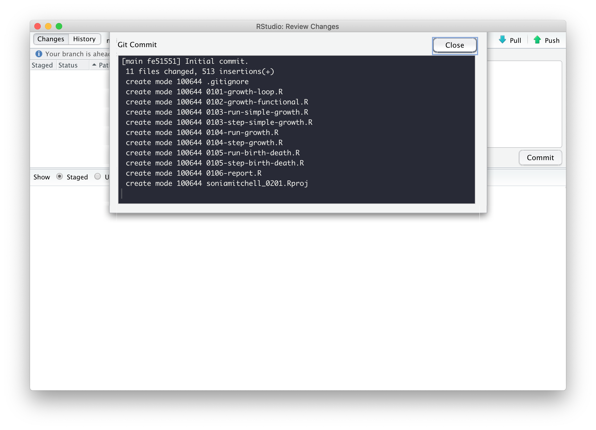
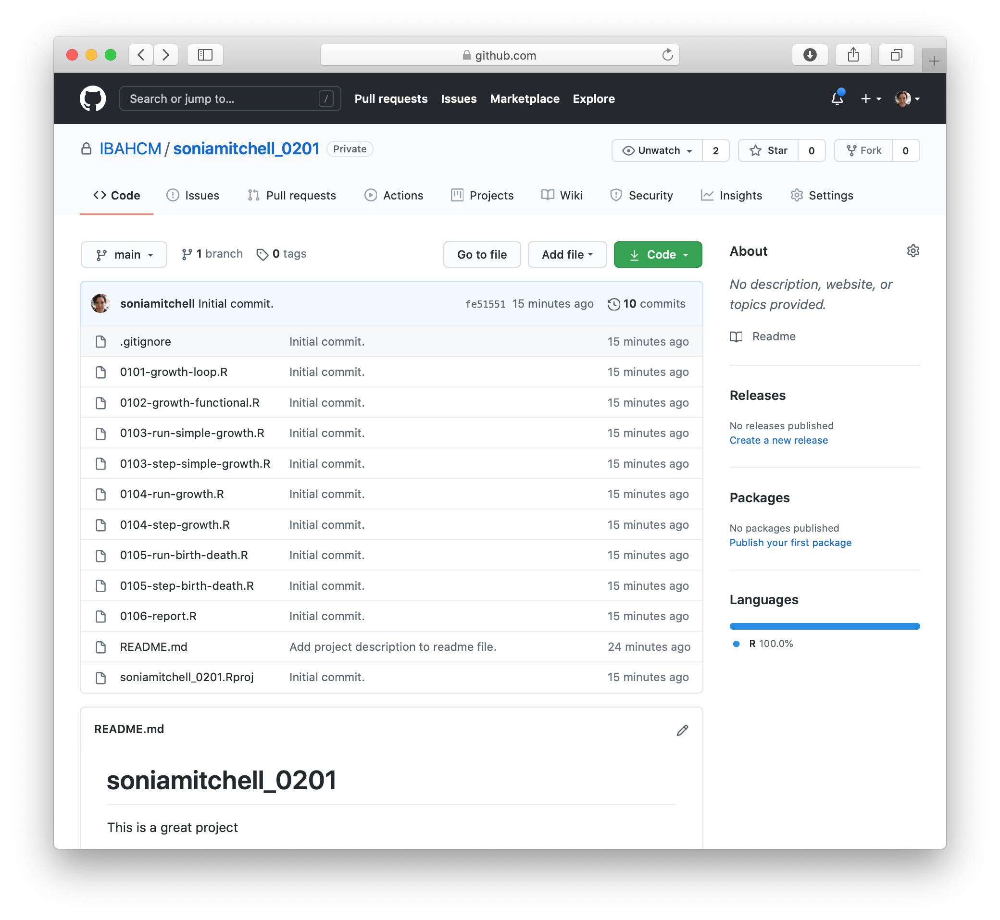

```{r setup, include=FALSE}
library(learnr)
tutorial_options(exercise.reveal_solution = FALSE)
gradethis::gradethis_setup()
 
knitr::opts_chunk$set(error = TRUE)
set.seed(123)
```

## Overview

*In this practical we will look at GitHub and RStudio projects as a means to 
organise your workflow.*

---

Note that from here on out you will be working in RStudio. First, however,
you'll need to create a repository in the SBOHVM organisation on GitHub.

## GitHub

First you'll need to create a repository in the SBOHVM organisation on GitHub.
You'll find instructions on how to do this
[here](https://sbohvm.github.io/RPiR/articles/pages/github.html). Call this
repository `githubusernameSeries01` (obviously use your real GitHub username!). 
Note that you'll need to do this throughout this course, which is why we've kept
these instructions separate.

## RStudio

After you've done that, back in RStudio, create a new project linked to that
repository using the instructions [here](https://sbohvm.github.io/RPiR/articles/pages/rstudio.html).
Load the `RPiR` package and run the
`practical_series_one()` function. This will populate your working directory --
and therefore your RStudio project and git repository -- with the scripts and
functions from Practical Series 1. Remember that the yellow question mark in the 
<span style="color: #dd1c77;">Status</span> column of the 
<span style="color: #dd1c77;">Git</span> tab means that these are not currently 
in your GitHub repository.

```{r echo = FALSE, fig.align = "center", out.width = "100%"}
knitr::include_graphics('images/a.png')
```

So let's push them up to GitHub! Check the boxes next to all of the files, the
scripts, the functions, and invisible `.gitignore` file and even the RStudio
project file. Then click <span style="color: #dd1c77;">Commit</span>.

```{r echo = FALSE, fig.align = "center", out.width = "100%"}

```

Write a suitably descriptive message and 
<span style="color: #dd1c77;">Commit</span> the files.

```{r echo = FALSE, fig.align = "center", out.width = "100%"}
knitr::include_graphics('images/c.png')
```

A new window should open with a summary of your actions, stating your commit 
message and telling you that 11 files changed and 513 insertions were made.

```{r echo = FALSE, fig.align = "center", out.width = "100%"}

```

Now go to your GitHub repository. Are the files there? What did we forget to 
do? Don't forget that pressing <span style="color: #dd1c77;">Commit</span> 
isn't enough. When you commit your files, you're packaging them up ready to go. 
You still have to <span style="color: #dd1c77;">Push</span> them to GitHub. Do
that now and make sure they appear in your repository.

```{r echo = FALSE, fig.align = "center", out.width = "100%"}

```

## A clean start

Sometimes you can find that something you have done before in R can interfere 
with what you are now doing -- though if you've written all of your code 
correctly, then obviously(!) this should never happen. It is useful then
to know that you can clear what is held in R's memory using `rm(list = ls())`. 
This will cause all of the variables and functions in your 
**global environment** to disappear (*e.g.* if you type `human.annual.growth` 
in the R console it should tell you that the object is "not found"). As a 
fundamental rule however:

> you should never hardcode `rm(list = ls())` into any of your scripts and
we recommend that you never use it at all.

It's generally a sign your code isn't written well if it can be affected by
something before it. Instead, you can clear your workspace by clicking the brush
in the <span style="color: #dd1c77;">Environment</span> tab in RStudio (or 
<span style="color: #dd1c77;">Session > Clear Workspace...</span> in the menus). 

However, generally it's easier to Restart R. This is much safer and more final.
You can do it in RStudio via <span style="color: #dd1c77;">Session > 
Restart R</span> in the menus: it is far 
more effective than clearing just the workspace as it resets everything, while 
leaving RStudio itself unaffected. Remember that once you have done this you may 
have to set the working directory to the correct folder, and you will certainly 
have to start running your code again completely from the beginning.

Note that, when you generate a report from the script file, they are always 
generated from a new, clean, version of R. So this is a very important final 
check that all of your code is working correctly -- it's as if 
you did restart R without actually wiping everything in your current R console -
but only if you read it and check it looks right!

### Global variables

The other check we strongly encourage you to do is to check that your function 
does not use any global variables by using `findGlobals()`.

You should also generate a report for any function files you create. If you want 
to, you can put the `findGlobals()` check into this function file (which will
run the check when you generate the report for that file) so it doesn't 
clutter up the main script itself. But this is only useful if you generate a 
report from the function file! To solve this, you can make it so the report will 
fail to generate for that script when global variables are used with the 
following code snippets:

```{r, eval = FALSE}
# Now check that function doesn't have any global variables.
library(codetools)
globals <- findGlobals(step_simple_growth, merge = FALSE)$variables 
if (length(globals) != 0) {
  stop("Function step_simple_growth() may not use global variable(s): ", globals)
}
```

This checks whether `length(globals)` is non-zero, which is to say whether the
`variables` element of what is returned by
`findGlobals(step_simple_growth, merge = FALSE)` is not of length zero, *i.e.* 
whether there are any global variables in the function `step_simple_growth`. 
If there are, then the contents of the curly brackets are run, `stop(...)` 
is called, and the code stops running. In fact, `step_simple_growth` has no 
global variables, so the code block is not run.

## Sharing is caring

Now we're going to try and share our work. To make it a little more interesting,
edit your `README.md` file. Write a sentence or two about yourself and what you
hope to get out of this course. Commit your changes and push them to GitHub.
Then look at your GitHub repository and make sure you can see your changes. 

To share your work, since you created a private (rather than a public) 
repository, you need to give people permission to see it. So, click on 
<span style="color: #de77ae;">Settings</span>, 
<span style="color: #de77ae;">Manage access</span>, then 
<span style="color: #de77ae;">Add teams</span>.

```{r echo = FALSE, fig.align = "center", out.width = "100%"}
knitr::include_graphics('images/f.png')
```

Find the `SBOHVM/rpir22` team (that's you guys) - by searching for `rpir22`.
Make sure <span style="color: #de77ae;">Read</span> access is selected and
<span style="color: #de77ae;">Add SBOHVM/rpir22 to this repository</span>.

```{r echo = FALSE, fig.align = "center", out.width = "100%"}

```

It should look like this:

```{r echo = FALSE, fig.align = "center", out.width = "100%"}

```

Now, exchange repository names with your group (everyone in your breakout room).
You should have access if you're part of the `SBOHVM/rpir22` team. Now go find 
them. Either search through the `SBOHVM` organisation, or go directly to their 
URL. For example, if I want to find `louisematthews`, I'd go here
https://github.com/SBOHVM/louisematthewsSeries01. Remember to take a look at
their GitHub readme, you might learn something new!

Just like before, we're going to clone this repository by clicking on the green
<span style="color: #de77ae;">Code</span> button and copying the URL 
associated with this repository.

```{r echo = FALSE, fig.align = "center", out.width = "100%"}
knitr::include_graphics('images/j.png')
```

Then, as we did before, go back to RStudio. Go to the 
<span style="color: #de77ae;">File</span> menu and create a 
<span style="color: #de77ae;">New Project...</span>, with 
<span style="color: #de77ae;">Version Control</span>, using 
<span style="color: #de77ae;">Git</span>. The project should open 
automatically.

Try generating a report from one of the files.

```{r echo = FALSE, fig.align = "center", out.width = "100%"}
knitr::include_graphics('images/k.png')
```

Hopefully you should generate a report without any problems. Whether you do or 
not, go back to your collaborators GitHub repository and add an issue. Do this 
by clicking on the <span style="color: #de77ae;">Issues</span> tab and adding a
<span style="color: #de77ae;">New Issue</span>.

```{r echo = FALSE, fig.align = "center", out.width = "100%"}
knitr::include_graphics('images/l.png')
```

In the issue you should describe whether or not you were successful, perhaps 
also including a nice encouraging message!

```{r echo = FALSE, fig.align = "center", out.width = "100%"}

```

If you click on the <span style="color: #de77ae;">Issues</span> tab again, 
you'll see a list of issues.

```{r echo = FALSE, fig.align = "center", out.width = "100%"}
knitr::include_graphics('images/n.png')
```

Now wait a bit for everyone to add their issues to your repository. Once they've
finished, go see what they've written. If any issues need addressed, go ahead and 
address them.
