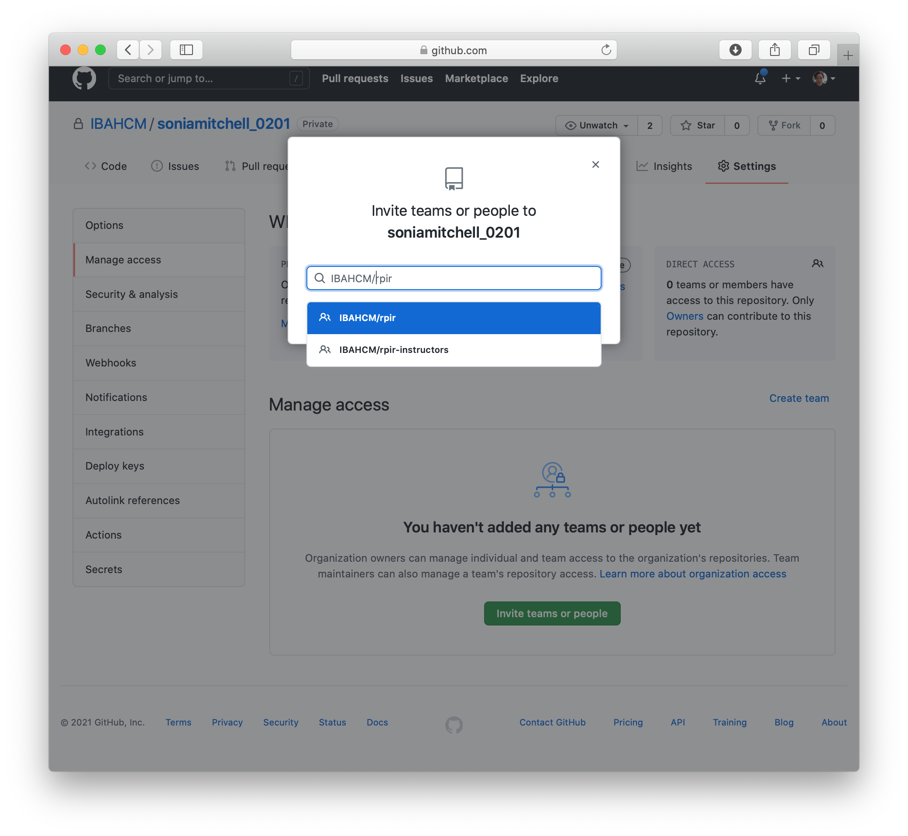
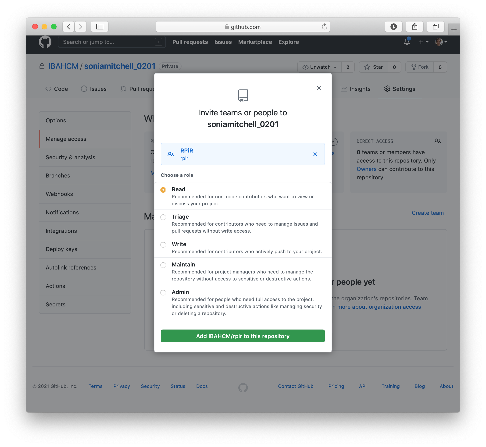
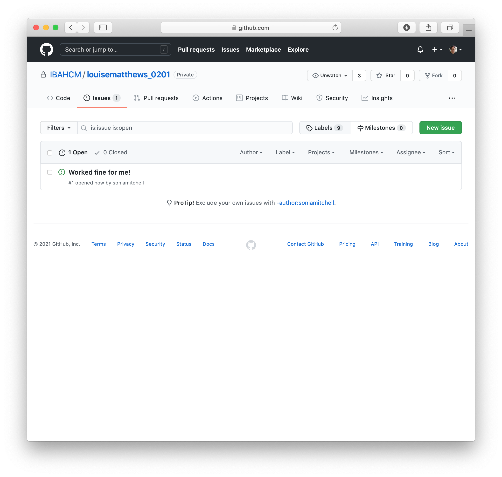

```{r setup, include=FALSE}
library(learnr)
 
knitr::opts_chunk$set(error = TRUE)
set.seed(123)
```

## Overview

*In this practical we will look at GitHub and RStudio projects as a means to 
organise your workflow.*

## GitHub

First you'll need to create a repository in the IBAHCM organisation on GitHub.
You'll find instructions on how to do this here. Note that you'll need to do 
this throughout this practical series, which is why we've kept these 
instructions separate.

After you've done that, back in RStudio.. load the `RPiR` package and run the
`practical_series_one()` 
function. This will populate your working directory -- and therefore your 
RStudio project -- with the scripts and functions from Practical series 1. 
Remember that the question mark in the 
<span style="color: #de77ae;">Status</span> column of the 
<span style="color: #de77ae;">Git</span> tab means that these are not currently 
in your GitHub repository.

```{r echo = FALSE, fig.align = "center", out.width = "100%"}
knitr::include_graphics('images/a.png')
```

So let's push them up to GitHub! Check the boxes next to all of the files, the
scripts, the functions, and invisible `.gitignore` file and even the RStudio
project file. Then click <span style="color: #de77ae;">Commit</span>.

```{r echo = FALSE, fig.align = "center", out.width = "100%"}
knitr::include_graphics('images/b.png')
```

Write a suitably descriptive message and 
<span style="color: #de77ae;">Commit</span> the files.

```{r echo = FALSE, fig.align = "center", out.width = "100%"}
knitr::include_graphics('images/c.png')
```

Alot has happened this time.. 11 files changed and 513 insertions.

```{r echo = FALSE, fig.align = "center", out.width = "100%"}
knitr::include_graphics('images/d.png')
```

Now go to your GitHub repository. Are the files there? What did we forget to 
do? Don't forget that pressing <span style="color: #de77ae;">Commit</span> 
isn't enough. When you commit your files, you're packaging them up ready to go. 
You still have to <span style="color: #de77ae;">Push</span> them to GitHub. Do
that now and make sure they appear in your repository.

```{r echo = FALSE, fig.align = "center", out.width = "100%"}
knitr::include_graphics('images/e.png')
```

## Sharing is caring

Now we're going to try and share our work. To make it a little more interesting,
edit your `README.md` file. Write a sentence or two about yourself and what you
hope to get out of this course. Commit your changes and push them to GitHub.
Then look at your GitHub repository and make sure you can see your changes. 

To share your work, since you created a private (rather than a public) 
repository, you need to give people permission to see it. So, click on 
<span style="color: #de77ae;">Settings</span>, 
<span style="color: #de77ae;">Manage access</span>, then 
<span style="color: #de77ae;">Invite teams or people</span>.

```{r echo = FALSE, fig.align = "center", out.width = "100%"}
knitr::include_graphics('images/f.png')
```

Find the `IBAHCM/rpir` team (that's you guys).

```{r echo = FALSE, fig.align = "center", out.width = "100%"}

```

Make sure <span style="color: #de77ae;">Read</span> access is selected and
<span style="color: #de77ae;">Add IBAHCM/rpir to this repository</span>.

```{r echo = FALSE, fig.align = "center", out.width = "100%"}

```

It should look like this:

```{r echo = FALSE, fig.align = "center", out.width = "100%"}
knitr::include_graphics('images/i.png')
```

Now, exchange repository names with your group (everyone in your breakout room).
You should have access if you're part of the `IBAHCM/rpir` team. Now go find 
them. Either search through the `IBAHCM` organisation, or go directly to their 
URL. For example, if I want to find `louisematthews`, I'd go here
[https://github.com/IBAHCM/louisematthews_0201](https://github.com/IBAHCM/louisematthews_0201). Remember to take a look at their GitHub readme, you might learn 
something new!

Just like before, we're going to clone this repository by clicking on the green
<span style="color: #de77ae;">Code</span> button and copying the URL 
associated with this repository.

```{r echo = FALSE, fig.align = "center", out.width = "100%"}
knitr::include_graphics('images/j.png')
```

Then, as we did before, go back to RStudio. Go to the 
<span style="color: #de77ae;">File</span> menu and create a 
<span style="color: #de77ae;">New Project...</span>, with 
<span style="color: #de77ae;">Version Control</span>, using 
<span style="color: #de77ae;">Git</span>. The project should open 
automatically.

Try generating a report from one of the files.

```{r echo = FALSE, fig.align = "center", out.width = "100%"}
knitr::include_graphics('images/k.png')
```

Hopefully you should generate a report without any problems. Whether you do or 
not, go back to your collaborators GitHub repository and add an issue. Do this 
by clicking on the <span style="color: #de77ae;">Issues</span> tab and adding a
<span style="color: #de77ae;">New Issue</span>.

```{r echo = FALSE, fig.align = "center", out.width = "100%"}
knitr::include_graphics('images/l.png')
```

In the issue you should describe whether or not you were successful, perhaps 
also including a nice encouraging message!

```{r echo = FALSE, fig.align = "center", out.width = "100%"}
knitr::include_graphics('images/m.png')
```

If you click on the <span style="color: #de77ae;">Issues</span> tab again, 
you'll see a list of issues.

```{r echo = FALSE, fig.align = "center", out.width = "100%"}

```

Now wait a bit for everyone to add their issues to your repository. Once they've
finished, go see what they've written. If any issues need addressed, go ahead and 
address them.
