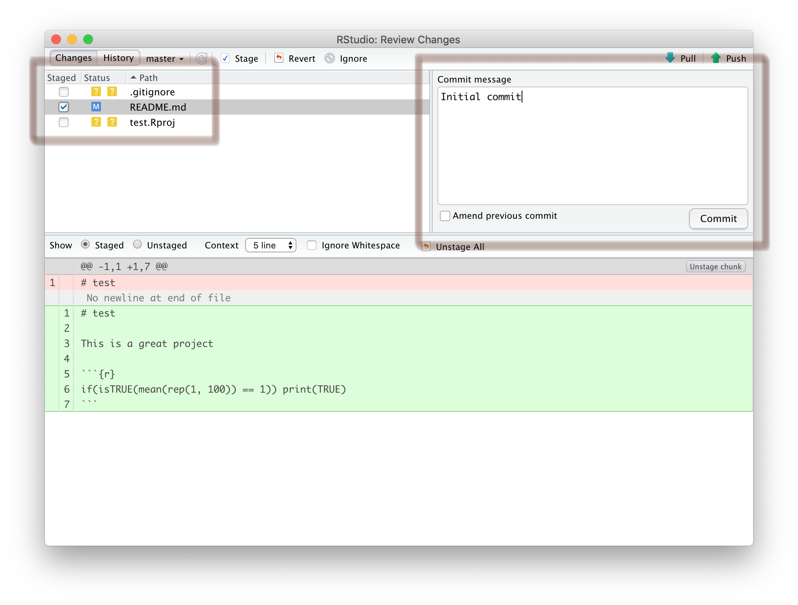

```{r, include = FALSE}
knitr::opts_chunk$set(
  collapse = TRUE,
  comment = "#>"
)
```

# GitHub

*for RStudio*

## Prerequisites

1. **First**, create a GitHub account with your academic email address
2. Verify your account
3. Go to https://education.github.com, click **Students** or 
**Get benefits for students**, and follow the instructions

## Setup Git on RStudio

In RStudio, click on the 
**RStudio** menu bar and go to **Preferences** (or **Tools** and **Global Options** if you're using Windows)

```{r echo = FALSE, fig.align = "center", out.width = "20%"}
knitr::include_graphics('github/0-1.png')
```

Go down to the **GIT/SVN** tab and ensure that 
**Enable version control interface for RStudio projects** is checked. 

While you're here, make sure you have a **Git executable**. If this box is empty, you need to install Git. Click on the [**Using Version Control with RStudio**](https://support.rstudio.com/hc/en-us/articles/200532077?version=1.2.1335&mode=desktop) link and scroll 
down to the **Installation** section. This will take you to a site that 
describes how to install Git on your machine. Now **restart** RStudio.

Now that we're sure Git is installed, we're going to set up encryption between 
our laptop and GitHub. To do this we need to generate a certificate. Click on 
**Create RSA Key...**

```{r echo = FALSE, fig.align = "center", out.width = "100%"}
knitr::include_graphics('github/0-2.png')
```

Now, click **Create** to generate your RSA key

```{r echo = FALSE, fig.align = "center", out.width = "100%"}
knitr::include_graphics('github/0-3.png')
```

It should look like this

```{r echo = FALSE, fig.align = "center", out.width = "100%"}
knitr::include_graphics('github/0-4.png')
```

Now you need to copy your public key and register it with GitHub, so click on **View public key**

```{r echo = FALSE, fig.align = "center", out.width = "100%"}
knitr::include_graphics('github/0-5.png')
```

.. and copy the key to your clipboard

```{r echo = FALSE, fig.align = "center", out.width = "100%"}
knitr::include_graphics('github/0-6.png')
```

Then in GitHub, in your **Personal settings**, open the **SSH and GPG keys** tab 

```{r echo = FALSE, fig.align = "center", out.width = "100%"}
knitr::include_graphics('github/0-7.png')
```

Create a **New SSH key**

```{r echo = FALSE, fig.align = "center", out.width = "100%"}
knitr::include_graphics('github/0-8.png')
```

Paste the public key that you copied from RStudio into the box and click
**Add SSH key** 

```{r echo = FALSE, fig.align = "center", out.width = "100%"}
knitr::include_graphics('github/0-9.png')
```

Now back in RStudio, tell Git your user name and email address (these are used 
to label each commit that you make to GitHub). Make sure the email address you 
enter here is the same as the one that you registered on GitHub.

```{r, eval = FALSE}
install.packages("usethis")
library(usethis)

use_git_config(
  scope = "user",
  user.name = "insert_github_username_here",
  user.email = "insert_email_address_here"
)
```

RStudio will now remember your details, so don't worry about having to enter 
them again in the future. You should, however, check that your username and 
email address was entered correctly! So from the terminal tab, input the 
following (this will only work on a Mac):

```{r, eval = FALSE}
git config --global --list
```

## Create a new GitHub repository

It's important that you use version control in your project workflow, so let's 
set up a new GitHub repository (you should make a new repository for each
project you're working on). To do this, click **New**

```{r echo = FALSE, fig.align = "center", out.width = "100%"}
knitr::include_graphics('github/1-1.png')
```

Choose a short, descriptive name for your repository and 
**Initialize this repository with a README**. Since this is a tutorial and not
a real project, this repository has been named `test`.

```{r echo = FALSE, fig.align = "center", out.width = "100%"}
knitr::include_graphics('github/1-2.png')
```

Congratulations! You have successfully created a new GitHub repository, 
containing a single `README.md` file. Remember this for later.

Now **copy** the URL associated with your GitHub repository to your clipboard

```{r echo = FALSE, fig.align = "center", out.width = "100%"}
knitr::include_graphics('github/1-3.png')
```

## Create a new RStudio project

In RStudio, click **File** > **New project...**

```{r echo = FALSE, fig.align = "center", out.width = "20%"}
knitr::include_graphics('github/2-1.png')
```

Since we're integrating version control into this project workflow, click **Version Control**

```{r echo = FALSE, fig.align = "center", out.width = "100%"}
knitr::include_graphics('github/2-2.png')
```

Select the option to clone a project from a **Git** repository

```{r echo = FALSE, fig.align = "center", out.width = "100%"}
knitr::include_graphics('github/2-3.png')
```

**Paste** your **Repository URL** into the first box, then click **Browse...** 
and navigate to the git folder on your desktop. If you don't have a git folder 
on your desktop then make one, as it's good practice to keep all of your 
projects together and well organised. RStudio will create a new subdirectory 
that will mirror the contents of your Git repository (so make sure you 
don't already have a folder with the same name as the repository you created, 
as this will cause problems). Now click **Create Project**

```{r echo = FALSE, fig.align = "center", out.width = "100%"}
knitr::include_graphics('github/2-4.png')
```

Congratulations! You have successfully created a new RStudio project (now with
added version control). In the example below, the RStudio project is called 
`test`. A new directory, `test`, has been created inside the git folder on your 
desktop (this is now your working directory). Inside this directory are three 
files, including a GitHub `README.md` file (imported from your GitHub 
repository), an RStudio project file (`test.Rproj`), and an invisible 
`.gitignore` file (created by RStudio). 

Note the appearance of a new **Git** tab next to **Connections**. This is 
important.

```{r echo = FALSE, fig.align = "center", out.width = "100%"}
knitr::include_graphics('github/2-5.png')
```

## Using Git in RStudio

Compare the contents of your working directory to the files listed in the
**Git** tab. The **Git** tab is a useful tool that shows you how your remote
directory (your GitHub repository) differs from your local directory 
(in this case `~Desktop/Git/test`). Currently, the `README.md` file in your 
local directory is identical to the one in your remote directory. That's why 
you can't see it in the **Git** tab. Instead, `.gitignore` and `test.Rproj`
are listed with yellow **Status** question marks. What do these icons mean?

* "?" - Files or directories that don't currently exist in your git repository 
(you either want to commit these or add them to `.gitignore`)
* "A" - Files that have been staged and are ready to commit (you're in the 
process of committing these)
* "M" - Files that are modified versions of those in the repository (you 
definately want to commit these)
* "D" - Files that are no longer in your local directory (you want to
commit these to GitHub)

Open the `README.md` file by clicking on its filename in the **Files** tab. 
Does this look familiar? (Compare the contents of this file to your
repository on GitHub)

```{r echo = FALSE, fig.align = "center", out.width = "100%"}
knitr::include_graphics('github/2-6.png')
```

Usually a GitHub README (written in [GitHub Flavored Markdown](https://help.github.com/en/github/writing-on-github)) will describe the 
contents of the GitHub repository or give an example of how to use the contents 
of said repository. Make some edits to `README.md` and **save** your file. Note 
that when we make edits to the README file, its **Status** changes to "M". This 
means that the file in your local directory is no longer identical to the file 
in your remote directory (on GitHub).

Click **Commit** to upload these changes to GitHub.

```{r echo = FALSE, fig.align = "center", out.width = "100%"}
knitr::include_graphics('github/2-7.png')
```

The **RStudio: Review Changes** window has opened. Click on the **Staged** 
checkbox next to `README.md` and enter a **Commit message**. Your message 
should describe the changes you've made to the file you're uploading (in this
case, an initial commit). These changes are shown in the lower half of the 
screen, with deletions and insertions highlighted in red and green, 
respectively. Click **Commit** to continue.

```{r echo = FALSE, fig.align = "center", out.width = "100%"}

```

Congratulations! `README.md` is now staged, with 7 insertions and 1 deletion. 
**Close** this window.

```{r echo = FALSE, fig.align = "center", out.width = "100%"}
knitr::include_graphics('github/3-2.png')
```

Then **Push** all staged files (at the moment, just `README.md`) to GitHub.

```{r echo = FALSE, fig.align = "center", out.width = "100%"}
knitr::include_graphics('github/3-3.png')
```

You'll need to enter your password..

```{r echo = FALSE, fig.align = "center", out.width = "100%"}
knitr::include_graphics('github/3-4.png')
```

Congratulations again! You've successfully pushed these changes to GitHub. 
**Close** this window and the **Review Changes** window beneath it.

```{r echo = FALSE, fig.align = "center", out.width = "100%"}
knitr::include_graphics('github/3-5.png')
```

Note that `README.md` is no longer listed in the **Git** tab (because both the
local and remote versions are identical).

```{r echo = FALSE, fig.align = "center", out.width = "100%"}
knitr::include_graphics('github/4-1.png')
```

... and the GitHub README is immediately updated. 

```{r echo = FALSE, fig.align = "center", out.width = "100%"}
knitr::include_graphics('github/4-2.png')
```

## Final remarks

RStudio offers integrated version control, which is useful for *daily tasks*
such as pushing, pulling, and reviewing changes (click on **Diff** in the 
**Git** tab). However, this is just the tip of the iceberg. If you have time, 
why not take a look at the links below. Try the interactive tutorials in 
"Learn Git Branching" by Peter Cottle and experiment in RStudio's **Terminal** 
tab with your own repository.

## Useful resources

* [Learn Git Branching, by Peter Cottle](https://learngitbranching.js.org)
* [R packages - Git and GitHub, by Hadley Wickham](http://r-pkgs.had.co.nz/git.html)
* [Pro Git, by Scott Chacon and Ben Straub ](https://git-scm.com/book/en/v2)
* [git/github guide, by Karl Broman](https://kbroman.org/github_tutorial/)
* [Learn Git with GitKraken](https://www.gitkraken.com/learn-git)
* [Learn the Basics of Git in Under 10 Minutes, by Gowtham Venkatesan](https://www.freecodecamp.org/news/learn-the-basics-of-git-in-under-10-minutes-da548267cc91/)
* [git - the simple guide, by Roger Dudler](https://rogerdudler.github.io/git-guide/)
