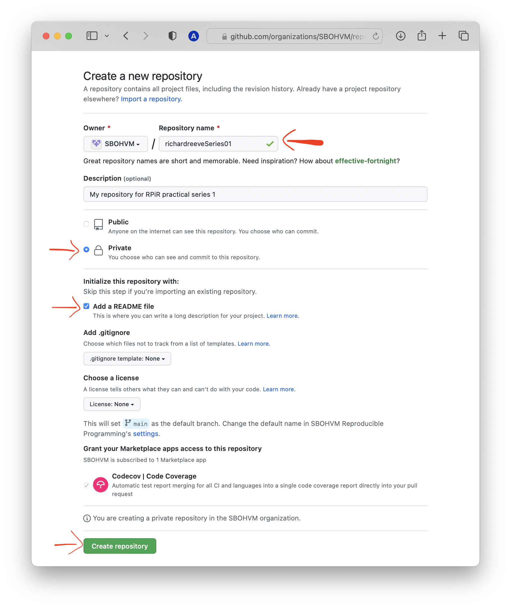
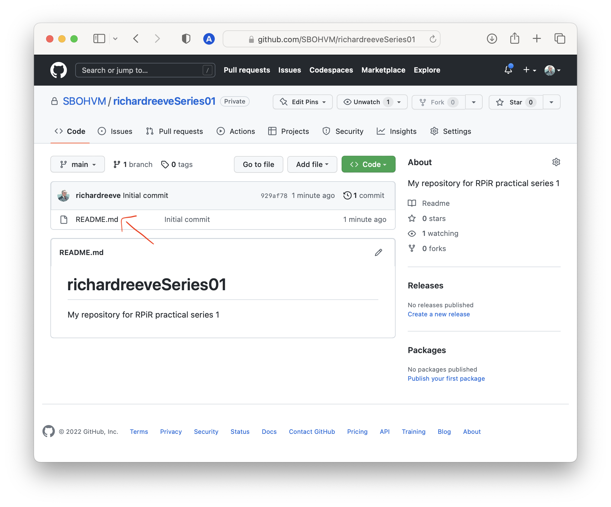

```{r, include = FALSE}
knitr::opts_chunk$set(
  collapse = TRUE,
  comment = "#>"
)
```

*Create a GitHub repository*

Whenever you start a new project, you should consider creating a new repository
on GitHub. Not only will you then be using version control, but it allows you 
to collaborate easily with others, as well as organising your workflow. This 
guide shows you how to create a new repository on GitHub.

To start off, go to the [SBOHVM](http://www.github.com/SBOHVM) organisation
(on GitHub). During this course, this is where you'll be creating all of your 
repositories. Once you're there, click on the green 
<span style="color: #de77ae;">New</span> button.

```{r echo = FALSE, fig.align = "center", out.width = "100%"}
knitr::include_graphics('images/use-github-01.png')
```


You should always choose a short, descriptive name for your repository. But in
this case, to make it easier for us to identify you, please include your name 
as well as an identifier associated with the practical you're working on, e.g.
`githubusernameSeries01`. Make sure you're creating
a <span style="color: #de77ae;">Private</span> repository, check the box to
<span style="color: #de77ae;">Initialize this repository with a README</span>,
then select <span style="color: #de77ae;">Create repository</span>. 

```{r echo = FALSE, fig.align = "center", out.width = "100%"}

```

> Note that in Practical series 3 you'll be writing a package... and when doing 
it's good practice for the name of your repository to match the name of
your package. It's important to be aware that the name of a package 
"should contain only (ASCII) letters, numbers and dot, have at least two 
characters and start with a letter and not end in a dot"
([ref](https://cran.r-project.org/doc/manuals/R-exts.html)). Though very few
[package](https://cran.r-project.org/web/packages/available_packages_by_name.html)
names include a dot.

Since we're not working with packages just yet, you could be more flexible in
naming this repository, but it's better to start as you mean to go on. Your
GitHub repo should now contain a single `README.md` file look a bit like this:

```{r echo = FALSE, fig.align = "center", out.width = "100%"}

```

If you want to learn more about creating projects (and using GitHub) in RStudio,
click [here](https://sbohvm.github.io/RPiR/articles/pages/rstudio.html).
