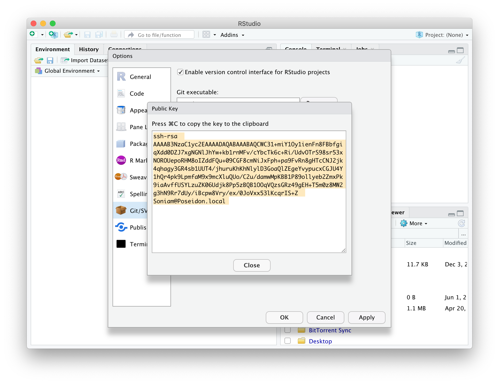
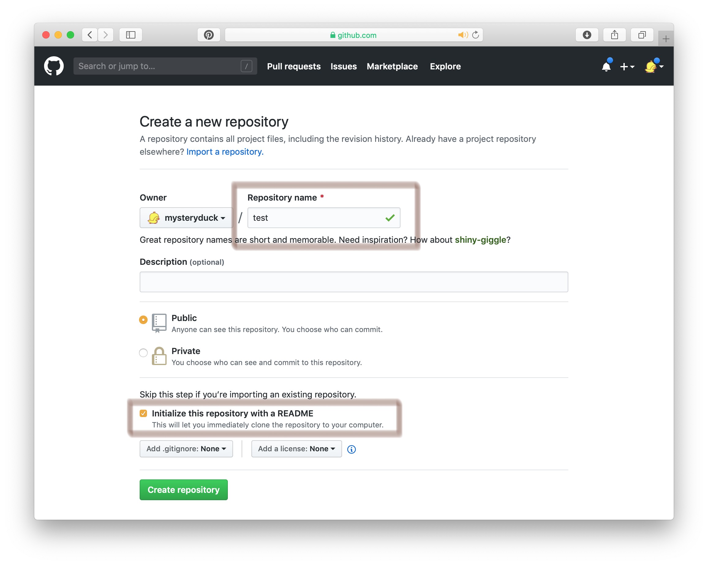
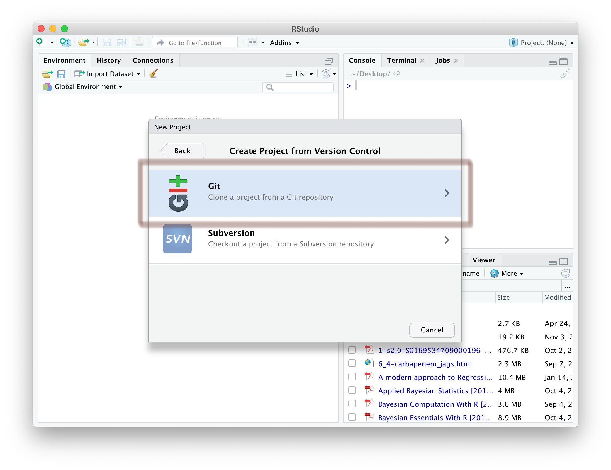
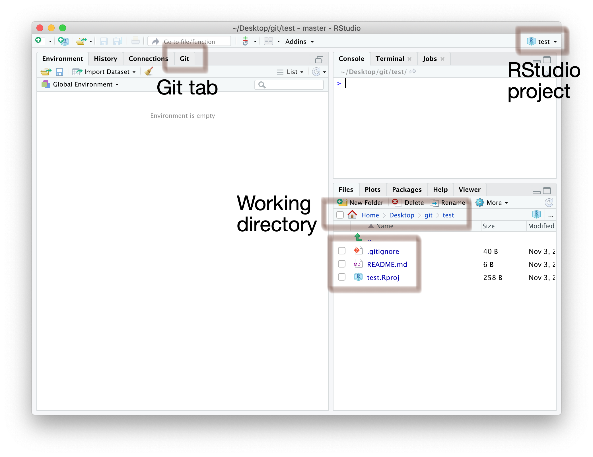
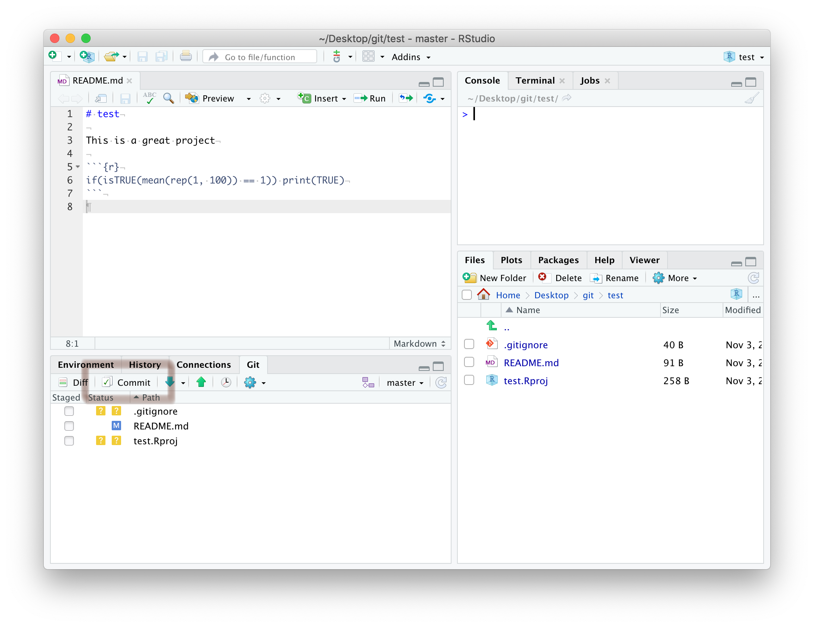
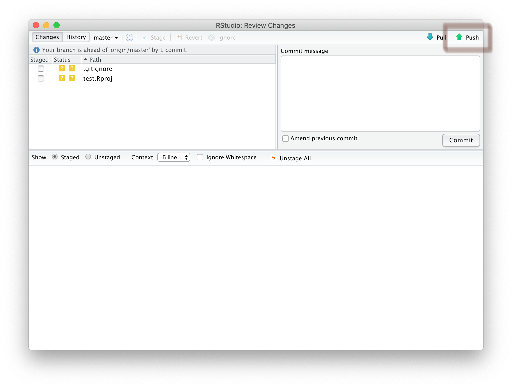
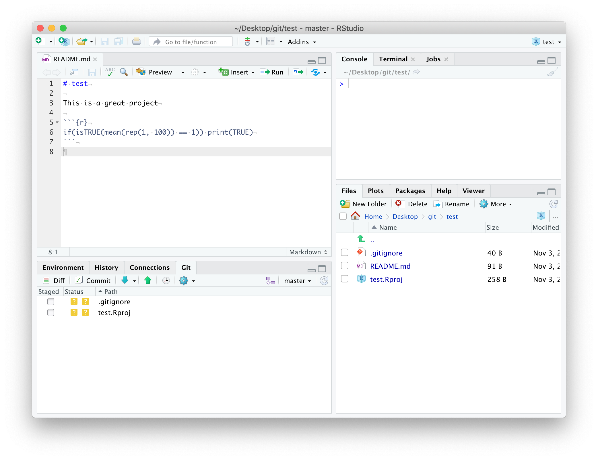
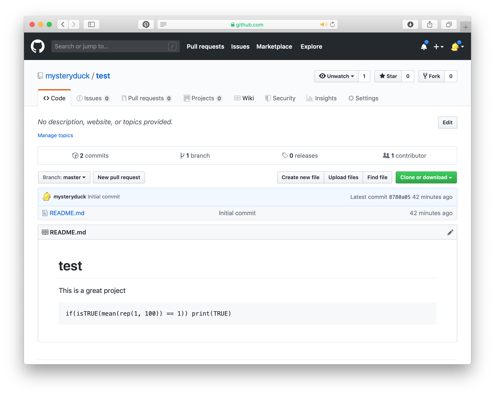

```{r, include = FALSE}
knitr::opts_chunk$set(
  collapse = TRUE,
  comment = "#>"
)
```

# GitHub

*for RStudio*

## Prerequisites

1. Create a GitHub account - go to https://github.com/ and sign up
   with your university email address
2. Verify your account
3. Go to https://education.github.com, click **Students** and/or 
**Get benefits for students**, and follow the instructions

### Possible problems

If you already have a GitHub account, then try registering it as an education
account using the same link. We *think* that it won't be critical for this
course that you are registered with the education pack, so if you can't, we'll
leave it for now. *Please do remember though in case anything crops up later.*
However, you will receive emails for the course on the email address you are
registered with here, so if you already have an account be aware of this. You
can change the email address GitHub uses on your profile if you need to.

## Ask to be added to the IBAHCM GitHub organisation

Go to the Discussion section of the [RPiR](https://github.com/IBAHCM/RPiR)
repository on GitHub, and create a new discussion (category *Registration*)^[The
direct link is [here](https://github.com/IBAHCM/RPiR/discussions/new) if you
can't find it.]. Simply ask to be added to the organisation. Once we've added
you, we'll respond and you should accept the invitation and acknowledge that you
have successfully joined. This discussion section on the R package is where we
will hold discussions and answer questions during the course, so you may want to
bookmark it.

## Meanwhile, set git and GitHub up with RStudio

In RStudio, open <span style="color: #de77ae;">RStudio > Preferences</span> 
(or <span style="color: #de77ae;">Tools > Global Options</span> if you're using 
Windows). Go down to the <span style="color: #de77ae;">GIT/SVN</span> tab and 
ensure that <span style="color: #de77ae;">Enable version control interface 
for RStudio projects</span> is checked. 

While you're here, make sure you have a <span style="color: #de77ae;">git 
executable</span>. If this box is empty, you need to install `git`. Go
[here](https://support.rstudio.com/hc/en-us/articles/200532077-Version-Control-with-Git-and-SVN) and scroll 
down to the <span style="color: #de77ae;">Installation</span> section, then 
**restart RStudio**.

> Note that having git installed *is different* from installing `libgit2` when
  you installed the `RPiR` package earlier, so you may have to install git here,
  even if you fixed the problems earlier!

Now that we're sure `git` is installed, we're going to set up encryption between 
your computer and GitHub. To do this we need to generate a certificate. Click on 
<span style="color: #de77ae;">Create RSA Key...</span>

```{r echo = FALSE, fig.align = "center", out.width = "100%"}
knitr::include_graphics('images/github/0-2.png')
```

Now, click <span style="color: #de77ae;">Create</span> to generate your RSA key

```{r echo = FALSE, fig.align = "center", out.width = "100%"}
knitr::include_graphics('images/github/0-3.png')
```

It should look like this

```{r echo = FALSE, fig.align = "center", out.width = "100%"}
knitr::include_graphics('images/github/0-4.png')
```

Now you need to copy your public key and register it with GitHub, so click on 
<span style="color: #de77ae;">View public key</span>

```{r echo = FALSE, fig.align = "center", out.width = "100%"}
knitr::include_graphics('images/github/0-5.png')
```

.. and copy the key to your clipboard

```{r echo = FALSE, fig.align = "center", out.width = "100%"}

```

Then in GitHub, in your <span style="color: #de77ae;">Personal settings</span>, 
open the <span style="color: #de77ae;">SSH and GPG keys</span> tab 

```{r echo = FALSE, fig.align = "center", out.width = "100%"}
knitr::include_graphics('images/github/0-7.png')
```

Create a <span style="color: #de77ae;">New SSH key</span>

```{r echo = FALSE, fig.align = "center", out.width = "100%"}
knitr::include_graphics('images/github/0-8.png')
```

Paste the public key that you copied from RStudio into the box and click
<span style="color: #de77ae;">Add SSH key</span>

```{r echo = FALSE, fig.align = "center", out.width = "100%"}
knitr::include_graphics('images/github/0-9.png')
```

Now back in RStudio, tell git your user name and email address (these are used 
to label each commit that you make to GitHub). **Make sure the email address you** 
**enter here is the same as the one that you registered on GitHub**. First, make
sure that the `usethis` package is installed by calling `library(usethis)`.
If that doesn't work, then install it, and then configure git using it:

```{r, eval = FALSE}
install.packages("usethis") # If need be
library(usethis)

use_git_config(
  scope = "user",
  user.name = "insert_github_username_here",
  user.email = "insert_email_address_here"
)
```

RStudio will now remember your details, so don't worry about having to enter 
them again in the future. You should, however, check that your username and 
email address was entered correctly! So from the terminal tab, input the 
following (this will only work on a Mac):

```
git config --global --list
```

## Add a PAT

Now in RStudio, run:

```{r, eval = FALSE}
usethis::create_github_token()
```

This will open a GitHub page in your browser, like this:

```{r echo = FALSE, fig.align = "center", out.width = "100%"}
knitr::include_graphics('images/github/git.png')
```

Scroll down to the bottom of this page and click on the green
<span style="color: #de77ae;">Generate Token</span> button. 

Your screen should now look something like this:

```{r echo = FALSE, fig.align = "center", out.width = "100%"}
knitr::include_graphics('images/github/pat.png')
```

Copy the alphanumeric string (in the green box) by clicking on the tiny, blue
clipboard. 

Now back in RStudio, run:

```{r, eval = FALSE}
usethis::edit_r_environ()
```

This will open up a new file in a new tab in RStudio called 
<span style="color: #de77ae;">.Renviron</span>. Inside this file, on a new line, 
type the following, replacing `put_string_here` with the alphanumeric string 
you copied earlier:

```
GITHUB_PAT="put_string_here"
```
Now save this file (don't run it) and close it. 

Now restart RStudio and you're done.

## Create a new GitHub repository

It's important that you use version control in your project workflow, so let's 
set up a new GitHub repository (you should make a new repository for each
project you're working on). To do this, click <span style="color: #de77ae;">New</span>

```{r echo = FALSE, fig.align = "center", out.width = "100%"}
knitr::include_graphics('images/github/1-1.png')
```

Choose a short, descriptive name for your repository and 
<span style="color: #de77ae;">Initialize this repository with a README</span>. 
Since this is a tutorial and not
a real project, this repository has been named `test`.

```{r echo = FALSE, fig.align = "center", out.width = "100%"}

```

Congratulations! You have successfully created a new GitHub repository, 
containing a single `README.md` file. Remember this for later.

Now **copy** the URL associated with your GitHub repository to your clipboard

```{r echo = FALSE, fig.align = "center", out.width = "100%"}
knitr::include_graphics('images/github/1-3.png')
```

## Create a new RStudio project

In RStudio, click <span style="color: #de77ae;">File > New project...</span>

```{r echo = FALSE, fig.align = "center", out.width = "20%"}
knitr::include_graphics('images/github/2-1.png')
```

Since we're integrating version control into this project workflow, click 
<span style="color: #de77ae;">Version Control</span>

```{r echo = FALSE, fig.align = "center", out.width = "100%"}
knitr::include_graphics('images/github/2-2.png')
```

Select the option to clone a project from a 
<span style="color: #de77ae;">Git</span> repository

```{r echo = FALSE, fig.align = "center", out.width = "100%"}

```

**Paste your Repository URL** into the first box, then click 
<span style="color: #de77ae;">Browse...</span> 
and navigate to the git folder on your desktop. If you don't have a git folder 
on your desktop then make one, as it's good practice to keep all of your 
projects together and well organised. RStudio will create a new subdirectory 
that will mirror the contents of your Git repository (so make sure you 
don't already have a folder with the same name as the repository you created, 
as this will cause problems). Now click 
<span style="color: #de77ae;">Create Project</span>

```{r echo = FALSE, fig.align = "center", out.width = "100%"}
knitr::include_graphics('images/github/2-4.png')
```

Congratulations! You have successfully created a new RStudio project (now with
added version control). In the example below, the RStudio project is called 
`test`. A new directory, `test`, has been created inside the git folder on your 
desktop (this is now your working directory). Inside this directory are three 
files, including a GitHub `README.md` file (imported from your GitHub 
repository), an RStudio project file (`test.Rproj`), and an invisible 
`.gitignore` file (created by RStudio). 

Note the appearance of a new <span style="color: #de77ae;">Git</span> tab next 
to <span style="color: #de77ae;">Connections</span>. This is 
important.

```{r echo = FALSE, fig.align = "center", out.width = "100%"}

```

## Using git in RStudio

Compare the contents of your working directory to the files listed in the
<span style="color: #de77ae;">Git</span> tab. The 
<span style="color: #de77ae;">Git</span> tab is a useful tool that shows you 
how your remote
directory (your GitHub repository) differs from your local directory 
(in this case `~Desktop/Git/test`). Currently, the `README.md` file in your 
local directory is identical to the one in your remote directory. That's why 
you can't see it in the <span style="color: #de77ae;">Git</span> tab. Instead,
`.gitignore` and `test.Rproj`
are listed with yellow **Status** question marks. What do these icons mean?

* "?" - Files or directories that don't currently exist in your git repository 
(you either want to commit these or add them to `.gitignore`)
* "A" - Files that have been staged and are ready to commit (you're in the 
process of committing these)
* "M" - Files that are modified versions of those in the repository (you 
definately want to commit these)
* "D" - Files that are no longer in your local directory (you want to
commit these to GitHub)

Open the `README.md` file by clicking on its filename in the 
<span style="color: #de77ae;">Files</span> tab. 
Does this look familiar? (Compare the contents of this file to your
repository on GitHub)

```{r echo = FALSE, fig.align = "center", out.width = "100%"}
knitr::include_graphics('images/github/2-6.png')
```

Usually a GitHub README (written in [GitHub Flavored Markdown](https://help.github.com/en/github/writing-on-github)) will describe the 
contents of the GitHub repository or give an example of how to use the contents 
of said repository. Make some edits to `README.md` and **save** your file. Note 
that when we make edits to the README file, its **Status** changes to "M". This 
means that the file in your local directory is no longer identical to the file 
in your remote directory (on GitHub).

Click <span style="color: #de77ae;">Commit</span> to upload these changes to GitHub.

```{r echo = FALSE, fig.align = "center", out.width = "100%"}

```

The <span style="color: #de77ae;">RStudio: Review Changes</span> window has 
opened. Click on the <span style="color: #de77ae;">Staged</span>
checkbox next to `README.md` and enter a 
<span style="color: #de77ae;">Commit message</span>. Your message 
should describe the changes you've made to the file you're uploading (in this
case, an initial commit). These changes are shown in the lower half of the 
screen, with deletions and insertions highlighted in red and green, 
respectively. Click <span style="color: #de77ae;">Commit</span> to continue.

```{r echo = FALSE, fig.align = "center", out.width = "100%"}
knitr::include_graphics('images/github/3-1.png')
```

Congratulations! `README.md` is now staged, with 7 insertions and 1 deletion. 
**Close** this window.

```{r echo = FALSE, fig.align = "center", out.width = "100%"}
knitr::include_graphics('images/github/3-2.png')
```

Then <span style="color: #de77ae;">Push</span> all staged files (at the moment, just `README.md`) to GitHub.

```{r echo = FALSE, fig.align = "center", out.width = "100%"}

```

You'll need to enter your password..

```{r echo = FALSE, fig.align = "center", out.width = "100%"}
knitr::include_graphics('images/github/3-4.png')
```

Congratulations again! You've successfully pushed these changes to GitHub. 
**Close** this window and the **Review Changes** window beneath it.

```{r echo = FALSE, fig.align = "center", out.width = "100%"}
knitr::include_graphics('images/github/3-5.png')
```

Note that `README.md` is no longer listed in the 
<span style="color: #de77ae;">Git</span> tab (because both the
local and remote versions are identical).

```{r echo = FALSE, fig.align = "center", out.width = "100%"}

```

... and the GitHub README is immediately updated. 

```{r echo = FALSE, fig.align = "center", out.width = "100%"}

```

## Final remarks

RStudio offers integrated version control, which is useful for *daily tasks*
such as pushing, pulling, and reviewing changes (click on 
<span style="color: #de77ae;">Diff</span> in the 
<span style="color: #de77ae;">Git</span> tab). However, this is just the tip of 
the iceberg. If you have time, 
why not take a look at the links below. Try the interactive tutorials in 
"Learn Git Branching" by Peter Cottle and experiment in RStudio's **Terminal** 
tab with your own repository.

## Useful resources

* [R packages - Git and GitHub, by Hadley Wickham](http://r-pkgs.had.co.nz/git.html)
* [Pro Git, by Scott Chacon and Ben Straub ](https://git-scm.com/book/en/v2)
* [git/github guide, by Karl Broman](https://kbroman.org/github_tutorial/)
* [Learn Git with GitKraken](https://www.gitkraken.com/learn-git)
* [Learn the Basics of Git in Under 10 Minutes, by Gowtham Venkatesan](https://www.freecodecamp.org/news/learn-the-basics-of-git-in-under-10-minutes-da548267cc91/)
* [git - the simple guide, by Roger Dudler](https://rogerdudler.github.io/git-guide/)
