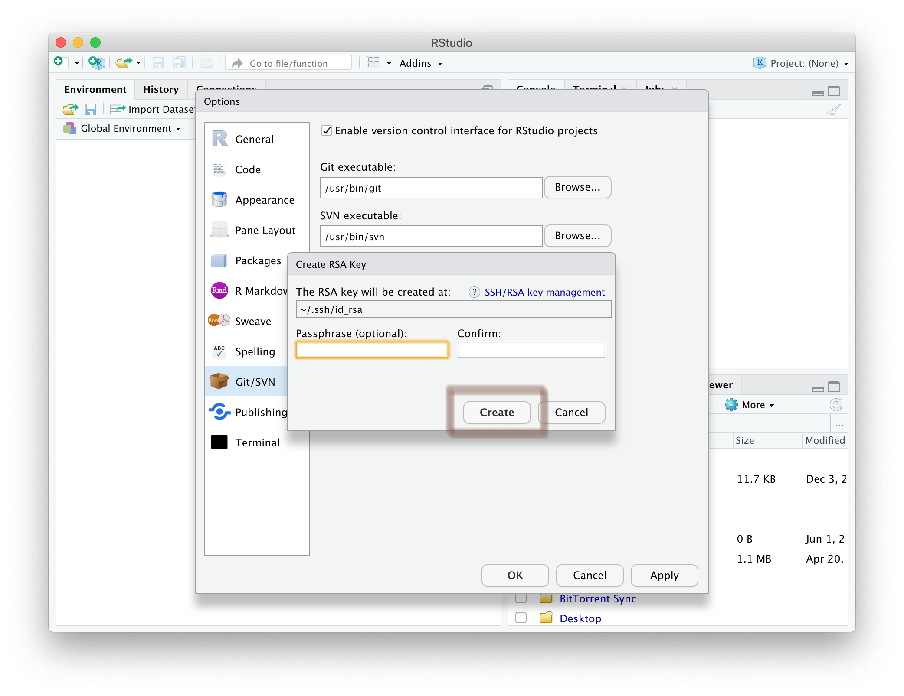

```{r, include = FALSE}
knitr::opts_chunk$set(
  collapse = TRUE,
  comment = "#>"
)
```

# GitHub

*for RStudio*

## Prerequisites

1. Create a GitHub account - go to https://github.com/ and sign up
   with your university email address
2. Verify your account
3. Go to https://education.github.com, click **Students** and/or 
**Get benefits for students**, and follow the instructions

### Possible problems

If you already have a GitHub account, then try registering it as an education
account using the same link. We *think* that it won't be critical for this
course that you are registered with the education pack, so if you can't, we'll
leave it for now. *Please do remember though in case anything crops up later.*
However, you will receive emails for the course on the email address you are
registered with here, so if you already have an account be aware of this. You
can change the email address GitHub uses on your profile if you need to.

## Ask to be added to the IBAHCM GitHub organisation

Go to the Discussion section of the [RPiR](https://github.com/IBAHCM/RPiR)
repository on GitHub, and create a new discussion (category *Registration*)^[The
direct link is [here](https://github.com/IBAHCM/RPiR/discussions/new) if you
can't find it.]. Simply ask to be added to the organisation. Once we've added
you, we'll respond and you should accept the invitation and acknowledge that you
have successfully joined. This discussion section on the R package is where we
will hold discussions and answer questions during the course, so you may want to
bookmark it.

## Meanwhile, set git and GitHub up with RStudio

In RStudio, open <span style="color: #de77ae;">RStudio > Preferences</span> 
(or <span style="color: #de77ae;">Tools > Global Options</span> if you're using 
Windows). Go down to the <span style="color: #de77ae;">GIT/SVN</span> tab and 
ensure that <span style="color: #de77ae;">Enable version control interface 
for RStudio projects</span> is checked. 

While you're here, make sure you have a <span style="color: #de77ae;">git 
executable</span>. If this box is empty, you need to install `git`. Go
[here](https://support.rstudio.com/hc/en-us/articles/200532077-Version-Control-with-Git-and-SVN) and scroll 
down to the <span style="color: #de77ae;">Installation</span> section, then 
**restart RStudio**.

> Note that having git installed *is different* from installing `libgit2` when
  you installed the `RPiR` package earlier, so you may have to install git here,
  even if you fixed the problems earlier!

Now that we're sure `git` is installed, we're going to set up encryption between 
your computer and GitHub. To do this we need to generate a certificate. Click on 
<span style="color: #de77ae;">Create RSA Key...</span>

```{r echo = FALSE, fig.align = "center", out.width = "100%"}
knitr::include_graphics('images/install-github-02.png')
```

Now, click <span style="color: #de77ae;">Create</span> to generate your RSA key

```{r echo = FALSE, fig.align = "center", out.width = "100%"}

```

It should look like this

```{r echo = FALSE, fig.align = "center", out.width = "100%"}
knitr::include_graphics('images/install-github-04.png')
```

Now you need to copy your public key and register it with GitHub, so click on 
<span style="color: #de77ae;">View public key</span>

```{r echo = FALSE, fig.align = "center", out.width = "100%"}
knitr::include_graphics('images/install-github-05.png')
```

.. and copy the key to your clipboard

```{r echo = FALSE, fig.align = "center", out.width = "100%"}
knitr::include_graphics('images/install-github-06.png')
```

Then in GitHub, in your <span style="color: #de77ae;">Personal settings</span>, 
open the <span style="color: #de77ae;">SSH and GPG keys</span> tab 

```{r echo = FALSE, fig.align = "center", out.width = "100%"}
knitr::include_graphics('images/install-github-07.png')
```

Create a <span style="color: #de77ae;">New SSH key</span>

```{r echo = FALSE, fig.align = "center", out.width = "100%"}
knitr::include_graphics('images/install-github-08.png')
```

Paste the public key that you copied from RStudio into the box and click
<span style="color: #de77ae;">Add SSH key</span>

```{r echo = FALSE, fig.align = "center", out.width = "100%"}
knitr::include_graphics('images/install-github-09.png')
```

Now back in RStudio, tell git your user name and email address (these are used 
to label each commit that you make to GitHub). **Make sure the email address you** 
**enter here is the same as the one that you registered on GitHub**. First, make
sure that the `usethis` package is installed by calling `library(usethis)`.
If that doesn't work, then install it, and then configure git using it:

```{r, eval = FALSE}
install.packages("usethis") # If need be
library(usethis)

use_git_config(
  scope = "user",
  user.name = "insert_github_username_here",
  user.email = "insert_email_address_here"
)
```

RStudio will now remember your details, so don't worry about having to enter 
them again in the future. You should, however, check that your username and 
email address was entered correctly! So from the terminal tab, input the 
following (this will only work on a Mac):

```
git config --global --list
```

## Add a PAT

Now in RStudio, run:

```{r, eval = FALSE}
usethis::create_github_token()
```

This will open a GitHub page in your browser, like this:

```{r echo = FALSE, fig.align = "center", out.width = "100%"}
knitr::include_graphics('images/install-github-git.png')
```

Scroll down to the bottom of this page and click on the green
<span style="color: #de77ae;">Generate Token</span> button. 

Your screen should now look something like this:

```{r echo = FALSE, fig.align = "center", out.width = "100%"}
knitr::include_graphics('images/install-github-pat.png')
```

Copy the alphanumeric string (in the green box) by clicking on the tiny, blue
clipboard. 

Now back in RStudio, run:

```{r, eval = FALSE}
gitcreds::gitcreds_set()
```

This will prompt you in the RStudio
<span style="color: #de77ae;">Console</span> tab with "Enter new password or
token". Paste in the alphanumeric string you copied above.

Now restart RStudio and you're done.

Note that if you have any problems getting RStudio to interact with GitHub, 
it may be useful to call:

```{r, eval = FALSE}
usethis::git_sitrep()
```

for more information.
