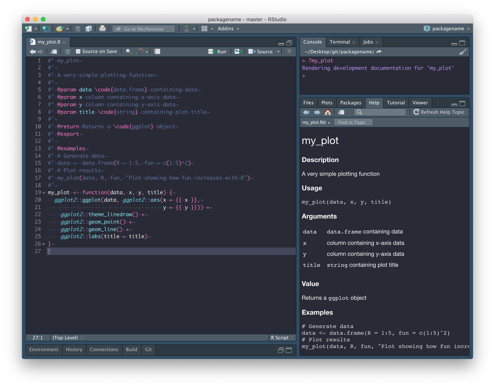

```{r, include = FALSE}
knitr::opts_chunk$set(
  collapse = TRUE,
  comment = "#>"
)
```

*R packages*

Warning: If for any reason you can't get `usethis::use_github()` to work, then
skip to the end of the page and follow the 
[alternative setup](https://ibahcm.github.io/RPiR/articles/pages/packages_guide.html#alternative-setup) instructions.

## Package structure

The easiest way to create an R package in RStudio is to generate one 
automatically in the menus, via
<span style="color: #de77ae;">File > New project... > New Directory > R Package</span>. 
Give your package a suitably descriptive name `packagename`, remembering that
it's good practice for the name of your repository to match the name of
your package. It's important to be aware that the name of a package:

> "should contain only (ASCII) letters, numbers and dot, have at least two 
characters and start with a letter and not end in a dot"
([ref](https://cran.r-project.org/doc/manuals/R-exts.html)). 

Though very few
[package names](https://cran.r-project.org/web/packages/available_packages_by_name.html)
include a dot.

Once you've picked a good name, check the box next to 
<span style="color: #de77ae;">Create a git repository</span>, then click on
<span style="color: #de77ae;">Create Project</span>.

```{r echo = FALSE, fig.align = "center", out.width = "100%"}
knitr::include_graphics('images/packages/1.png')
```

You should find that (1) a new RStudio project has been created called 
<span style="color: #de77ae;">packagename</span>, (2) your working
directory is now <span style="color: #de77ae;">packagename</span>, 
and (3) inside this directory are a number of files and directories:

```{r echo = FALSE, fig.align = "center", out.width = "100%"}
knitr::include_graphics('images/packages/2.png')
```

We'll explore these files in due course. In the mean time, 
<span style="color: #de77ae;">commit</span> these files with a nice
descriptive comment, but don't push just yet. 

```{r echo = FALSE, fig.align = "center", out.width = "100%"}
knitr::include_graphics('images/packages/3.png')
```

First, we need to set up a GitHub repository and while there are a number of 
ways to do this, the easiest way to connect an existing RStudio project to 
GitHub is by running this:

```{r, eval = FALSE}
usethis::use_github(organisation = "IBAHCM", private = TRUE)
```

This process will automatically edit your 
<span style="color: #de77ae;">DESCRIPTION</span> file and ask whether
it's OK to commit these changes, so just say yes, and your GitHub
repository should open automatically in a window in your browser. 

```{r echo = FALSE, fig.align = "center", out.width = "100%"}
knitr::include_graphics('images/packages/4.png')
```

We don't have a README yet, so click 
<span style="color: #de77ae;">Add a README</span> and type something nice in 
your README file (in your browser), then scroll down and 
<span style="color: #de77ae;">Commit new file</span>. Your GitHub repository 
should now look something like this:

```{r echo = FALSE, fig.align = "center", out.width = "100%"}
knitr::include_graphics('images/packages/5.png')
```

and RStudio should look like this:

```{r echo = FALSE, fig.align = "center", out.width = "100%"}
knitr::include_graphics('images/packages/6.png')
```

Now that we're connected to GitHub, click on the blue 
<span style="color: #de77ae;">Pull</span> arrow. When you do this, you should 
see that the 
<span style="color: #de77ae;">README.md</span> file has been pulled down from 
GitHub and is in your working directory, with contents matching what you wrote 
on GitHub. Open it and confirm this for yourself, and close that 
<span style="color: #de77ae;">hello.R</span> file -- it was automatically 
generated by RStudio and we don't need it. 

```{r echo = FALSE, fig.align = "center", out.width = "100%"}
knitr::include_graphics('images/packages/7.png')
```

In fact, there are a few files we should delete:
<span style="color: #de77ae;">R/hello.R</span>,
<span style="color: #de77ae;">man/hello.Rd</span> (documentation related to the 
hello.R file we don't need), and the 
<span style="color: #de77ae;">NAMESPACE</span> file in the package
root.

```{r echo = FALSE, fig.align = "center", out.width = "100%"}
knitr::include_graphics('images/packages/8.png')
```

Now run `devtools::document()` from the package root. You'll notice, in the 
<span style="color: #de77ae;">Git</span> tab, 
<span style="color: #de77ae;">NAMESPACE</span> has changed from deleted to 
modified. This is because `devtools::document()` created a new 
<span style="color: #de77ae;">NAMESPACE</span> file.
Why did we just delete and recreate 
<span style="color: #de77ae;">NAMESPACE</span>? Because from now on, it will
be automatically populated whenever we call `devtools::document()`, which is
only possible if we use `devtools::document()` to create a new file.

```{r echo = FALSE, fig.align = "center", out.width = "100%"}
knitr::include_graphics('images/packages/9.png')
```

## Package documentation

Now we're going to write some documentation for our package. To do this we
need to create a new file called 
<span style="color: #de77ae;">packagename-package.R</span> (replacing 
`packagename` with the name of your own package). Save this file in the 
<span style="color: #de77ae;">R</span> directory.

Once we've finished writing the file, we run `devtools::document()` to generate 
the documentation files and `?packagename` to load the documentation into 
RStudio.

As you can see, below:

* The first line is the package title
* The second chunk of text (separated by a blank line) is the package 
  **Description**
* The third chunk of text (separated by a blank line) is the **Details** section

After that everything is labeled with a tag, so order doesn't matter

* `@author` is **Author(s)** 
* There's no object to represent the package, so we write `NULL` (on line 15),
  but manually label it with the `@docType`, `@name`, and `@alias` tags 
  (lines 11-13).

```{r echo = FALSE, fig.align = "center", out.width = "100%"}
knitr::include_graphics('images/packages/10.png')
```

The next thing we need to do is edit the 
<span style="color: #de77ae;">DESCRIPTION</span> file, more info
[here](https://r-pkgs.org/description.html). Most of this requires
following prompts in the template. The only thing I've done differently here
is combine <span style="color: #de77ae;">Author</span> and 
<span style="color: #de77ae;">Maintainer</span> into a single entry, *i.e.* 

```
Author: Who wrote it
Maintainer: The package maintainer <yourself@somewhere.net>
```

has been changed to

```
Authors@R: person("Sonia", "Mitchell", email = "sonia.mitchell@glasgow.ac.uk",
                  role = c("cre", "aut"), comment = c(ORCID = "0000-0003-1536-2066"))
```

because it allows us to include more information, more info
[here](https://r-pkgs.org/description.html#author).

```{r echo = FALSE, fig.align = "center", out.width = "100%"}
knitr::include_graphics('images/packages/11.png')
```

## Functions and documentation

Now I'm going to add a new function (you can add any function you like). Make sure 
the name of your function is the same as the file you're writing in and save it
in the <span style="color: #de77ae;">R</span> directory. I've also added
some documentation above the function (details described below).

We can run `devtools::document()` in the package root to populate the 
<span style="color: #de77ae;">NAMESPACE</span> and automatically generate 
the documentation files in the 
<span style="color: #de77ae;">man</span> directory. After which you can run 
`?my_plot` to look at it.

```{r echo = FALSE, fig.align = "center", out.width = "100%"}

```

The first line is the title.

```
#' my_plot
```

The next section (separated by a blank line) is the **Description**. The 
description can continue onto multiple lines so long as you don't start writing 
paragraphs with blank lines between them. This is true for all of the following
examples.

```
#' A very simple plotting function
```

**Usage** is generated automatically from the function itself.

After that everything has been labeled with a tag, so order doesn't really 
matter, but the `@param` tag is used to document the **Arguments**. Note the 
format here is `@param argument description`. 

```
#' @param data \code{data.frame} containing data
#' @param x column containing x-axis data
#' @param y column containing y-axis data
#' @param title \code{string} containing plot title
```

The `@return` tag is used to document the output of the function in the 
**Value** section.

```
#' @return Returns a \code{ggplot} object
```

The `@export` tag is used to identify this function as being exported by your
package. That is, a function intended to be usable and not internal (a function 
that cannot be called, but is used internally by other functions).

```
#' @export
```

Finally, the `@examples` tag is used to document the **Examples** section. 
Note that here, you can use blank lines if you want and as usual, comments are 
encouraged.

```
#' @examples
#' # Generate data
#' data <- data.frame(R = 1:5, fun = c(1:5)^2)
#' # Plot results
#' my_plot(data, R, fun, "Plot showing how fun increases with R")
```

We want to be able to install this function as part of our package, but there's
one thing left to do before we can do that. Our function, `my_plot()` 
is dependent on the `ggplot2` package. That is, `my_plot()` uses functions 
from the `ggplot2` package and therefore needs `ggplot2` to be installed before 
it will work. We can configure our package so that this happens automatically. 

## Add dependencies

As mentioned previously, our `my_plot()` function is dependent on the `ggplot2`
package and so, we need to add a dependency on `ggplot2` to our package. To do
this we need to do four things.

1. Inside the `my_plot()` function, we need to explicitly say that `ggplot()`, 
   `aes()`, `theme_linedraw()`, `geom_point()`, `geom_line()`, and `labs()` 
   come from the `ggplot2` package. This is done by prepending them with 
   `ggplot2::`.
   
   ```{r, eval = FALSE}
   my_plot <- function(data, x, y, title) {
     ggplot2::ggplot(data, ggplot2::aes(x = {{ x }},
                                        y = {{ y }})) +
     ggplot2::theme_linedraw() +
     ggplot2::geom_point() +
     ggplot2::geom_line() +
     ggplot2::labs(title = title)
   }
   ```
   
2. Add an entry in the `Imports` field of the 
   <span style="color: #de77ae;">DESCRIPTION</span> file (lines 15-16). 
   This can be automated using
   `usethis::use_package("ggplot2")`.
   
   ```{r echo = FALSE, fig.align = "center", out.width = "100%"}
   knitr::include_graphics('images/packages/13.png')
   ```
   
   Note that if you need to add a dependency on a package that exists within a
   GitHub repository, you can use this instead:

   ```{r, eval = FALSE}
   usethis::use_dev_package("RPiR", remote = "IBAHCM/RPiR")
   ```

3. Add an `@import` tag to the 
   <span style="color: #de77ae;">packagename-package.R</span> file 
   (see line 15).
   
   ```{r echo = FALSE, fig.align = "center", out.width = "100%"}
   knitr::include_graphics('images/packages/14.png')
   ```
   
4. Run `devtools::document()` to populate the 
   <span style="color: #de77ae;">NAMESPACE</span> file from the `@import` tag in
   <span style="color: #de77ae;">packagename-package.R</span>. Note that you 
   should never edit <span style="color: #de77ae;">NAMESPACE</span> by hand.

## Add a demo

The last thing we're going to do is add a demo file. To do that we need to add
a <span style="color: #de77ae;">demo</span> directory to the package root. This 
is where the demos live. 

Next we need to create a <span style="color: #de77ae;">00Index</span> file 
(with no file extension) inside the <span style="color: #de77ae;">demo</span> 
directory. This file must list the names of the demos installed as part of your 
package. The file itself should look something like this:

```
my_demo   A simple demo

```

Note that each entry should be written on a new line, in a standard 
format. That is, the name of the demo (it's filename), followed by (at least) 
three spaces, followed by a simple description. Also note the empty line at
the end of the file.

Now we're going to add a demo, which is a standard R file (in this case 
including a little R markdown). 

> The important thing to note here is that you no longer need to `source()`
files, since any functions you need to use can be installed as part of the 
package.

```{r echo = FALSE, fig.align = "center", out.width = "100%"}
knitr::include_graphics('images/packages/15.png')
```

Next, we need to install our package using `devtools::install()`.

After which, we can run `demo(package = "packagename")` to list all of the 
demos in our package, or `demo("my_demo", package = "packagename")` to run 
the `my_demo` demo.

## Add data

The next thing we're going to do is add data to our package. To do this, run
`usethis::use_data_raw("BCI")`. This will create a new directory, called
`data-raw` and within it a file called
<span style="color: #de77ae;">BCI.R</span>. We should put our raw, unedited data
in this directory. Any code we use to process our data should be written in
<span style="color: #de77ae;">BCI.R</span>. The processing file should end up
looking something like this:

```{r, eval = FALSE}
## code to prepare `BCI` dataset goes here

# Read the data
raw.data <- read.csv("data-raw/myrawdata.csv", header = TRUE)

# Process the data
BCI <- some_tidying_process(raw.data)

# Add the data to your package
usethis::use_data(BCI, overwrite = TRUE)
```

Next we need to generate the packaged data by running the processing script. 
The `use_data()` function will create a
<span style="color: #de77ae;">data</span> directory, within which will be
an rds file containing our dataset.

The next step is to open our <span style="color: #de77ae;">.gitignore</span>
file and add `data-raw` on a new line to ignore the contents of this directory. 
The reason being, the contents of <span style="color: #de77ae;">data-raw</span> 
are not part of the package (installable data exists 
within your <span style="color: #de77ae;">data</span> directory) and we don't 
want to upload these large files to GitHub.

Next we should document our data (more info 
[here](https://r-pkgs.org/data.html) and
[here](https://kbroman.org/pkg_primer/pages/data.html)). To do that, we need to 
create a <span style="color: #de77ae;">data.R</span> file in the 
<span style="color: #de77ae;">R</span> directory. It should look something like
this:

```{r, eval = FALSE}
#' mydataset
#' 
#' Description of mydataset
#' 
#' @docType data
#' @usage data(mydataset)
#' 
#' @format A data frame with x rows and y variables:
#' \describe{
#'   \item{variable1}{description}
#'   \item{variabl2}{description}
#'   ...
#' }
#' 
#' @source \url{http://somewhere.important.com/}
"mydataset"
```

As usual, we need to run `devtools::document()` in the package root to automatically
generate the documentation files and then `devtools::install()` to install our
package.

After which, we can run `data(package = "packagename")` to list all of the 
data in our package.

## Alternative setup

If for any reason you can't get `usethis::use_github()` to work, then follow
these [instructions](https://ibahcm.github.io/RPiR/articles/pages/github.html)
to create a repository on GitHub with a 
<span style="color: #de77ae;">README</span> file. Remember that the name of your
repository should match the name of your package and be aware that the name of
your package:

> "should contain only (ASCII) letters, numbers and dot, have at least two 
characters and start with a letter and not end in a dot"
([ref](https://cran.r-project.org/doc/manuals/R-exts.html)). 

Though very few
[package names](https://cran.r-project.org/web/packages/available_packages_by_name.html)
include a dot. In the following example, the name of our repository 
(and package) is `packagename`.

Once you have a repository on GitHub, follow
these [instructions](https://ibahcm.github.io/RPiR/articles/pages/rstudio.html)
to clone your repository and add it as a new project in RStudio. Then create the
package structure by running:

```
usethis::create_package("structure")
```

at which point you'll get a warning saying you shouldn't really be nesting 
RStudio projects inside each other. Ignore that and say yes, you want to 
continue. You'll end up with a file structure that looks a bit like this:

```
packagename/ ---> .gitignore
                  README.md
                  packagename.Rproj
                  structure/        ---> .gitignore 
                                         .Rbuildignore
                                         DESCRIPTION
                                         NAMESPACE
                                         structure.Rproj
                                         R/
                                         
```

Take everything in the <span style="color: #de77ae;">structure</span>
directory except for the <span style="color: #de77ae;">structure.Rproj</span>
and <span style="color: #de77ae;">.gitignore</span>
files and put it in the <span style="color: #de77ae;">packagename</span> 
directory. Now delete the <span style="color: #de77ae;">structure</span>
directory and move to the <span style="color: #de77ae;">packagename</span>
project in RStudio. Once you've done that, create an empty directory within 
<span style="color: #de77ae;">packagename</span> called 
<span style="color: #de77ae;">man</span>. Your file structure should now look 
like this:

```
packagename/ ---> .gitignore
                  README.md
                  packagename.Rproj
                  .Rbuildignore
                  DESCRIPTION
                  NAMESPACE
                  R/
                  man/
```

Finally, delete the <span style="color: #de77ae;">NAMESPACE file</span> and
run `devtools::document()` from the package root to create a new 
<span style="color: #de77ae;">NAMESPACE</span> file. Why did we just delete and
recreate <span style="color: #de77ae;">NAMESPACE</span>? Because from now on, it 
will be automatically populated whenever we call `devtools::document()`, which 
is only possible if we use `devtools::document()` to create a new file.
Also, don't forget to keep pushing your changes to GitHub.

You can now rejoin the instructions above
[here](https://ibahcm.github.io/RPiR/articles/pages/packages_guide.html#package-documentation).

## Final thoughts

If you get stuck and need to troubleshoot your package, try running 
`devtools::check()`. This will build your package in a clean environment and 
potentially highlight any issues that might be causing problems. 

Whenever you make a change to your package (particularly when you're pushing
to GitHub), you should try to get into the 
habit of changing the version number. This is important because it allows
you to keep track of which version of the code is being used in a 
particular analysis. The format is usually **major.minor.patch**, more info
[here](https://semver.org). 

The version of your package is recorded in the 
<span style="color: #de77ae;">DESCRIPTION</span> file, like this:

```
Version: 0.1.0
```

Here, we have added more than enough to warrant increasing version number 
from `0.1.0` to `0.2.0`, so do that now. Remember to push this change to 
GitHub too.

## Sharing is caring

The only thing left to do now is to share your package with other people. So 
go ahead and give them access (on the GitHub website, 
<span style="color: #de77ae;">Settings > Manage access > Invite teams or people</span>).

Then ask them to run:

```
devtools::install_github("IBAHCM/packagename")
```

Go ahead and try to install my package. Try to run the demo. 

Note that if for some reason you can't install a package using 
`install_github()`, you can clone a repository as you did
[here](https://ibahcm.github.io/RPiR/articles/pages/rstudio.html) and instead 
run `devtools::install()` in the package root, in the usual way.
