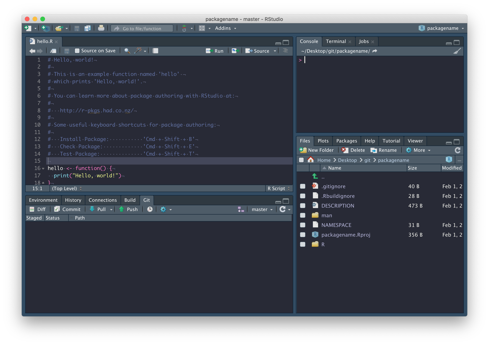
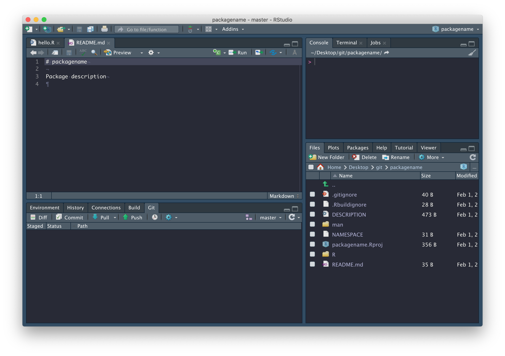
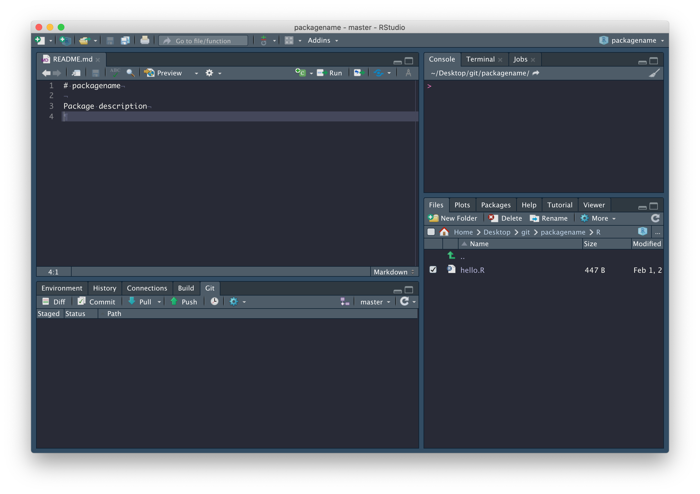
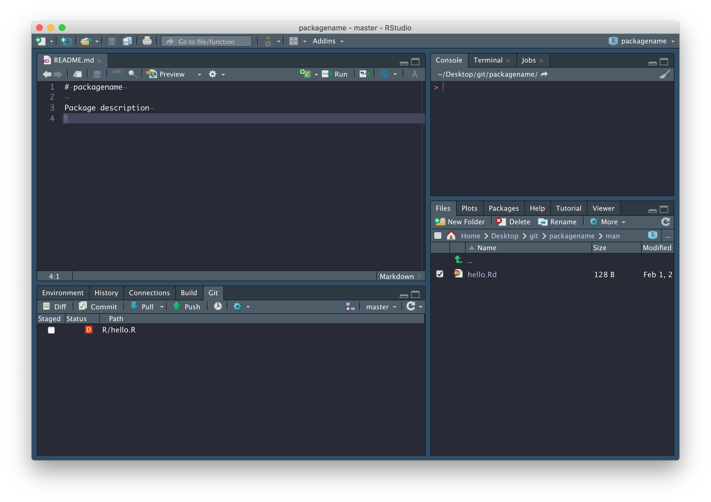
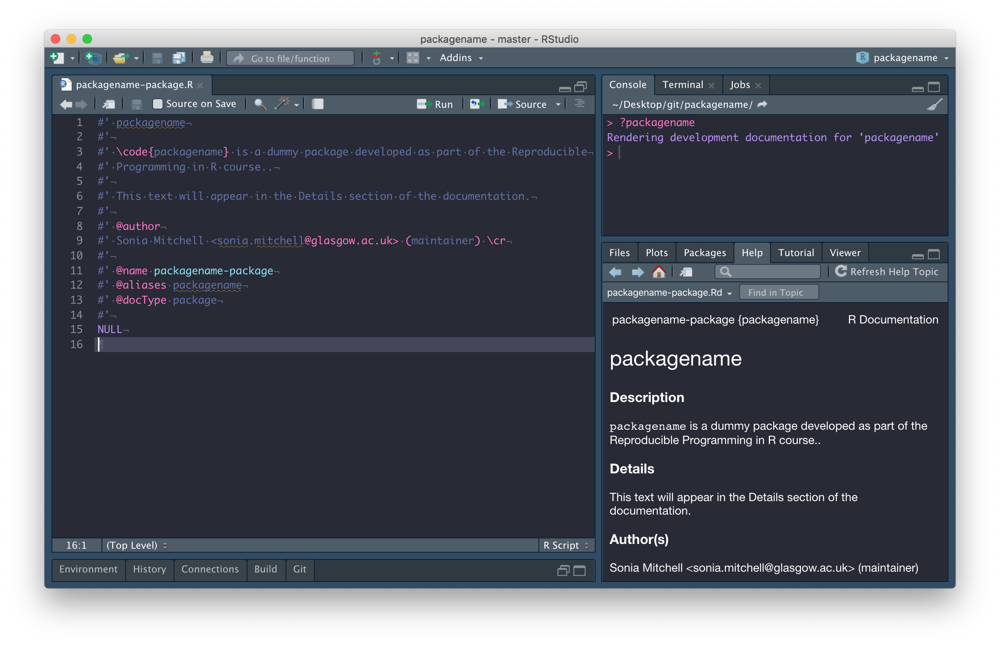
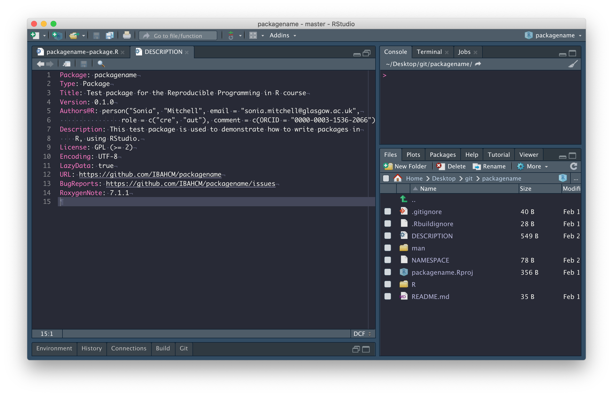

```{r, include = FALSE}
knitr::opts_chunk$set(
  collapse = TRUE,
  comment = "#>"
)
```

*R packages*

The easiest way to create an R package in RStudio is to generate one 
automatically in the menus, via
<span style="color: #de77ae;">File > New project... > New Directory > R Package</span>. 
Give your package a suitably descriptive name `packagename`, remembering that
it's good practice for the name of your repository to match the name of
your package. It's important to be aware that the name of a package:

> "should contain only (ASCII) letters, numbers and dot, have at least two 
characters and start with a letter and not end in a dot"
([ref](https://cran.r-project.org/doc/manuals/R-exts.html)). 

Though very few
[package names](https://cran.r-project.org/web/packages/available_packages_by_name.html)
include a dot.

Once you've picked a good name, check the box next to 
<span style="color: #de77ae;">Create a git repository</span>, then click on
<span style="color: #de77ae;">Create Project</span>.

```{r echo = FALSE, fig.align = "center", out.width = "100%"}
knitr::include_graphics('images/packages/1.png')
```

You should find that (1) a new RStudio project has been created called 
<span style="color: #de77ae;">packagename</span>, (2) your working
directory is now <span style="color: #de77ae;">packagename</span>, 
and (3) inside this directory are a number of files and directories:

```{r echo = FALSE, fig.align = "center", out.width = "100%"}
knitr::include_graphics('images/packages/2.png')
```

We'll explore these files in due course. In the mean time, 
<span style="color: #de77ae;">commit</span> these files with a nice
descriptive comment, but don't push just yet. 

```{r echo = FALSE, fig.align = "center", out.width = "100%"}
knitr::include_graphics('images/packages/3.png')
```

First, we need to set up a GitHub repository and while there are a number of 
ways to do this, the easiest way to connect an existing RStudio project to 
GitHub is by running this:

```{r, eval = FALSE}
usethis::use_github(organisation = "IBAHCM", private = TRUE)
```

This process will automatically edit your 
<span style="color: #de77ae;">DESCRIPTION</span> file and ask whether
it's OK to commit these changes, so just say yes, and your GitHub
repository should open automatically in a window in your browser. 

```{r echo = FALSE, fig.align = "center", out.width = "100%"}
knitr::include_graphics('images/packages/4.png')
```

We don't have a README yet, so click 
<span style="color: #de77ae;">Add a README</span> and type something nice in 
your README file (in your browser), then scroll down and 
<span style="color: #de77ae;">Commit new file</span>. Your GitHub repository 
should now look something like this:

```{r echo = FALSE, fig.align = "center", out.width = "100%"}
knitr::include_graphics('images/packages/5.png')
```

and RStudio should look like this:

```{r echo = FALSE, fig.align = "center", out.width = "100%"}

```

Now that we're connected to GitHub, click on the blue 
<span style="color: #de77ae;">Pull</span> arrow. When you do this, you should 
see that the 
<span style="color: #de77ae;">README.md</span> file has been pulled down from 
GitHub and is in your working directory, with contents matching what you wrote 
on GitHub. Open it and confirm this for yourself, and close that 
<span style="color: #de77ae;">hello.R</span> file -- it was automatically 
generated by RStudio and we don't need it. 

```{r echo = FALSE, fig.align = "center", out.width = "100%"}

```

In fact, there are a couple of files we should delete. The
<span style="color: #de77ae;">hello.R</span> file, in the 
<span style="color: #de77ae;">R</span>
directory:

```{r echo = FALSE, fig.align = "center", out.width = "100%"}

```

The <span style="color: #de77ae;">hello.Rd</span> file, in the 
<span style="color: #de77ae;">man</span>
directory (documentation related to the hello.R file we don't need):

```{r echo = FALSE, fig.align = "center", out.width = "100%"}

```

and the <span style="color: #de77ae;">NAMESPACE</span> file in the package
root:

```{r echo = FALSE, fig.align = "center", out.width = "100%"}

```

Now run `devtools::document()` from the package root. You'll notice, in the 
<span style="color: #de77ae;">Git</span> tab, 
<span style="color: #de77ae;">NAMESPACE</span> has changed from deleted to 
modified. This is because `devtools::document()` created a new 
<span style="color: #de77ae;">NAMESPACE</span> file.
Why did we just delete and recreate 
<span style="color: #de77ae;">NAMESPACE</span>? Because from now on, it will
be automatically populated whenever we call `devtools::document()`, which is
only possible if we use `devtools::document()` to create a new file.

```{r echo = FALSE, fig.align = "center", out.width = "100%"}

```

## Functions and documentation

Now I'm going to add a new function (you can add any function you like). Make sure 
the name of your function is the same as the file you're writing in and save it
in the <span style="color: #de77ae;">R</span> directory. I've also added
some documentation above the function (details describing how to write this 
are below).

We can run `devtools::document()` in the package root to automatically generate 
the documentation files in the 
<span style="color: #de77ae;">man</span> directory. After which you can run 
`?my_plot` to look at it.

```{r echo = FALSE, fig.align = "center", out.width = "100%"}
knitr::include_graphics('images/packages/13.png')
```

The first line is the title.

```
#' my_plot
```

The next section (separated by a blank line) is the **Description**. The 
description can continue onto multiple lines so long as you don't start writing 
paragraphs with blank lines between them. This is true for all of the following
examples.

```
#' A very simple plotting function
```

**Usage** is generated automatically from the function itself.

After that everything has been labeled with a tag, so order doesn't really 
matter, but the `@param` tag is used to document the **Arguments**. Note the 
format here is `@param argument description`. 

```
#' @param data \code{data.frame} containing data
#' @param x column containing x-axis data
#' @param y column containing y-axis data
#' @param title \code{string} containing plot title
```

The `@return` tag is used to document the output of the function in the 
**Value** section.

```
#' @return Returns a \code{ggplot} object
```

The `@export` tag is used to identify this function as being exported by your
package. That is, a function intended to be usable and not internal (a function 
that cannot be called, but is used internally by other functions).

```
#' @export
```

Finally, the `@examples` tag is used to document the **Examples** section. 
Note that here, you can use blank lines if you want and as usual, comments are 
encouraged.

```
#' @examples
#' # Generate data
#' data <- data.frame(R = 1:5, fun = c(1:5)^2)
#' # Plot results
#' my_plot(data, R, fun, "Plot showing how fun increases with R")
```

We want to be able to install this function as part of our package, but there's
one thing left to do before we can do that. Our function, `my_plot()` 
is dependent on the `ggplot2` package. That is, `my_plot()` uses functions 
from the `ggplot2` package and therefore needs `ggplot2` to be installed before 
it will work. We can configure our package so that this happens automatically. 

## Add dependencies

To add dependencies to our package, we need to do 3 things

```
usethis::use_package("ggplot2", type = "Imports")
```


