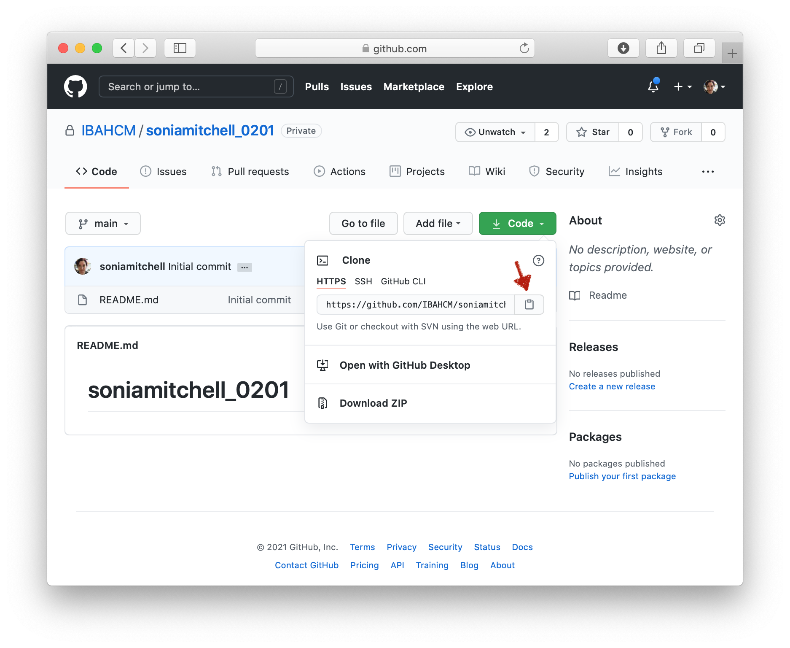

```{r, include = FALSE}
knitr::opts_chunk$set(
  collapse = TRUE,
  comment = "#>"
)
```

This guide assumes you have a GitHub repository all set up. If you need help
doing that, there's another guide 
[here](https://ibahcm.github.io/RPiR/articles/pages/github.html) that will take you through it. 

Once you're all set up, click on the green 
<span style="color: #de77ae;">Code</span> button and 
**copy the URL** associated with your GitHub repository to your clipboard

```{r echo = FALSE, fig.align = "center", out.width = "100%"}

```

Then in RStudio, click <span style="color: #de77ae;">File > New project...</span>, 
then since we're integrating version control into this project workflow, you 
should select <span style="color: #de77ae;">Version Control</span>.

```{r echo = FALSE, fig.align = "center", out.width = "100%"}
knitr::include_graphics('images/use-github-05.png')
```

Select the option to clone a project from a 
<span style="color: #de77ae;">Git</span> repository.

```{r echo = FALSE, fig.align = "center", out.width = "100%"}
knitr::include_graphics('images/use-github-06.png')
```

**Paste your Repository URL** into the first box, then click 
<span style="color: #de77ae;">Browse...</span> 
and navigate to the git folder on your desktop. If you don't have a git folder 
on your desktop then make one, as it's good practice to keep all of your 
projects together and well organised. RStudio will create a new subdirectory 
that will mirror the contents of your Git repository (so make sure you 
don't already have a folder with the same name as the repository you created, 
as this will cause problems). Now click 
<span style="color: #de77ae;">Create Project</span> and enter your GitHub 
username and password if you're asked.

```{r echo = FALSE, fig.align = "center", out.width = "100%"}
knitr::include_graphics('images/use-github-07.png')
```

Congratulations! You have successfully created a new RStudio project (now with
added version control). In the example below, (1) the RStudio project is called 
`soniamitchell_0201`, (2) a new directory, `soniamitchell_0201`, has been 
created, which is now your working directory, and inside this directory are (3) 
three files, including a GitHub `README.md` file (imported from your GitHub 
repository), an RStudio project file (`soniamitchell_0201.Rproj`), and an 
invisible `.gitignore` file (created by RStudio). 

Note the appearance of a new <span style="color: #de77ae;">Git</span> tab next 
to <span style="color: #de77ae;">Connections</span>. This is 
important.

```{r echo = FALSE, fig.align = "center", out.width = "100%"}
knitr::include_graphics('images/use-github-08.png')
```

## Using Git in RStudio

Compare the contents of your working directory to the files listed in the
<span style="color: #de77ae;">Git</span> tab. The 
<span style="color: #de77ae;">Git</span> tab is a useful tool that shows you 
how your remote
directory (your GitHub repository) differs from your local directory 
(in this case `~/Desktop/Git/soniamitchell_0201`). Currently, the `README.md`
file in your local directory is identical to the one in your remote directory.
That's why you can't see it in the <span style="color: #de77ae;">Git</span> tab.
Instead, `.gitignore` and `soniamitchell_0201.Rproj` are listed with yellow
question marks in the <span style="color: #de77ae;">Status</span> column. What
do these icons mean?

* "?" - Files or directories that don't currently exist in your git repository 
  (you either want to commit these or add them to `.gitignore`)
* "A" - Files that have been staged and are ready to commit (you're in the 
  process of committing these)
* "M" - Files that are modified versions of those in the repository (you 
  definately want to commit these)
* "D" - Files that are no longer in your local directory (you've likely deleted
  these and want to commit their absence to GitHub)

Open the `README.md` file by clicking on its filename in the 
<span style="color: #de77ae;">Files</span> tab. 
Does this look familiar? (Compare the contents of this file to your
repository on GitHub)

```{r echo = FALSE, fig.align = "center", out.width = "100%"}
knitr::include_graphics('images/use-github-09.png')
```

Usually a GitHub README (written in [GitHub Flavored Markdown](https://help.github.com/en/github/writing-on-github)) will describe the 
contents of the GitHub repository or give an example of how to use the contents 
of said repository. Make some edits to `README.md` and **save your file**. Note 
that when we make edits to the README file, its 
<span style="color: #de77ae;">Status</span> changes to "M". This 
means that the file in your local directory is no longer identical to the file 
in your remote directory (on GitHub). Check the box next to the file you want 
to commit (`README.md`), then click <span style="color: #de77ae;">Commit</span>.

```{r echo = FALSE, fig.align = "center", out.width = "100%"}
knitr::include_graphics('images/use-github-10.png')
```

The <span style="color: #de77ae;">RStudio: Review Changes</span> window has 
opened. Make sure the checkbox is ticked next to `README.md` and enter a 
<span style="color: #de77ae;">Commit message</span>. Your message 
should describe the changes you've made to the file you're uploading. These 
changes are shown in the lower half of the 
screen, with deletions and insertions highlighted in red and green, 
respectively. Click <span style="color: #de77ae;">Commit</span> to stage your 
changes (preparing to upload to GitHub).

```{r echo = FALSE, fig.align = "center", out.width = "100%"}
knitr::include_graphics('images/use-github-11.png')
```

Congratulations! `README.md` is now staged, with 5 insertions. 
**Close** the <span style="color: #de77ae;">RStudio: Review Changes</span> window.

```{r echo = FALSE, fig.align = "center", out.width = "100%"}
knitr::include_graphics('images/use-github-12.png')
```

Notice that `README.md` has disappeared from the 
<span style="color: #de77ae;">Git</span> tab? That's because it's packaged up 
(staged) and ready to be shipped out (pushed) to GitHub.
Click on the green <span style="color: #de77ae;">Push</span> arrow, to push 
all staged files (at the moment, just `README.md`) to GitHub. Enter your 
password if you're asked for it.

```{r echo = FALSE, fig.align = "center", out.width = "100%"}
knitr::include_graphics('images/use-github-13.png')
```

Congratulations again! You've successfully pushed these changes to GitHub. Go
take a look at your GitHub repository and you'll see that the GitHub README 
has been updated. 

```{r echo = FALSE, fig.align = "center", out.width = "100%"}
knitr::include_graphics('images/use-github-14.png')
```

## Final remarks

RStudio offers integrated version control, which is useful for **daily tasks**
such as pushing, pulling, and reviewing changes (click on 
<span style="color: #de77ae;">Diff</span> in the 
<span style="color: #de77ae;">Git</span> tab). However, this is just the tip of 
the iceberg. If you have time, why not take a look at the links below.

## Additional resources

* [R packages - Git and GitHub, by Hadley Wickham](http://r-pkgs.had.co.nz/git.html)
* [Pro Git, by Scott Chacon and Ben Straub ](https://git-scm.com/book/en/v2)
* [git/github guide, by Karl Broman](https://kbroman.org/github_tutorial/)
* [git - the simple guide, by Roger Dudler](https://rogerdudler.github.io/git-guide/)
